<div align="center">

# 🎨 Logos Apps

### A free, open collection of **2,091** clean SVG logos for apps, tools & tech brands.

<p>
  
  
  
</p>

<p>
  <a href="https://github.com/ln-dev7/logos-apps/archive/refs/heads/master.zip">
    
  </a>
  <a href="https://ln-dev7.github.io/logos-apps/">
    
  </a>
</p>

**[🖼️ Open the interactive gallery](https://ln-dev7.github.io/logos-apps/)** — search, filter by category, and download any logo in one click.

</div>

---

## 🚀 Quick start

**Download everything:** [grab the full pack (.zip)](https://github.com/ln-dev7/logos-apps/archive/refs/heads/master.zip) · **Clone:** `git clone https://github.com/ln-dev7/logos-apps.git`

**Hotlink a single logo:**

```html

```

**Naming convention:** `brand.svg` = icon only · `brand-wordmark.svg` = logotype (icon + name).

> 💡 In the tables below, **click any icon** to open its file — then use GitHub's download button, or visit the [gallery](https://ln-dev7.github.io/logos-apps/) for true 1-click downloads.

---

<a id="toc"></a>

## 📚 Categories

- [🤖 AI & Machine Learning](#cat-ai) — **56**
- [💻 Languages & Runtimes](#cat-lang) — **83**
- [⚛️ Frameworks & UI Libraries](#cat-fw) — **319**
- [🛠️ Dev Tools, CI/CD & Testing](#cat-dev) — **512**
- [☁️ Cloud, Hosting & Infrastructure](#cat-cloud) — **207**
- [🗄️ Databases & Data](#cat-db) — **155**
- [🎨 Design & Creative](#cat-design) — **52**
- [💬 Social & Communication](#cat-social) — **74**
- [💳 Payments, Fintech & Crypto](#cat-pay) — **56**
- [📋 Productivity & Collaboration](#cat-prod) — **91**
- [🛒 E-commerce & CMS](#cat-shop) — **67**
- [🎵 Media & Entertainment](#cat-media) — **32**
- [🖥️ OS, Platforms & Browsers](#cat-os) — **57**
- [📊 Analytics, Marketing & CRM](#cat-mkt) — **125**
- [🔐 Security & Identity](#cat-sec) — **38**
- [🌐 Web Standards & Protocols](#cat-web) — **52**
- [🏢 Companies & Services](#cat-corp) — **79**
- [📦 Others](#cat-other) — **36**

> ⚠️ Categories are auto-generated — spotted a logo in the wrong place? PRs welcome!

---

<a id="cat-ai"></a>

## 🤖 AI & Machine Learning <sub>(56)</sub>

<table>
<tr><td align="center"><a href="./ai.svg">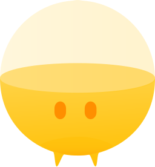<br/><sub><code>ai</code></sub></a></td><td align="center"><a href="./anthropic.svg"><br/><sub><code>anthropic</code></sub></a></td><td align="center"><a href="./anthropic-wordmark.svg"><br/><sub><code>anthropic-wordmark</code></sub></a></td><td align="center"><a href="./api-ai.svg"><br/><sub><code>api-ai</code></sub></a></td><td align="center"><a href="./brainjs.svg"><br/><sub><code>brainjs</code></sub></a></td><td align="center"><a href="./caffe2.svg"><br/><sub><code>caffe2</code></sub></a></td></tr>
<tr><td align="center"><a href="./claude.svg"><br/><sub><code>claude</code></sub></a></td><td align="center"><a href="./claude-wordmark.svg"><br/><sub><code>claude-wordmark</code></sub></a></td><td align="center"><a href="./danfo.svg"><br/><sub><code>danfo</code></sub></a></td><td align="center"><a href="./deepseek.svg"><br/><sub><code>deepseek</code></sub></a></td><td align="center"><a href="./deepseek-wordmark.svg"><br/><sub><code>deepseek-wordmark</code></sub></a></td><td align="center"><a href="./dialogflow.svg"><br/><sub><code>dialogflow</code></sub></a></td></tr>
<tr><td align="center"><a href="./floydhub.svg">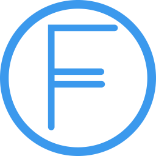<br/><sub><code>floydhub</code></sub></a></td><td align="center"><a href="./github-copilot.svg"><br/><sub><code>github-copilot</code></sub></a></td><td align="center"><a href="./google-bard.svg"><br/><sub><code>google-bard</code></sub></a></td><td align="center"><a href="./google-bard-wordmark.svg">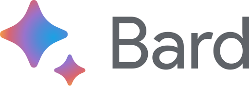<br/><sub><code>google-bard-wordmark</code></sub></a></td><td align="center"><a href="./google-gemini.svg"><br/><sub><code>google-gemini</code></sub></a></td><td align="center"><a href="./google-palm.svg"><br/><sub><code>google-palm</code></sub></a></td></tr>
<tr><td align="center"><a href="./gradio.svg"><br/><sub><code>gradio</code></sub></a></td><td align="center"><a href="./gradio-wordmark.svg"><br/><sub><code>gradio-wordmark</code></sub></a></td><td align="center"><a href="./grok.svg"><br/><sub><code>grok</code></sub></a></td><td align="center"><a href="./grok-wordmark.svg"><br/><sub><code>grok-wordmark</code></sub></a></td><td align="center"><a href="./hugging-face.svg"><br/><sub><code>hugging-face</code></sub></a></td><td align="center"><a href="./hugging-face-wordmark.svg"><br/><sub><code>hugging-face-wordmark</code></sub></a></td></tr>
<tr><td align="center"><a href="./jupyter.svg"><br/><sub><code>jupyter</code></sub></a></td><td align="center"><a href="./matplotlib.svg">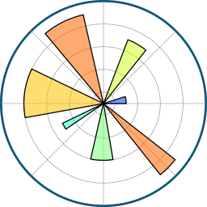<br/><sub><code>matplotlib</code></sub></a></td><td align="center"><a href="./matplotlib-wordmark.svg"><br/><sub><code>matplotlib-wordmark</code></sub></a></td><td align="center"><a href="./midjourney.svg"><br/><sub><code>midjourney</code></sub></a></td><td align="center"><a href="./mindsdb.svg"><br/><sub><code>mindsdb</code></sub></a></td><td align="center"><a href="./mindsdb-wordmark.svg"><br/><sub><code>mindsdb-wordmark</code></sub></a></td></tr>
<tr><td align="center"><a href="./mistral-ai.svg"><br/><sub><code>mistral-ai</code></sub></a></td><td align="center"><a href="./mistral-ai-wordmark.svg"><br/><sub><code>mistral-ai-wordmark</code></sub></a></td><td align="center"><a href="./model-context-protocol.svg"><br/><sub><code>model-context-protocol</code></sub></a></td><td align="center"><a href="./model-context-protocol-wordmark.svg"><br/><sub><code>model-context-protocol-wordmark</code></sub></a></td><td align="center"><a href="./moonshot-ai.svg"><br/><sub><code>moonshot-ai</code></sub></a></td><td align="center"><a href="./moonshot-ai-wordmark.svg"><br/><sub><code>moonshot-ai-wordmark</code></sub></a></td></tr>
<tr><td align="center"><a href="./nanonets.svg"><br/><sub><code>nanonets</code></sub></a></td><td align="center"><a href="./numpy.svg">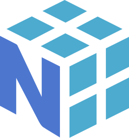<br/><sub><code>numpy</code></sub></a></td><td align="center"><a href="./openai.svg"><br/><sub><code>openai</code></sub></a></td><td align="center"><a href="./openai-wordmark.svg"><br/><sub><code>openai-wordmark</code></sub></a></td><td align="center"><a href="./opencv.svg">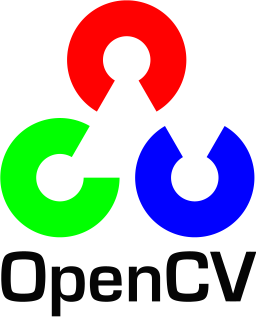<br/><sub><code>opencv</code></sub></a></td><td align="center"><a href="./pandas.svg">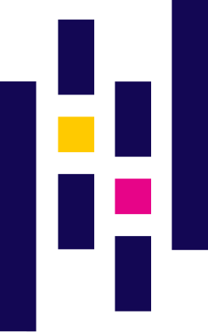<br/><sub><code>pandas</code></sub></a></td></tr>
<tr><td align="center"><a href="./pandas-wordmark.svg"><br/><sub><code>pandas-wordmark</code></sub></a></td><td align="center"><a href="./perplexity.svg"><br/><sub><code>perplexity</code></sub></a></td><td align="center"><a href="./perplexity-wordmark.svg"><br/><sub><code>perplexity-wordmark</code></sub></a></td><td align="center"><a href="./pytorch.svg"><br/><sub><code>pytorch</code></sub></a></td><td align="center"><a href="./pytorch-wordmark.svg"><br/><sub><code>pytorch-wordmark</code></sub></a></td><td align="center"><a href="./qwen.svg">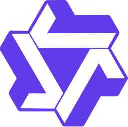<br/><sub><code>qwen</code></sub></a></td></tr>
<tr><td align="center"><a href="./qwen-wordmark.svg"><br/><sub><code>qwen-wordmark</code></sub></a></td><td align="center"><a href="./seaborn.svg"><br/><sub><code>seaborn</code></sub></a></td><td align="center"><a href="./seaborn-wordmark.svg"><br/><sub><code>seaborn-wordmark</code></sub></a></td><td align="center"><a href="./stability-ai.svg"><br/><sub><code>stability-ai</code></sub></a></td><td align="center"><a href="./stability-ai-wordmark.svg"><br/><sub><code>stability-ai-wordmark</code></sub></a></td><td align="center"><a href="./streamlit.svg"><br/><sub><code>streamlit</code></sub></a></td></tr>
<tr><td align="center"><a href="./tensorflow.svg"><br/><sub><code>tensorflow</code></sub></a></td><td align="center"><a href="./x-ai.svg"><br/><sub><code>x-ai</code></sub></a></td></tr>
</table>

<p align="right"><a href="#toc">⬆️ Back to top</a></p>
<a id="cat-lang"></a>

## 💻 Languages & Runtimes <sub>(83)</sub>

<table>
<tr><td align="center"><a href="./autoit.svg">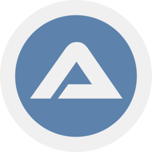<br/><sub><code>autoit</code></sub></a></td><td align="center"><a href="./bun.svg"><br/><sub><code>bun</code></sub></a></td><td align="center"><a href="./c.svg"><br/><sub><code>c</code></sub></a></td><td align="center"><a href="./c-plusplus.svg"><br/><sub><code>c-plusplus</code></sub></a></td><td align="center"><a href="./c-sharp.svg"><br/><sub><code>c-sharp</code></sub></a></td><td align="center"><a href="./ceylon.svg"><br/><sub><code>ceylon</code></sub></a></td></tr>
<tr><td align="center"><a href="./clio-lang.svg">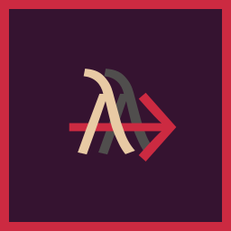<br/><sub><code>clio-lang</code></sub></a></td><td align="center"><a href="./cljs.svg"><br/><sub><code>cljs</code></sub></a></td><td align="center"><a href="./clojure.svg">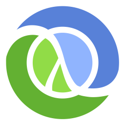<br/><sub><code>clojure</code></sub></a></td><td align="center"><a href="./coffeescript.svg"><br/><sub><code>coffeescript</code></sub></a></td><td align="center"><a href="./crystal.svg"><br/><sub><code>crystal</code></sub></a></td><td align="center"><a href="./dart.svg"><br/><sub><code>dart</code></sub></a></td></tr>
<tr><td align="center"><a href="./deno.svg">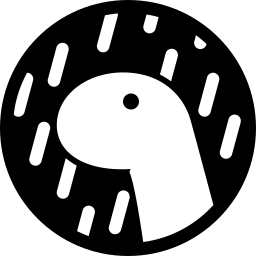<br/><sub><code>deno</code></sub></a></td><td align="center"><a href="./dotnet.svg"><br/><sub><code>dotnet</code></sub></a></td><td align="center"><a href="./ecma.svg"><br/><sub><code>ecma</code></sub></a></td><td align="center"><a href="./elm.svg"><br/><sub><code>elm</code></sub></a></td><td align="center"><a href="./elm-classic.svg"><br/><sub><code>elm-classic</code></sub></a></td><td align="center"><a href="./erlang.svg">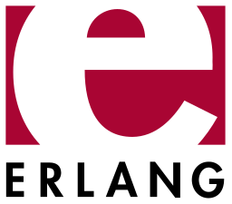<br/><sub><code>erlang</code></sub></a></td></tr>
<tr><td align="center"><a href="./es6.svg"><br/><sub><code>es6</code></sub></a></td><td align="center"><a href="./fortran.svg"><br/><sub><code>fortran</code></sub></a></td><td align="center"><a href="./fsharp.svg"><br/><sub><code>fsharp</code></sub></a></td><td align="center"><a href="./gleam.svg">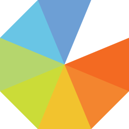<br/><sub><code>gleam</code></sub></a></td><td align="center"><a href="./go.svg"><br/><sub><code>go</code></sub></a></td><td align="center"><a href="./gopher.svg"><br/><sub><code>gopher</code></sub></a></td></tr>
<tr><td align="center"><a href="./hack.svg"><br/><sub><code>hack</code></sub></a></td><td align="center"><a href="./haskell.svg"><br/><sub><code>haskell</code></sub></a></td><td align="center"><a href="./haskell-wordmark.svg"><br/><sub><code>haskell-wordmark</code></sub></a></td><td align="center"><a href="./haxe.svg"><br/><sub><code>haxe</code></sub></a></td><td align="center"><a href="./hermes.svg"><br/><sub><code>hermes</code></sub></a></td><td align="center"><a href="./hhvm.svg"><br/><sub><code>hhvm</code></sub></a></td></tr>
<tr><td align="center"><a href="./hoa.svg"><br/><sub><code>hoa</code></sub></a></td><td align="center"><a href="./imba.svg"><br/><sub><code>imba</code></sub></a></td><td align="center"><a href="./imba-wordmark.svg"><br/><sub><code>imba-wordmark</code></sub></a></td><td align="center"><a href="./io.svg"><br/><sub><code>io</code></sub></a></td><td align="center"><a href="./java.svg"><br/><sub><code>java</code></sub></a></td><td align="center"><a href="./javascript.svg"><br/><sub><code>javascript</code></sub></a></td></tr>
<tr><td align="center"><a href="./jruby.svg"><br/><sub><code>jruby</code></sub></a></td><td align="center"><a href="./julia.svg"><br/><sub><code>julia</code></sub></a></td><td align="center"><a href="./kotlin.svg">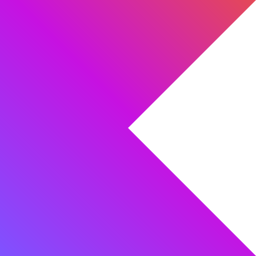<br/><sub><code>kotlin</code></sub></a></td><td align="center"><a href="./kotlin-wordmark.svg"><br/><sub><code>kotlin-wordmark</code></sub></a></td><td align="center"><a href="./lua.svg"><br/><sub><code>lua</code></sub></a></td><td align="center"><a href="./micro-python.svg"><br/><sub><code>micro-python</code></sub></a></td></tr>
<tr><td align="center"><a href="./mint-lang.svg"><br/><sub><code>mint-lang</code></sub></a></td><td align="center"><a href="./mono.svg"><br/><sub><code>mono</code></sub></a></td><td align="center"><a href="./nasm.svg"><br/><sub><code>nasm</code></sub></a></td><td align="center"><a href="./net.svg"><br/><sub><code>net</code></sub></a></td><td align="center"><a href="./nim-lang.svg"><br/><sub><code>nim-lang</code></sub></a></td><td align="center"><a href="./nodejs.svg">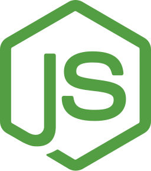<br/><sub><code>nodejs</code></sub></a></td></tr>
<tr><td align="center"><a href="./nodejs-icon-alt.svg"><br/><sub><code>nodejs-icon-alt</code></sub></a></td><td align="center"><a href="./nodejs-wordmark.svg">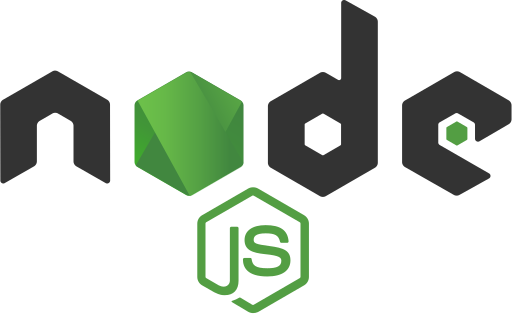<br/><sub><code>nodejs-wordmark</code></sub></a></td><td align="center"><a href="./ocaml.svg"><br/><sub><code>ocaml</code></sub></a></td><td align="center"><a href="./perl.svg"><br/><sub><code>perl</code></sub></a></td><td align="center"><a href="./php.svg"><br/><sub><code>php</code></sub></a></td><td align="center"><a href="./php-alt.svg"><br/><sub><code>php-alt</code></sub></a></td></tr>
<tr><td align="center"><a href="./purescript.svg"><br/><sub><code>purescript</code></sub></a></td><td align="center"><a href="./purescript-wordmark.svg"><br/><sub><code>purescript-wordmark</code></sub></a></td><td align="center"><a href="./pyscript.svg"><br/><sub><code>pyscript</code></sub></a></td><td align="center"><a href="./python.svg"><br/><sub><code>python</code></sub></a></td><td align="center"><a href="./r-lang.svg"><br/><sub><code>r-lang</code></sub></a></td><td align="center"><a href="./reasonml.svg"><br/><sub><code>reasonml</code></sub></a></td></tr>
<tr><td align="center"><a href="./reasonml-wordmark.svg"><br/><sub><code>reasonml-wordmark</code></sub></a></td><td align="center"><a href="./rescript.svg"><br/><sub><code>rescript</code></sub></a></td><td align="center"><a href="./rescript-wordmark.svg"><br/><sub><code>rescript-wordmark</code></sub></a></td><td align="center"><a href="./ruby.svg">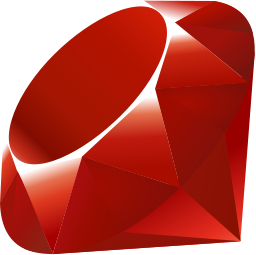<br/><sub><code>ruby</code></sub></a></td><td align="center"><a href="./rust.svg"><br/><sub><code>rust</code></sub></a></td><td align="center"><a href="./scala.svg"><br/><sub><code>scala</code></sub></a></td></tr>
<tr><td align="center"><a href="./solidity.svg"><br/><sub><code>solidity</code></sub></a></td><td align="center"><a href="./spidermonkey.svg"><br/><sub><code>spidermonkey</code></sub></a></td><td align="center"><a href="./spidermonkey-wordmark.svg"><br/><sub><code>spidermonkey-wordmark</code></sub></a></td><td align="center"><a href="./swift.svg"><br/><sub><code>swift</code></sub></a></td><td align="center"><a href="./tsnode.svg"><br/><sub><code>tsnode</code></sub></a></td><td align="center"><a href="./typescript.svg"><br/><sub><code>typescript</code></sub></a></td></tr>
<tr><td align="center"><a href="./typescript-icon-round.svg"><br/><sub><code>typescript-icon-round</code></sub></a></td><td align="center"><a href="./typescript-wordmark.svg"><br/><sub><code>typescript-wordmark</code></sub></a></td><td align="center"><a href="./v8.svg">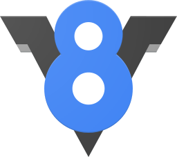<br/><sub><code>v8</code></sub></a></td><td align="center"><a href="./v8-ignition.svg"><br/><sub><code>v8-ignition</code></sub></a></td><td align="center"><a href="./v8-turbofan.svg"><br/><sub><code>v8-turbofan</code></sub></a></td><td align="center"><a href="./vlang.svg"><br/><sub><code>vlang</code></sub></a></td></tr>
<tr><td align="center"><a href="./webassembly.svg">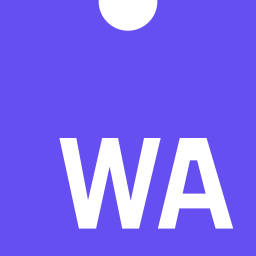<br/><sub><code>webassembly</code></sub></a></td><td align="center"><a href="./winglang.svg"><br/><sub><code>winglang</code></sub></a></td><td align="center"><a href="./winglang-wordmark.svg"><br/><sub><code>winglang-wordmark</code></sub></a></td><td align="center"><a href="./xtend.svg"><br/><sub><code>xtend</code></sub></a></td><td align="center"><a href="./zig.svg"><br/><sub><code>zig</code></sub></a></td></tr>
</table>

<p align="right"><a href="#toc">⬆️ Back to top</a></p>
<a id="cat-fw"></a>

## ⚛️ Frameworks & UI Libraries <sub>(319)</sub>

<table>
<tr><td align="center"><a href="./adonisjs.svg"><br/><sub><code>adonisjs</code></sub></a></td><td align="center"><a href="./adonisjs-wordmark.svg">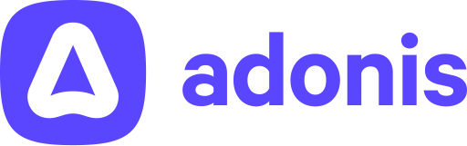<br/><sub><code>adonisjs-wordmark</code></sub></a></td><td align="center"><a href="./akka.svg"><br/><sub><code>akka</code></sub></a></td><td align="center"><a href="./alpinejs.svg"><br/><sub><code>alpinejs</code></sub></a></td><td align="center"><a href="./alpinejs-wordmark.svg"><br/><sub><code>alpinejs-wordmark</code></sub></a></td><td align="center"><a href="./ampersand.svg"><br/><sub><code>ampersand</code></sub></a></td></tr>
<tr><td align="center"><a href="./analog.svg">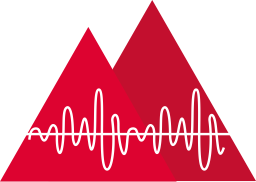<br/><sub><code>analog</code></sub></a></td><td align="center"><a href="./angular.svg"><br/><sub><code>angular</code></sub></a></td><td align="center"><a href="./angular-wordmark.svg"><br/><sub><code>angular-wordmark</code></sub></a></td><td align="center"><a href="./ant-design.svg"><br/><sub><code>ant-design</code></sub></a></td><td align="center"><a href="./apollostack.svg"><br/><sub><code>apollostack</code></sub></a></td><td align="center"><a href="./astro.svg"><br/><sub><code>astro</code></sub></a></td></tr>
<tr><td align="center"><a href="./astro-wordmark.svg"><br/><sub><code>astro-wordmark</code></sub></a></td><td align="center"><a href="./atomicojs.svg"><br/><sub><code>atomicojs</code></sub></a></td><td align="center"><a href="./atomicojs-wordmark.svg"><br/><sub><code>atomicojs-wordmark</code></sub></a></td><td align="center"><a href="./aurelia.svg"><br/><sub><code>aurelia</code></sub></a></td><td align="center"><a href="./autoprefixer.svg">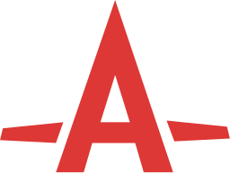<br/><sub><code>autoprefixer</code></sub></a></td><td align="center"><a href="./axios.svg"><br/><sub><code>axios</code></sub></a></td></tr>
<tr><td align="center"><a href="./backbone.svg"><br/><sub><code>backbone</code></sub></a></td><td align="center"><a href="./backbone-wordmark.svg"><br/><sub><code>backbone-wordmark</code></sub></a></td><td align="center"><a href="./bem.svg"><br/><sub><code>bem</code></sub></a></td><td align="center"><a href="./bem-2.svg"><br/><sub><code>bem-2</code></sub></a></td><td align="center"><a href="./blitzjs.svg"><br/><sub><code>blitzjs</code></sub></a></td><td align="center"><a href="./blitzjs-wordmark.svg"><br/><sub><code>blitzjs-wordmark</code></sub></a></td></tr>
<tr><td align="center"><a href="./blueprint.svg"><br/><sub><code>blueprint</code></sub></a></td><td align="center"><a href="./bootstrap.svg">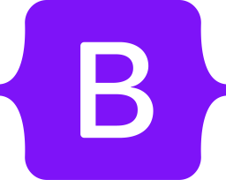<br/><sub><code>bootstrap</code></sub></a></td><td align="center"><a href="./bourbon.svg"><br/><sub><code>bourbon</code></sub></a></td><td align="center"><a href="./bulma.svg"><br/><sub><code>bulma</code></sub></a></td><td align="center"><a href="./cakephp.svg"><br/><sub><code>cakephp</code></sub></a></td><td align="center"><a href="./cakephp-wordmark.svg"><br/><sub><code>cakephp-wordmark</code></sub></a></td></tr>
<tr><td align="center"><a href="./canjs.svg"><br/><sub><code>canjs</code></sub></a></td><td align="center"><a href="./capacitorjs.svg"><br/><sub><code>capacitorjs</code></sub></a></td><td align="center"><a href="./capacitorjs-wordmark.svg"><br/><sub><code>capacitorjs-wordmark</code></sub></a></td><td align="center"><a href="./celluloid.svg">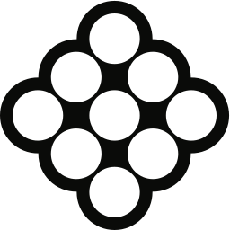<br/><sub><code>celluloid</code></sub></a></td><td align="center"><a href="./chartjs.svg"><br/><sub><code>chartjs</code></sub></a></td><td align="center"><a href="./cinder.svg"><br/><sub><code>cinder</code></sub></a></td></tr>
<tr><td align="center"><a href="./codeigniter.svg"><br/><sub><code>codeigniter</code></sub></a></td><td align="center"><a href="./codeigniter-wordmark.svg"><br/><sub><code>codeigniter-wordmark</code></sub></a></td><td align="center"><a href="./compass.svg"><br/><sub><code>compass</code></sub></a></td><td align="center"><a href="./component.svg"><br/><sub><code>component</code></sub></a></td><td align="center"><a href="./componentkit.svg">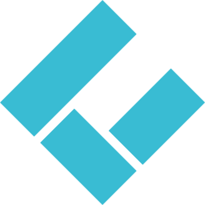<br/><sub><code>componentkit</code></sub></a></td><td align="center"><a href="./compose-multiplatform.svg"><br/><sub><code>compose-multiplatform</code></sub></a></td></tr>
<tr><td align="center"><a href="./cordova.svg"><br/><sub><code>cordova</code></sub></a></td><td align="center"><a href="./create-react-app.svg"><br/><sub><code>create-react-app</code></sub></a></td><td align="center"><a href="./createjs.svg"><br/><sub><code>createjs</code></sub></a></td><td align="center"><a href="./cssnext.svg"><br/><sub><code>cssnext</code></sub></a></td><td align="center"><a href="./cyclejs.svg"><br/><sub><code>cyclejs</code></sub></a></td><td align="center"><a href="./d3.svg"><br/><sub><code>d3</code></sub></a></td></tr>
<tr><td align="center"><a href="./daisyui.svg"><br/><sub><code>daisyui</code></sub></a></td><td align="center"><a href="./daisyui-wordmark.svg"><br/><sub><code>daisyui-wordmark</code></sub></a></td><td align="center"><a href="./derby.svg"><br/><sub><code>derby</code></sub></a></td><td align="center"><a href="./django.svg"><br/><sub><code>django</code></sub></a></td><td align="center"><a href="./django-wordmark.svg"><br/><sub><code>django-wordmark</code></sub></a></td><td align="center"><a href="./dojo.svg"><br/><sub><code>dojo</code></sub></a></td></tr>
<tr><td align="center"><a href="./dojo-toolkit.svg"><br/><sub><code>dojo-toolkit</code></sub></a></td><td align="center"><a href="./dojo-wordmark.svg"><br/><sub><code>dojo-wordmark</code></sub></a></td><td align="center"><a href="./dropzone.svg"><br/><sub><code>dropzone</code></sub></a></td><td align="center"><a href="./effect.svg"><br/><sub><code>effect</code></sub></a></td><td align="center"><a href="./effect-wordmark.svg"><br/><sub><code>effect-wordmark</code></sub></a></td><td align="center"><a href="./effector.svg"><br/><sub><code>effector</code></sub></a></td></tr>
<tr><td align="center"><a href="./electron.svg"><br/><sub><code>electron</code></sub></a></td><td align="center"><a href="./element.svg"><br/><sub><code>element</code></sub></a></td><td align="center"><a href="./elemental-ui.svg"><br/><sub><code>elemental-ui</code></sub></a></td><td align="center"><a href="./eleventy.svg"><br/><sub><code>eleventy</code></sub></a></td><td align="center"><a href="./ember.svg"><br/><sub><code>ember</code></sub></a></td><td align="center"><a href="./ember-tomster.svg">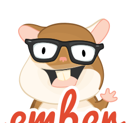<br/><sub><code>ember-tomster</code></sub></a></td></tr>
<tr><td align="center"><a href="./enact.svg"><br/><sub><code>enact</code></sub></a></td><td align="center"><a href="./enyo.svg"><br/><sub><code>enyo</code></sub></a></td><td align="center"><a href="./eta.svg"><br/><sub><code>eta</code></sub></a></td><td align="center"><a href="./eta-wordmark.svg"><br/><sub><code>eta-wordmark</code></sub></a></td><td align="center"><a href="./evergreen.svg"><br/><sub><code>evergreen</code></sub></a></td><td align="center"><a href="./evergreen-wordmark.svg"><br/><sub><code>evergreen-wordmark</code></sub></a></td></tr>
<tr><td align="center"><a href="./expo.svg"><br/><sub><code>expo</code></sub></a></td><td align="center"><a href="./expo-wordmark.svg"><br/><sub><code>expo-wordmark</code></sub></a></td><td align="center"><a href="./exponent.svg"><br/><sub><code>exponent</code></sub></a></td><td align="center"><a href="./express.svg"><br/><sub><code>express</code></sub></a></td><td align="center"><a href="./falcor.svg"><br/><sub><code>falcor</code></sub></a></td><td align="center"><a href="./famous.svg"><br/><sub><code>famous</code></sub></a></td></tr>
<tr><td align="center"><a href="./fastapi.svg">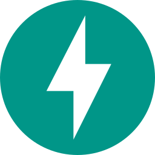<br/><sub><code>fastapi</code></sub></a></td><td align="center"><a href="./fastapi-wordmark.svg"><br/><sub><code>fastapi-wordmark</code></sub></a></td><td align="center"><a href="./fastify.svg"><br/><sub><code>fastify</code></sub></a></td><td align="center"><a href="./fastify-wordmark.svg"><br/><sub><code>fastify-wordmark</code></sub></a></td><td align="center"><a href="./feathersjs.svg"><br/><sub><code>feathersjs</code></sub></a></td><td align="center"><a href="./flask.svg"><br/><sub><code>flask</code></sub></a></td></tr>
<tr><td align="center"><a href="./flat-ui.svg">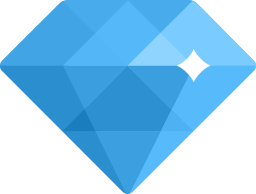<br/><sub><code>flat-ui</code></sub></a></td><td align="center"><a href="./flight.svg">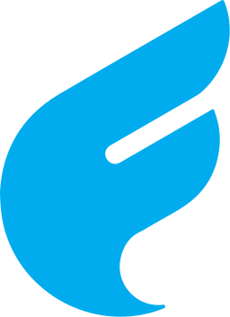<br/><sub><code>flight</code></sub></a></td><td align="center"><a href="./flutter.svg"><br/><sub><code>flutter</code></sub></a></td><td align="center"><a href="./flux.svg"><br/><sub><code>flux</code></sub></a></td><td align="center"><a href="./fluxxor.svg"><br/><sub><code>fluxxor</code></sub></a></td><td align="center"><a href="./flyjs.svg"><br/><sub><code>flyjs</code></sub></a></td></tr>
<tr><td align="center"><a href="./foundation.svg"><br/><sub><code>foundation</code></sub></a></td><td align="center"><a href="./framework7.svg">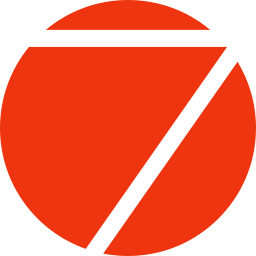<br/><sub><code>framework7</code></sub></a></td><td align="center"><a href="./framework7-wordmark.svg"><br/><sub><code>framework7-wordmark</code></sub></a></td><td align="center"><a href="./fresh.svg">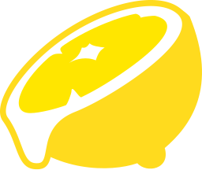<br/><sub><code>fresh</code></sub></a></td><td align="center"><a href="./gatsby.svg">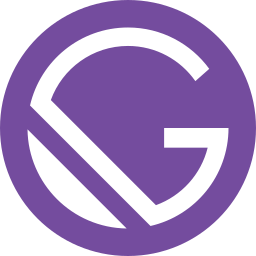<br/><sub><code>gatsby</code></sub></a></td><td align="center"><a href="./gin.svg">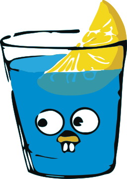<br/><sub><code>gin</code></sub></a></td></tr>
<tr><td align="center"><a href="./glamorous.svg"><br/><sub><code>glamorous</code></sub></a></td><td align="center"><a href="./glamorous-wordmark.svg"><br/><sub><code>glamorous-wordmark</code></sub></a></td><td align="center"><a href="./glimmerjs.svg"><br/><sub><code>glimmerjs</code></sub></a></td><td align="center"><a href="./godot.svg">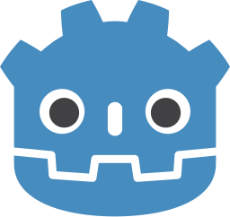<br/><sub><code>godot</code></sub></a></td><td align="center"><a href="./godot-wordmark.svg"><br/><sub><code>godot-wordmark</code></sub></a></td><td align="center"><a href="./grails.svg"><br/><sub><code>grails</code></sub></a></td></tr>
<tr><td align="center"><a href="./grape.svg">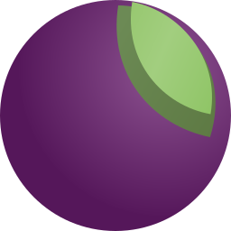<br/><sub><code>grape</code></sub></a></td><td align="center"><a href="./graphene.svg">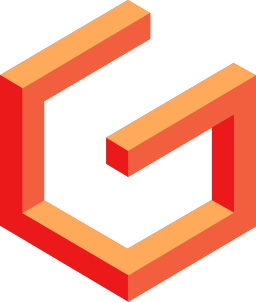<br/><sub><code>graphene</code></sub></a></td><td align="center"><a href="./graphql.svg"><br/><sub><code>graphql</code></sub></a></td><td align="center"><a href="./greensock.svg"><br/><sub><code>greensock</code></sub></a></td><td align="center"><a href="./greensock-wordmark.svg">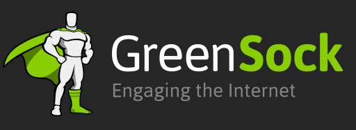<br/><sub><code>greensock-wordmark</code></sub></a></td><td align="center"><a href="./gridsome.svg"><br/><sub><code>gridsome</code></sub></a></td></tr>
<tr><td align="center"><a href="./gridsome-wordmark.svg"><br/><sub><code>gridsome-wordmark</code></sub></a></td><td align="center"><a href="./grommet.svg"><br/><sub><code>grommet</code></sub></a></td><td align="center"><a href="./grpc.svg"><br/><sub><code>grpc</code></sub></a></td><td align="center"><a href="./gwt.svg"><br/><sub><code>gwt</code></sub></a></td><td align="center"><a href="./haml.svg"><br/><sub><code>haml</code></sub></a></td><td align="center"><a href="./hanami.svg"><br/><sub><code>hanami</code></sub></a></td></tr>
<tr><td align="center"><a href="./handlebars.svg"><br/><sub><code>handlebars</code></sub></a></td><td align="center"><a href="./hapi.svg"><br/><sub><code>hapi</code></sub></a></td><td align="center"><a href="./haxl.svg"><br/><sub><code>haxl</code></sub></a></td><td align="center"><a href="./headlessui.svg"><br/><sub><code>headlessui</code></sub></a></td><td align="center"><a href="./headlessui-wordmark.svg"><br/><sub><code>headlessui-wordmark</code></sub></a></td><td align="center"><a href="./hexo.svg"><br/><sub><code>hexo</code></sub></a></td></tr>
<tr><td align="center"><a href="./highcharts.svg"><br/><sub><code>highcharts</code></sub></a></td><td align="center"><a href="./hono.svg"><br/><sub><code>hono</code></sub></a></td><td align="center"><a href="./hoodie.svg"><br/><sub><code>hoodie</code></sub></a></td><td align="center"><a href="./hookstate.svg">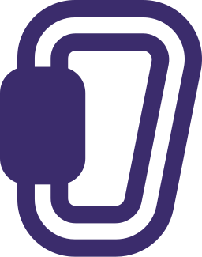<br/><sub><code>hookstate</code></sub></a></td><td align="center"><a href="./horizon.svg"><br/><sub><code>horizon</code></sub></a></td><td align="center"><a href="./htmx.svg">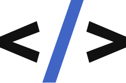<br/><sub><code>htmx</code></sub></a></td></tr>
<tr><td align="center"><a href="./htmx-wordmark.svg"><br/><sub><code>htmx-wordmark</code></sub></a></td><td align="center"><a href="./hugo.svg"><br/><sub><code>hugo</code></sub></a></td><td align="center"><a href="./hyperapp.svg"><br/><sub><code>hyperapp</code></sub></a></td><td align="center"><a href="./immer.svg">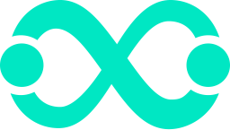<br/><sub><code>immer</code></sub></a></td><td align="center"><a href="./immer-wordmark.svg">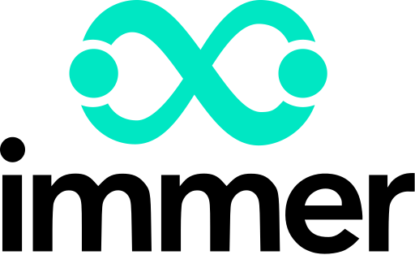<br/><sub><code>immer-wordmark</code></sub></a></td><td align="center"><a href="./immutable.svg"><br/><sub><code>immutable</code></sub></a></td></tr>
<tr><td align="center"><a href="./inferno.svg"><br/><sub><code>inferno</code></sub></a></td><td align="center"><a href="./ink.svg"><br/><sub><code>ink</code></sub></a></td><td align="center"><a href="./ionic.svg">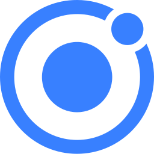<br/><sub><code>ionic</code></sub></a></td><td align="center"><a href="./ionic-wordmark.svg"><br/><sub><code>ionic-wordmark</code></sub></a></td><td align="center"><a href="./jade.svg"><br/><sub><code>jade</code></sub></a></td><td align="center"><a href="./jekyll.svg"><br/><sub><code>jekyll</code></sub></a></td></tr>
<tr><td align="center"><a href="./jhipster.svg"><br/><sub><code>jhipster</code></sub></a></td><td align="center"><a href="./jhipster-wordmark.svg"><br/><sub><code>jhipster-wordmark</code></sub></a></td><td align="center"><a href="./jotai.svg"><br/><sub><code>jotai</code></sub></a></td><td align="center"><a href="./jquery.svg"><br/><sub><code>jquery</code></sub></a></td><td align="center"><a href="./jquery-mobile.svg"><br/><sub><code>jquery-mobile</code></sub></a></td><td align="center"><a href="./jss.svg"><br/><sub><code>jss</code></sub></a></td></tr>
<tr><td align="center"><a href="./kemal.svg"><br/><sub><code>kemal</code></sub></a></td><td align="center"><a href="./knockout.svg"><br/><sub><code>knockout</code></sub></a></td><td align="center"><a href="./koa.svg"><br/><sub><code>koa</code></sub></a></td><td align="center"><a href="./kore.svg"><br/><sub><code>kore</code></sub></a></td><td align="center"><a href="./koreio.svg"><br/><sub><code>koreio</code></sub></a></td><td align="center"><a href="./kraken.svg"><br/><sub><code>kraken</code></sub></a></td></tr>
<tr><td align="center"><a href="./krakenjs.svg">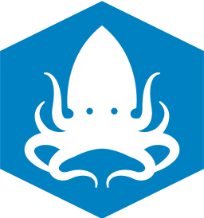<br/><sub><code>krakenjs</code></sub></a></td><td align="center"><a href="./ktor.svg"><br/><sub><code>ktor</code></sub></a></td><td align="center"><a href="./ktor-wordmark.svg"><br/><sub><code>ktor-wordmark</code></sub></a></td><td align="center"><a href="./laravel.svg"><br/><sub><code>laravel</code></sub></a></td><td align="center"><a href="./leaflet.svg"><br/><sub><code>leaflet</code></sub></a></td><td align="center"><a href="./less.svg"><br/><sub><code>less</code></sub></a></td></tr>
<tr><td align="center"><a href="./lexical.svg"><br/><sub><code>lexical</code></sub></a></td><td align="center"><a href="./lexical-wordmark.svg"><br/><sub><code>lexical-wordmark</code></sub></a></td><td align="center"><a href="./liftweb.svg"><br/><sub><code>liftweb</code></sub></a></td><td align="center"><a href="./lit.svg"><br/><sub><code>lit</code></sub></a></td><td align="center"><a href="./lit-wordmark.svg"><br/><sub><code>lit-wordmark</code></sub></a></td><td align="center"><a href="./lodash.svg"><br/><sub><code>lodash</code></sub></a></td></tr>
<tr><td align="center"><a href="./loopback.svg"><br/><sub><code>loopback</code></sub></a></td><td align="center"><a href="./loopback-wordmark.svg"><br/><sub><code>loopback-wordmark</code></sub></a></td><td align="center"><a href="./lotus.svg"><br/><sub><code>lotus</code></sub></a></td><td align="center"><a href="./lumen.svg"><br/><sub><code>lumen</code></sub></a></td><td align="center"><a href="./malinajs.svg"><br/><sub><code>malinajs</code></sub></a></td><td align="center"><a href="./mantine.svg">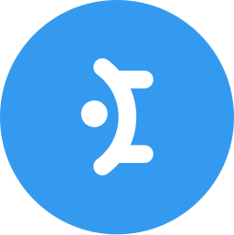<br/><sub><code>mantine</code></sub></a></td></tr>
<tr><td align="center"><a href="./mantine-wordmark.svg"><br/><sub><code>mantine-wordmark</code></sub></a></td><td align="center"><a href="./marionette.svg"><br/><sub><code>marionette</code></sub></a></td><td align="center"><a href="./marko.svg"><br/><sub><code>marko</code></sub></a></td><td align="center"><a href="./marko-wordmark.svg"><br/><sub><code>marko-wordmark</code></sub></a></td><td align="center"><a href="./material-ui.svg">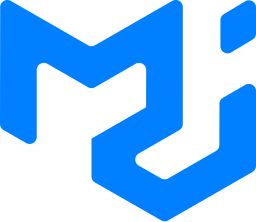<br/><sub><code>material-ui</code></sub></a></td><td align="center"><a href="./materializecss.svg"><br/><sub><code>materializecss</code></sub></a></td></tr>
<tr><td align="center"><a href="./meanio.svg"><br/><sub><code>meanio</code></sub></a></td><td align="center"><a href="./mern.svg"><br/><sub><code>mern</code></sub></a></td><td align="center"><a href="./meteor.svg"><br/><sub><code>meteor</code></sub></a></td><td align="center"><a href="./meteor-wordmark.svg"><br/><sub><code>meteor-wordmark</code></sub></a></td><td align="center"><a href="./micro.svg">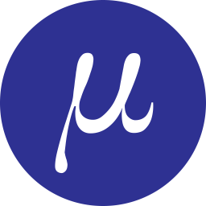<br/><sub><code>micro</code></sub></a></td><td align="center"><a href="./micro-wordmark.svg"><br/><sub><code>micro-wordmark</code></sub></a></td></tr>
<tr><td align="center"><a href="./microcosm.svg"><br/><sub><code>microcosm</code></sub></a></td><td align="center"><a href="./middleman.svg"><br/><sub><code>middleman</code></sub></a></td><td align="center"><a href="./milligram.svg">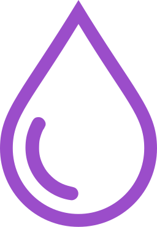<br/><sub><code>milligram</code></sub></a></td><td align="center"><a href="./million.svg"><br/><sub><code>million</code></sub></a></td><td align="center"><a href="./million-wordmark.svg"><br/><sub><code>million-wordmark</code></sub></a></td><td align="center"><a href="./mithril.svg"><br/><sub><code>mithril</code></sub></a></td></tr>
<tr><td align="center"><a href="./mobx.svg"><br/><sub><code>mobx</code></sub></a></td><td align="center"><a href="./momentjs.svg">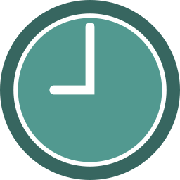<br/><sub><code>momentjs</code></sub></a></td><td align="center"><a href="./moon.svg"><br/><sub><code>moon</code></sub></a></td><td align="center"><a href="./mootools.svg"><br/><sub><code>mootools</code></sub></a></td><td align="center"><a href="./myth.svg"><br/><sub><code>myth</code></sub></a></td><td align="center"><a href="./naiveui.svg"><br/><sub><code>naiveui</code></sub></a></td></tr>
<tr><td align="center"><a href="./nativescript.svg"><br/><sub><code>nativescript</code></sub></a></td><td align="center"><a href="./neat.svg"><br/><sub><code>neat</code></sub></a></td><td align="center"><a href="./nestjs.svg"><br/><sub><code>nestjs</code></sub></a></td><td align="center"><a href="./nextjs.svg"><br/><sub><code>nextjs</code></sub></a></td><td align="center"><a href="./nextjs-wordmark.svg"><br/><sub><code>nextjs-wordmark</code></sub></a></td><td align="center"><a href="./nodal.svg">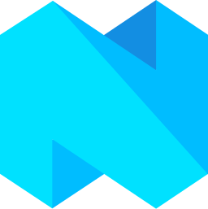<br/><sub><code>nodal</code></sub></a></td></tr>
<tr><td align="center"><a href="./node-sass.svg"><br/><sub><code>node-sass</code></sub></a></td><td align="center"><a href="./nodewebkit.svg"><br/><sub><code>nodewebkit</code></sub></a></td><td align="center"><a href="./nuxt.svg"><br/><sub><code>nuxt</code></sub></a></td><td align="center"><a href="./nuxt-wordmark.svg"><br/><sub><code>nuxt-wordmark</code></sub></a></td><td align="center"><a href="./openframeworks.svg"><br/><sub><code>openframeworks</code></sub></a></td><td align="center"><a href="./opengl.svg"><br/><sub><code>opengl</code></sub></a></td></tr>
<tr><td align="center"><a href="./openlayers.svg"><br/><sub><code>openlayers</code></sub></a></td><td align="center"><a href="./p5js.svg"><br/><sub><code>p5js</code></sub></a></td><td align="center"><a href="./pandacss.svg"><br/><sub><code>pandacss</code></sub></a></td><td align="center"><a href="./pandacss-wordmark.svg"><br/><sub><code>pandacss-wordmark</code></sub></a></td><td align="center"><a href="./partytown.svg"><br/><sub><code>partytown</code></sub></a></td><td align="center"><a href="./partytown-wordmark.svg"><br/><sub><code>partytown-wordmark</code></sub></a></td></tr>
<tr><td align="center"><a href="./pepperoni.svg"><br/><sub><code>pepperoni</code></sub></a></td><td align="center"><a href="./phalcon.svg"><br/><sub><code>phalcon</code></sub></a></td><td align="center"><a href="./phoenix.svg"><br/><sub><code>phoenix</code></sub></a></td><td align="center"><a href="./phonegap.svg"><br/><sub><code>phonegap</code></sub></a></td><td align="center"><a href="./phonegap-bot.svg"><br/><sub><code>phonegap-bot</code></sub></a></td><td align="center"><a href="./pinia.svg"><br/><sub><code>pinia</code></sub></a></td></tr>
<tr><td align="center"><a href="./pixijs.svg"><br/><sub><code>pixijs</code></sub></a></td><td align="center"><a href="./play.svg"><br/><sub><code>play</code></sub></a></td><td align="center"><a href="./polymer.svg"><br/><sub><code>polymer</code></sub></a></td><td align="center"><a href="./postcss.svg"><br/><sub><code>postcss</code></sub></a></td><td align="center"><a href="./preact.svg"><br/><sub><code>preact</code></sub></a></td><td align="center"><a href="./processing.svg"><br/><sub><code>processing</code></sub></a></td></tr>
<tr><td align="center"><a href="./pug.svg"><br/><sub><code>pug</code></sub></a></td><td align="center"><a href="./q.svg"><br/><sub><code>q</code></sub></a></td><td align="center"><a href="./qt.svg"><br/><sub><code>qt</code></sub></a></td><td align="center"><a href="./quarkus.svg"><br/><sub><code>quarkus</code></sub></a></td><td align="center"><a href="./quarkus-wordmark.svg"><br/><sub><code>quarkus-wordmark</code></sub></a></td><td align="center"><a href="./qwik.svg"><br/><sub><code>qwik</code></sub></a></td></tr>
<tr><td align="center"><a href="./qwik-wordmark.svg"><br/><sub><code>qwik-wordmark</code></sub></a></td><td align="center"><a href="./rails.svg"><br/><sub><code>rails</code></sub></a></td><td align="center"><a href="./ramda.svg"><br/><sub><code>ramda</code></sub></a></td><td align="center"><a href="./randomcolor.svg"><br/><sub><code>randomcolor</code></sub></a></td><td align="center"><a href="./raphael.svg"><br/><sub><code>raphael</code></sub></a></td><td align="center"><a href="./rax.svg"><br/><sub><code>rax</code></sub></a></td></tr>
<tr><td align="center"><a href="./react.svg"><br/><sub><code>react</code></sub></a></td><td align="center"><a href="./react-query.svg"><br/><sub><code>react-query</code></sub></a></td><td align="center"><a href="./react-query-wordmark.svg"><br/><sub><code>react-query-wordmark</code></sub></a></td><td align="center"><a href="./react-router.svg"><br/><sub><code>react-router</code></sub></a></td><td align="center"><a href="./react-spring.svg"><br/><sub><code>react-spring</code></sub></a></td><td align="center"><a href="./react-styleguidist.svg"><br/><sub><code>react-styleguidist</code></sub></a></td></tr>
<tr><td align="center"><a href="./reactivex.svg"><br/><sub><code>reactivex</code></sub></a></td><td align="center"><a href="./reapp.svg"><br/><sub><code>reapp</code></sub></a></td><td align="center"><a href="./recoil.svg"><br/><sub><code>recoil</code></sub></a></td><td align="center"><a href="./recoil-wordmark.svg"><br/><sub><code>recoil-wordmark</code></sub></a></td><td align="center"><a href="./redux.svg"><br/><sub><code>redux</code></sub></a></td><td align="center"><a href="./redux-observable.svg"><br/><sub><code>redux-observable</code></sub></a></td></tr>
<tr><td align="center"><a href="./redux-saga.svg"><br/><sub><code>redux-saga</code></sub></a></td><td align="center"><a href="./redwoodjs.svg"><br/><sub><code>redwoodjs</code></sub></a></td><td align="center"><a href="./relay.svg"><br/><sub><code>relay</code></sub></a></td><td align="center"><a href="./remix.svg"><br/><sub><code>remix</code></sub></a></td><td align="center"><a href="./remix-wordmark.svg"><br/><sub><code>remix-wordmark</code></sub></a></td><td align="center"><a href="./require.svg"><br/><sub><code>require</code></sub></a></td></tr>
<tr><td align="center"><a href="./rest-li.svg"><br/><sub><code>rest-li</code></sub></a></td><td align="center"><a href="./riot.svg"><br/><sub><code>riot</code></sub></a></td><td align="center"><a href="./sagui.svg"><br/><sub><code>sagui</code></sub></a></td><td align="center"><a href="./sails.svg"><br/><sub><code>sails</code></sub></a></td><td align="center"><a href="./sass.svg"><br/><sub><code>sass</code></sub></a></td><td align="center"><a href="./sass-doc.svg"><br/><sub><code>sass-doc</code></sub></a></td></tr>
<tr><td align="center"><a href="./semantic-ui.svg"><br/><sub><code>semantic-ui</code></sub></a></td><td align="center"><a href="./sencha.svg"><br/><sub><code>sencha</code></sub></a></td><td align="center"><a href="./seneca.svg"><br/><sub><code>seneca</code></sub></a></td><td align="center"><a href="./sinatra.svg"><br/><sub><code>sinatra</code></sub></a></td><td align="center"><a href="./slim.svg"><br/><sub><code>slim</code></sub></a></td><td align="center"><a href="./snap-svg.svg"><br/><sub><code>snap-svg</code></sub></a></td></tr>
<tr><td align="center"><a href="./socket-io.svg"><br/><sub><code>socket-io</code></sub></a></td><td align="center"><a href="./solidjs.svg"><br/><sub><code>solidjs</code></sub></a></td><td align="center"><a href="./solidjs-wordmark.svg"><br/><sub><code>solidjs-wordmark</code></sub></a></td><td align="center"><a href="./spring.svg"><br/><sub><code>spring</code></sub></a></td><td align="center"><a href="./spring-wordmark.svg"><br/><sub><code>spring-wordmark</code></sub></a></td><td align="center"><a href="./stately.svg"><br/><sub><code>stately</code></sub></a></td></tr>
<tr><td align="center"><a href="./stately-wordmark.svg"><br/><sub><code>stately-wordmark</code></sub></a></td><td align="center"><a href="./stenciljs.svg"><br/><sub><code>stenciljs</code></sub></a></td><td align="center"><a href="./stenciljs-wordmark.svg"><br/><sub><code>stenciljs-wordmark</code></sub></a></td><td align="center"><a href="./steroids.svg"><br/><sub><code>steroids</code></sub></a></td><td align="center"><a href="./stimulus.svg"><br/><sub><code>stimulus</code></sub></a></td><td align="center"><a href="./stimulus-wordmark.svg"><br/><sub><code>stimulus-wordmark</code></sub></a></td></tr>
<tr><td align="center"><a href="./strongloop.svg"><br/><sub><code>strongloop</code></sub></a></td><td align="center"><a href="./struts.svg"><br/><sub><code>struts</code></sub></a></td><td align="center"><a href="./stylis.svg"><br/><sub><code>stylis</code></sub></a></td><td align="center"><a href="./stylus.svg"><br/><sub><code>stylus</code></sub></a></td><td align="center"><a href="./sugarss.svg"><br/><sub><code>sugarss</code></sub></a></td><td align="center"><a href="./supersonic.svg"><br/><sub><code>supersonic</code></sub></a></td></tr>
<tr><td align="center"><a href="./susy.svg"><br/><sub><code>susy</code></sub></a></td><td align="center"><a href="./svelte.svg"><br/><sub><code>svelte</code></sub></a></td><td align="center"><a href="./svelte-kit.svg"><br/><sub><code>svelte-kit</code></sub></a></td><td align="center"><a href="./svelte-wordmark.svg"><br/><sub><code>svelte-wordmark</code></sub></a></td><td align="center"><a href="./swr.svg"><br/><sub><code>swr</code></sub></a></td><td align="center"><a href="./symfony.svg"><br/><sub><code>symfony</code></sub></a></td></tr>
<tr><td align="center"><a href="./t3.svg"><br/><sub><code>t3</code></sub></a></td><td align="center"><a href="./tailwindcss.svg"><br/><sub><code>tailwindcss</code></sub></a></td><td align="center"><a href="./tailwindcss-wordmark.svg"><br/><sub><code>tailwindcss-wordmark</code></sub></a></td><td align="center"><a href="./tauri.svg"><br/><sub><code>tauri</code></sub></a></td><td align="center"><a href="./threejs.svg"><br/><sub><code>threejs</code></sub></a></td><td align="center"><a href="./thymeleaf.svg"><br/><sub><code>thymeleaf</code></sub></a></td></tr>
<tr><td align="center"><a href="./thymeleaf-wordmark.svg"><br/><sub><code>thymeleaf-wordmark</code></sub></a></td><td align="center"><a href="./titon.svg"><br/><sub><code>titon</code></sub></a></td><td align="center"><a href="./trpc.svg"><br/><sub><code>trpc</code></sub></a></td><td align="center"><a href="./turret.svg"><br/><sub><code>turret</code></sub></a></td><td align="center"><a href="./uikit.svg"><br/><sub><code>uikit</code></sub></a></td><td align="center"><a href="./unity.svg"><br/><sub><code>unity</code></sub></a></td></tr>
<tr><td align="center"><a href="./unjs.svg"><br/><sub><code>unjs</code></sub></a></td><td align="center"><a href="./unocss.svg"><br/><sub><code>unocss</code></sub></a></td><td align="center"><a href="./unrealengine.svg"><br/><sub><code>unrealengine</code></sub></a></td><td align="center"><a href="./unrealengine-wordmark.svg"><br/><sub><code>unrealengine-wordmark</code></sub></a></td><td align="center"><a href="./vaadin.svg"><br/><sub><code>vaadin</code></sub></a></td><td align="center"><a href="./vue.svg"><br/><sub><code>vue</code></sub></a></td></tr>
<tr><td align="center"><a href="./vuetifyjs.svg"><br/><sub><code>vuetifyjs</code></sub></a></td><td align="center"><a href="./vueuse.svg"><br/><sub><code>vueuse</code></sub></a></td><td align="center"><a href="./vulkan.svg"><br/><sub><code>vulkan</code></sub></a></td><td align="center"><a href="./webix.svg"><br/><sub><code>webix</code></sub></a></td><td align="center"><a href="./webix-wordmark.svg"><br/><sub><code>webix-wordmark</code></sub></a></td><td align="center"><a href="./wicket.svg"><br/><sub><code>wicket</code></sub></a></td></tr>
<tr><td align="center"><a href="./wicket-wordmark.svg"><br/><sub><code>wicket-wordmark</code></sub></a></td><td align="center"><a href="./windi-css.svg"><br/><sub><code>windi-css</code></sub></a></td><td align="center"><a href="./xamarin.svg"><br/><sub><code>xamarin</code></sub></a></td><td align="center"><a href="./xstate.svg"><br/><sub><code>xstate</code></sub></a></td><td align="center"><a href="./yii.svg"><br/><sub><code>yii</code></sub></a></td><td align="center"><a href="./zend-framework.svg"><br/><sub><code>zend-framework</code></sub></a></td></tr>
<tr><td align="center"><a href="./zod.svg"><br/><sub><code>zod</code></sub></a></td></tr>
</table>

<p align="right"><a href="#toc">⬆️ Back to top</a></p>
<a id="cat-dev"></a>

## 🛠️ Dev Tools, CI/CD & Testing <sub>(512)</sub>

<table>
<tr><td align="center"><a href="./aerogear.svg"><br/><sub><code>aerogear</code></sub></a></td><td align="center"><a href="./airbrake.svg"><br/><sub><code>airbrake</code></sub></a></td><td align="center"><a href="./amplication.svg"><br/><sub><code>amplication</code></sub></a></td><td align="center"><a href="./amplication-wordmark.svg"><br/><sub><code>amplication-wordmark</code></sub></a></td><td align="center"><a href="./ansible.svg"><br/><sub><code>ansible</code></sub></a></td><td align="center"><a href="./apache.svg"><br/><sub><code>apache</code></sub></a></td></tr>
<tr><td align="center"><a href="./apache-camel.svg"><br/><sub><code>apache-camel</code></sub></a></td><td align="center"><a href="./apache-cloudstack.svg"><br/><sub><code>apache-cloudstack</code></sub></a></td><td align="center"><a href="./apiary.svg"><br/><sub><code>apiary</code></sub></a></td><td align="center"><a href="./apidog.svg"><br/><sub><code>apidog</code></sub></a></td><td align="center"><a href="./apidog-wordmark.svg"><br/><sub><code>apidog-wordmark</code></sub></a></td><td align="center"><a href="./apigee.svg"><br/><sub><code>apigee</code></sub></a></td></tr>
<tr><td align="center"><a href="./apitools.svg"><br/><sub><code>apitools</code></sub></a></td><td align="center"><a href="./appcelerator.svg"><br/><sub><code>appcelerator</code></sub></a></td><td align="center"><a href="./appcenter.svg"><br/><sub><code>appcenter</code></sub></a></td><td align="center"><a href="./appcenter-wordmark.svg"><br/><sub><code>appcenter-wordmark</code></sub></a></td><td align="center"><a href="./appcircle.svg"><br/><sub><code>appcircle</code></sub></a></td><td align="center"><a href="./appcircle-wordmark.svg"><br/><sub><code>appcircle-wordmark</code></sub></a></td></tr>
<tr><td align="center"><a href="./appcode.svg"><br/><sub><code>appcode</code></sub></a></td><td align="center"><a href="./appdynamics.svg"><br/><sub><code>appdynamics</code></sub></a></td><td align="center"><a href="./appdynamics-wordmark.svg"><br/><sub><code>appdynamics-wordmark</code></sub></a></td><td align="center"><a href="./apphub.svg"><br/><sub><code>apphub</code></sub></a></td><td align="center"><a href="./appium.svg"><br/><sub><code>appium</code></sub></a></td><td align="center"><a href="./applitools.svg"><br/><sub><code>applitools</code></sub></a></td></tr>
<tr><td align="center"><a href="./applitools-wordmark.svg"><br/><sub><code>applitools-wordmark</code></sub></a></td><td align="center"><a href="./appmaker.svg"><br/><sub><code>appmaker</code></sub></a></td><td align="center"><a href="./apportable.svg"><br/><sub><code>apportable</code></sub></a></td><td align="center"><a href="./appsignal.svg"><br/><sub><code>appsignal</code></sub></a></td><td align="center"><a href="./appsignal-wordmark.svg"><br/><sub><code>appsignal-wordmark</code></sub></a></td><td align="center"><a href="./appveyor.svg"><br/><sub><code>appveyor</code></sub></a></td></tr>
<tr><td align="center"><a href="./architect.svg"><br/><sub><code>architect</code></sub></a></td><td align="center"><a href="./architect-wordmark.svg"><br/><sub><code>architect-wordmark</code></sub></a></td><td align="center"><a href="./argo.svg"><br/><sub><code>argo</code></sub></a></td><td align="center"><a href="./argo-wordmark.svg"><br/><sub><code>argo-wordmark</code></sub></a></td><td align="center"><a href="./armory.svg"><br/><sub><code>armory</code></sub></a></td><td align="center"><a href="./armory-wordmark.svg"><br/><sub><code>armory-wordmark</code></sub></a></td></tr>
<tr><td align="center"><a href="./asciidoctor.svg"><br/><sub><code>asciidoctor</code></sub></a></td><td align="center"><a href="./assembla.svg"><br/><sub><code>assembla</code></sub></a></td><td align="center"><a href="./assembla-wordmark.svg"><br/><sub><code>assembla-wordmark</code></sub></a></td><td align="center"><a href="./async-api.svg"><br/><sub><code>async-api</code></sub></a></td><td align="center"><a href="./async-api-wordmark.svg"><br/><sub><code>async-api-wordmark</code></sub></a></td><td align="center"><a href="./atom.svg"><br/><sub><code>atom</code></sub></a></td></tr>
<tr><td align="center"><a href="./atom-wordmark.svg"><br/><sub><code>atom-wordmark</code></sub></a></td><td align="center"><a href="./autocode.svg"><br/><sub><code>autocode</code></sub></a></td><td align="center"><a href="./ava.svg"><br/><sub><code>ava</code></sub></a></td><td align="center"><a href="./babel.svg"><br/><sub><code>babel</code></sub></a></td><td align="center"><a href="./bamboo.svg"><br/><sub><code>bamboo</code></sub></a></td><td align="center"><a href="./bash.svg"><br/><sub><code>bash</code></sub></a></td></tr>
<tr><td align="center"><a href="./bash-wordmark.svg"><br/><sub><code>bash-wordmark</code></sub></a></td><td align="center"><a href="./beats.svg"><br/><sub><code>beats</code></sub></a></td><td align="center"><a href="./bigpanda.svg"><br/><sub><code>bigpanda</code></sub></a></td><td align="center"><a href="./biomejs.svg"><br/><sub><code>biomejs</code></sub></a></td><td align="center"><a href="./biomejs-wordmark.svg"><br/><sub><code>biomejs-wordmark</code></sub></a></td><td align="center"><a href="./bitbar.svg"><br/><sub><code>bitbar</code></sub></a></td></tr>
<tr><td align="center"><a href="./bitbucket.svg"><br/><sub><code>bitbucket</code></sub></a></td><td align="center"><a href="./bitnami.svg"><br/><sub><code>bitnami</code></sub></a></td><td align="center"><a href="./bitrise.svg"><br/><sub><code>bitrise</code></sub></a></td><td align="center"><a href="./bitrise-wordmark.svg"><br/><sub><code>bitrise-wordmark</code></sub></a></td><td align="center"><a href="./bosun.svg"><br/><sub><code>bosun</code></sub></a></td><td align="center"><a href="./bower.svg"><br/><sub><code>bower</code></sub></a></td></tr>
<tr><td align="center"><a href="./brackets.svg"><br/><sub><code>brackets</code></sub></a></td><td align="center"><a href="./broccoli.svg"><br/><sub><code>broccoli</code></sub></a></td><td align="center"><a href="./brotli.svg"><br/><sub><code>brotli</code></sub></a></td><td align="center"><a href="./browserify.svg"><br/><sub><code>browserify</code></sub></a></td><td align="center"><a href="./browserify-wordmark.svg"><br/><sub><code>browserify-wordmark</code></sub></a></td><td align="center"><a href="./browserling.svg"><br/><sub><code>browserling</code></sub></a></td></tr>
<tr><td align="center"><a href="./browserslist.svg"><br/><sub><code>browserslist</code></sub></a></td><td align="center"><a href="./browserstack.svg"><br/><sub><code>browserstack</code></sub></a></td><td align="center"><a href="./browsersync.svg"><br/><sub><code>browsersync</code></sub></a></td><td align="center"><a href="./brunch.svg"><br/><sub><code>brunch</code></sub></a></td><td align="center"><a href="./buck.svg"><br/><sub><code>buck</code></sub></a></td><td align="center"><a href="./buddy.svg"><br/><sub><code>buddy</code></sub></a></td></tr>
<tr><td align="center"><a href="./bugherd.svg"><br/><sub><code>bugherd</code></sub></a></td><td align="center"><a href="./bugherd-wordmark.svg"><br/><sub><code>bugherd-wordmark</code></sub></a></td><td align="center"><a href="./bugsee.svg"><br/><sub><code>bugsee</code></sub></a></td><td align="center"><a href="./bugsnag.svg"><br/><sub><code>bugsnag</code></sub></a></td><td align="center"><a href="./bugsnag-wordmark.svg"><br/><sub><code>bugsnag-wordmark</code></sub></a></td><td align="center"><a href="./buildkite.svg"><br/><sub><code>buildkite</code></sub></a></td></tr>
<tr><td align="center"><a href="./buildkite-wordmark.svg"><br/><sub><code>buildkite-wordmark</code></sub></a></td><td align="center"><a href="./cachet.svg"><br/><sub><code>cachet</code></sub></a></td><td align="center"><a href="./calibre.svg"><br/><sub><code>calibre</code></sub></a></td><td align="center"><a href="./calibre-wordmark.svg"><br/><sub><code>calibre-wordmark</code></sub></a></td><td align="center"><a href="./capistrano.svg"><br/><sub><code>capistrano</code></sub></a></td><td align="center"><a href="./carbide.svg"><br/><sub><code>carbide</code></sub></a></td></tr>
<tr><td align="center"><a href="./chai.svg"><br/><sub><code>chai</code></sub></a></td><td align="center"><a href="./chalk.svg"><br/><sub><code>chalk</code></sub></a></td><td align="center"><a href="./chef.svg"><br/><sub><code>chef</code></sub></a></td><td align="center"><a href="./chromatic.svg"><br/><sub><code>chromatic</code></sub></a></td><td align="center"><a href="./chromatic-wordmark.svg"><br/><sub><code>chromatic-wordmark</code></sub></a></td><td align="center"><a href="./circleci.svg"><br/><sub><code>circleci</code></sub></a></td></tr>
<tr><td align="center"><a href="./cirrus.svg"><br/><sub><code>cirrus</code></sub></a></td><td align="center"><a href="./cirrus-ci.svg"><br/><sub><code>cirrus-ci</code></sub></a></td><td align="center"><a href="./clickdeploy.svg"><br/><sub><code>clickdeploy</code></sub></a></td><td align="center"><a href="./clion.svg"><br/><sub><code>clion</code></sub></a></td><td align="center"><a href="./cloud9.svg"><br/><sub><code>cloud9</code></sub></a></td><td align="center"><a href="./cocoapods.svg"><br/><sub><code>cocoapods</code></sub></a></td></tr>
<tr><td align="center"><a href="./codacy.svg"><br/><sub><code>codacy</code></sub></a></td><td align="center"><a href="./codebase.svg"><br/><sub><code>codebase</code></sub></a></td><td align="center"><a href="./codebeat.svg"><br/><sub><code>codebeat</code></sub></a></td><td align="center"><a href="./codeception.svg"><br/><sub><code>codeception</code></sub></a></td><td align="center"><a href="./codeclimate.svg"><br/><sub><code>codeclimate</code></sub></a></td><td align="center"><a href="./codeclimate-wordmark.svg"><br/><sub><code>codeclimate-wordmark</code></sub></a></td></tr>
<tr><td align="center"><a href="./codecov.svg"><br/><sub><code>codecov</code></sub></a></td><td align="center"><a href="./codecov-wordmark.svg"><br/><sub><code>codecov-wordmark</code></sub></a></td><td align="center"><a href="./codefactor.svg"><br/><sub><code>codefactor</code></sub></a></td><td align="center"><a href="./codefactor-wordmark.svg"><br/><sub><code>codefactor-wordmark</code></sub></a></td><td align="center"><a href="./codepen.svg"><br/><sub><code>codepen</code></sub></a></td><td align="center"><a href="./codepen-wordmark.svg"><br/><sub><code>codepen-wordmark</code></sub></a></td></tr>
<tr><td align="center"><a href="./codepicnic.svg"><br/><sub><code>codepicnic</code></sub></a></td><td align="center"><a href="./codepush.svg"><br/><sub><code>codepush</code></sub></a></td><td align="center"><a href="./codersrank.svg"><br/><sub><code>codersrank</code></sub></a></td><td align="center"><a href="./codersrank-wordmark.svg"><br/><sub><code>codersrank-wordmark</code></sub></a></td><td align="center"><a href="./coderwall.svg"><br/><sub><code>coderwall</code></sub></a></td><td align="center"><a href="./codesandbox.svg"><br/><sub><code>codesandbox</code></sub></a></td></tr>
<tr><td align="center"><a href="./codesandbox-wordmark.svg"><br/><sub><code>codesandbox-wordmark</code></sub></a></td><td align="center"><a href="./codeschool.svg"><br/><sub><code>codeschool</code></sub></a></td><td align="center"><a href="./codesee.svg"><br/><sub><code>codesee</code></sub></a></td><td align="center"><a href="./codesee-wordmark.svg"><br/><sub><code>codesee-wordmark</code></sub></a></td><td align="center"><a href="./codeship.svg"><br/><sub><code>codeship</code></sub></a></td><td align="center"><a href="./codio.svg"><br/><sub><code>codio</code></sub></a></td></tr>
<tr><td align="center"><a href="./codium.svg"><br/><sub><code>codium</code></sub></a></td><td align="center"><a href="./codium-wordmark.svg"><br/><sub><code>codium-wordmark</code></sub></a></td><td align="center"><a href="./commitizen.svg"><br/><sub><code>commitizen</code></sub></a></td><td align="center"><a href="./compose.svg"><br/><sub><code>compose</code></sub></a></td><td align="center"><a href="./composer.svg"><br/><sub><code>composer</code></sub></a></td><td align="center"><a href="./conan-io.svg"><br/><sub><code>conan-io</code></sub></a></td></tr>
<tr><td align="center"><a href="./concourse.svg"><br/><sub><code>concourse</code></sub></a></td><td align="center"><a href="./conda.svg"><br/><sub><code>conda</code></sub></a></td><td align="center"><a href="./consul.svg"><br/><sub><code>consul</code></sub></a></td><td align="center"><a href="./coveralls.svg"><br/><sub><code>coveralls</code></sub></a></td><td align="center"><a href="./coverity.svg"><br/><sub><code>coverity</code></sub></a></td><td align="center"><a href="./crashlytics.svg"><br/><sub><code>crashlytics</code></sub></a></td></tr>
<tr><td align="center"><a href="./crittercism.svg"><br/><sub><code>crittercism</code></sub></a></td><td align="center"><a href="./cross-browser-testing.svg"><br/><sub><code>cross-browser-testing</code></sub></a></td><td align="center"><a href="./crossbrowsertesting.svg"><br/><sub><code>crossbrowsertesting</code></sub></a></td><td align="center"><a href="./crossplane.svg"><br/><sub><code>crossplane</code></sub></a></td><td align="center"><a href="./crossplane-wordmark.svg"><br/><sub><code>crossplane-wordmark</code></sub></a></td><td align="center"><a href="./crucible.svg"><br/><sub><code>crucible</code></sub></a></td></tr>
<tr><td align="center"><a href="./cucumber.svg"><br/><sub><code>cucumber</code></sub></a></td><td align="center"><a href="./curl.svg"><br/><sub><code>curl</code></sub></a></td><td align="center"><a href="./cypress.svg"><br/><sub><code>cypress</code></sub></a></td><td align="center"><a href="./cypress-wordmark.svg"><br/><sub><code>cypress-wordmark</code></sub></a></td><td align="center"><a href="./dat.svg"><br/><sub><code>dat</code></sub></a></td><td align="center"><a href="./datadog.svg"><br/><sub><code>datadog</code></sub></a></td></tr>
<tr><td align="center"><a href="./datadog-wordmark.svg"><br/><sub><code>datadog-wordmark</code></sub></a></td><td align="center"><a href="./datagrip.svg"><br/><sub><code>datagrip</code></sub></a></td><td align="center"><a href="./dataspell.svg"><br/><sub><code>dataspell</code></sub></a></td><td align="center"><a href="./dependabot.svg"><br/><sub><code>dependabot</code></sub></a></td><td align="center"><a href="./dependencyci.svg"><br/><sub><code>dependencyci</code></sub></a></td><td align="center"><a href="./deploy.svg"><br/><sub><code>deploy</code></sub></a></td></tr>
<tr><td align="center"><a href="./deployhq.svg"><br/><sub><code>deployhq</code></sub></a></td><td align="center"><a href="./deployhq-wordmark.svg"><br/><sub><code>deployhq-wordmark</code></sub></a></td><td align="center"><a href="./deppbot.svg"><br/><sub><code>deppbot</code></sub></a></td><td align="center"><a href="./dimer.svg"><br/><sub><code>dimer</code></sub></a></td><td align="center"><a href="./distelli.svg"><br/><sub><code>distelli</code></sub></a></td><td align="center"><a href="./dockbit.svg"><br/><sub><code>dockbit</code></sub></a></td></tr>
<tr><td align="center"><a href="./docker.svg"><br/><sub><code>docker</code></sub></a></td><td align="center"><a href="./docker-wordmark.svg"><br/><sub><code>docker-wordmark</code></sub></a></td><td align="center"><a href="./docusaurus.svg"><br/><sub><code>docusaurus</code></sub></a></td><td align="center"><a href="./dreamfactory.svg"><br/><sub><code>dreamfactory</code></sub></a></td><td align="center"><a href="./drone.svg"><br/><sub><code>drone</code></sub></a></td><td align="center"><a href="./drone-wordmark.svg"><br/><sub><code>drone-wordmark</code></sub></a></td></tr>
<tr><td align="center"><a href="./drools.svg"><br/><sub><code>drools</code></sub></a></td><td align="center"><a href="./drools-wordmark.svg"><br/><sub><code>drools-wordmark</code></sub></a></td><td align="center"><a href="./dynatrace.svg"><br/><sub><code>dynatrace</code></sub></a></td><td align="center"><a href="./dynatrace-wordmark.svg"><br/><sub><code>dynatrace-wordmark</code></sub></a></td><td align="center"><a href="./eclipse.svg"><br/><sub><code>eclipse</code></sub></a></td><td align="center"><a href="./eclipse-wordmark.svg"><br/><sub><code>eclipse-wordmark</code></sub></a></td></tr>
<tr><td align="center"><a href="./editorconfig.svg"><br/><sub><code>editorconfig</code></sub></a></td><td align="center"><a href="./emacs.svg"><br/><sub><code>emacs</code></sub></a></td><td align="center"><a href="./emacs-classic.svg"><br/><sub><code>emacs-classic</code></sub></a></td><td align="center"><a href="./embedly.svg"><br/><sub><code>embedly</code></sub></a></td><td align="center"><a href="./emmet.svg"><br/><sub><code>emmet</code></sub></a></td><td align="center"><a href="./envoy.svg"><br/><sub><code>envoy</code></sub></a></td></tr>
<tr><td align="center"><a href="./envoy-wordmark.svg"><br/><sub><code>envoy-wordmark</code></sub></a></td><td align="center"><a href="./envoyer.svg"><br/><sub><code>envoyer</code></sub></a></td><td align="center"><a href="./envoyproxy.svg"><br/><sub><code>envoyproxy</code></sub></a></td><td align="center"><a href="./epsagon.svg"><br/><sub><code>epsagon</code></sub></a></td><td align="center"><a href="./epsagon-wordmark.svg"><br/><sub><code>epsagon-wordmark</code></sub></a></td><td align="center"><a href="./esbuild.svg"><br/><sub><code>esbuild</code></sub></a></td></tr>
<tr><td align="center"><a href="./esdoc.svg"><br/><sub><code>esdoc</code></sub></a></td><td align="center"><a href="./eslint.svg"><br/><sub><code>eslint</code></sub></a></td><td align="center"><a href="./eslint-old.svg"><br/><sub><code>eslint-old</code></sub></a></td><td align="center"><a href="./etcd.svg"><br/><sub><code>etcd</code></sub></a></td><td align="center"><a href="./eventsentry.svg"><br/><sub><code>eventsentry</code></sub></a></td><td align="center"><a href="./fabric.svg"><br/><sub><code>fabric</code></sub></a></td></tr>
<tr><td align="center"><a href="./fabric-io.svg"><br/><sub><code>fabric-io</code></sub></a></td><td align="center"><a href="./faker.svg"><br/><sub><code>faker</code></sub></a></td><td align="center"><a href="./fastlane.svg"><br/><sub><code>fastlane</code></sub></a></td><td align="center"><a href="./floodio.svg"><br/><sub><code>floodio</code></sub></a></td><td align="center"><a href="./flow.svg"><br/><sub><code>flow</code></sub></a></td><td align="center"><a href="./fogbugz.svg"><br/><sub><code>fogbugz</code></sub></a></td></tr>
<tr><td align="center"><a href="./fogbugz-wordmark.svg"><br/><sub><code>fogbugz-wordmark</code></sub></a></td><td align="center"><a href="./forest.svg"><br/><sub><code>forest</code></sub></a></td><td align="center"><a href="./forestadmin.svg"><br/><sub><code>forestadmin</code></sub></a></td><td align="center"><a href="./forestadmin-wordmark.svg"><br/><sub><code>forestadmin-wordmark</code></sub></a></td><td align="center"><a href="./forever.svg"><br/><sub><code>forever</code></sub></a></td><td align="center"><a href="./formkeep.svg"><br/><sub><code>formkeep</code></sub></a></td></tr>
<tr><td align="center"><a href="./gaugeio.svg"><br/><sub><code>gaugeio</code></sub></a></td><td align="center"><a href="./git.svg"><br/><sub><code>git</code></sub></a></td><td align="center"><a href="./git-wordmark.svg"><br/><sub><code>git-wordmark</code></sub></a></td><td align="center"><a href="./gitboard.svg"><br/><sub><code>gitboard</code></sub></a></td><td align="center"><a href="./github.svg"><br/><sub><code>github</code></sub></a></td><td align="center"><a href="./github-actions.svg"><br/><sub><code>github-actions</code></sub></a></td></tr>
<tr><td align="center"><a href="./github-octocat.svg"><br/><sub><code>github-octocat</code></sub></a></td><td align="center"><a href="./github-wordmark.svg"><br/><sub><code>github-wordmark</code></sub></a></td><td align="center"><a href="./gitkraken.svg"><br/><sub><code>gitkraken</code></sub></a></td><td align="center"><a href="./gitlab.svg"><br/><sub><code>gitlab</code></sub></a></td><td align="center"><a href="./gitlab-wordmark.svg"><br/><sub><code>gitlab-wordmark</code></sub></a></td><td align="center"><a href="./gitup.svg"><br/><sub><code>gitup</code></sub></a></td></tr>
<tr><td align="center"><a href="./glint.svg"><br/><sub><code>glint</code></sub></a></td><td align="center"><a href="./glitch.svg"><br/><sub><code>glitch</code></sub></a></td><td align="center"><a href="./glitch-wordmark.svg"><br/><sub><code>glitch-wordmark</code></sub></a></td><td align="center"><a href="./gocd.svg"><br/><sub><code>gocd</code></sub></a></td><td align="center"><a href="./goland.svg"><br/><sub><code>goland</code></sub></a></td><td align="center"><a href="./gomix.svg"><br/><sub><code>gomix</code></sub></a></td></tr>
<tr><td align="center"><a href="./gradle.svg"><br/><sub><code>gradle</code></sub></a></td><td align="center"><a href="./grafana.svg"><br/><sub><code>grafana</code></sub></a></td><td align="center"><a href="./graylog.svg"><br/><sub><code>graylog</code></sub></a></td><td align="center"><a href="./graylog-wordmark.svg"><br/><sub><code>graylog-wordmark</code></sub></a></td><td align="center"><a href="./growth-book.svg"><br/><sub><code>growth-book</code></sub></a></td><td align="center"><a href="./growth-book-wordmark.svg"><br/><sub><code>growth-book-wordmark</code></sub></a></td></tr>
<tr><td align="center"><a href="./grunt.svg"><br/><sub><code>grunt</code></sub></a></td><td align="center"><a href="./gulp.svg"><br/><sub><code>gulp</code></sub></a></td><td align="center"><a href="./gunicorn.svg"><br/><sub><code>gunicorn</code></sub></a></td><td align="center"><a href="./harness.svg"><br/><sub><code>harness</code></sub></a></td><td align="center"><a href="./harness-wordmark.svg"><br/><sub><code>harness-wordmark</code></sub></a></td><td align="center"><a href="./harrow.svg"><br/><sub><code>harrow</code></sub></a></td></tr>
<tr><td align="center"><a href="./helm.svg"><br/><sub><code>helm</code></sub></a></td><td align="center"><a href="./homebrew.svg"><br/><sub><code>homebrew</code></sub></a></td><td align="center"><a href="./hosted-graphite.svg"><br/><sub><code>hosted-graphite</code></sub></a></td><td align="center"><a href="./houndci.svg"><br/><sub><code>houndci</code></sub></a></td><td align="center"><a href="./httpie.svg"><br/><sub><code>httpie</code></sub></a></td><td align="center"><a href="./httpie-wordmark.svg"><br/><sub><code>httpie-wordmark</code></sub></a></td></tr>
<tr><td align="center"><a href="./hyper.svg"><br/><sub><code>hyper</code></sub></a></td><td align="center"><a href="./imagemin.svg"><br/><sub><code>imagemin</code></sub></a></td><td align="center"><a href="./incident.svg"><br/><sub><code>incident</code></sub></a></td><td align="center"><a href="./incident-wordmark.svg"><br/><sub><code>incident-wordmark</code></sub></a></td><td align="center"><a href="./infer.svg"><br/><sub><code>infer</code></sub></a></td><td align="center"><a href="./insomnia.svg"><br/><sub><code>insomnia</code></sub></a></td></tr>
<tr><td align="center"><a href="./intellij-idea.svg"><br/><sub><code>intellij-idea</code></sub></a></td><td align="center"><a href="./jasmine.svg"><br/><sub><code>jasmine</code></sub></a></td><td align="center"><a href="./jenkins.svg"><br/><sub><code>jenkins</code></sub></a></td><td align="center"><a href="./jest.svg"><br/><sub><code>jest</code></sub></a></td><td align="center"><a href="./jetbrains.svg"><br/><sub><code>jetbrains</code></sub></a></td><td align="center"><a href="./jetbrains-space.svg"><br/><sub><code>jetbrains-space</code></sub></a></td></tr>
<tr><td align="center"><a href="./jetbrains-space-wordmark.svg"><br/><sub><code>jetbrains-space-wordmark</code></sub></a></td><td align="center"><a href="./jetbrains-wordmark.svg"><br/><sub><code>jetbrains-wordmark</code></sub></a></td><td align="center"><a href="./jfrog.svg"><br/><sub><code>jfrog</code></sub></a></td><td align="center"><a href="./jsbin.svg"><br/><sub><code>jsbin</code></sub></a></td><td align="center"><a href="./jscs.svg"><br/><sub><code>jscs</code></sub></a></td><td align="center"><a href="./jsdom.svg"><br/><sub><code>jsdom</code></sub></a></td></tr>
<tr><td align="center"><a href="./jsfiddle.svg"><br/><sub><code>jsfiddle</code></sub></a></td><td align="center"><a href="./jspm.svg"><br/><sub><code>jspm</code></sub></a></td><td align="center"><a href="./kallithea.svg"><br/><sub><code>kallithea</code></sub></a></td><td align="center"><a href="./karma.svg"><br/><sub><code>karma</code></sub></a></td><td align="center"><a href="./katalon.svg"><br/><sub><code>katalon</code></sub></a></td><td align="center"><a href="./katalon-wordmark.svg"><br/><sub><code>katalon-wordmark</code></sub></a></td></tr>
<tr><td align="center"><a href="./keymetrics.svg"><br/><sub><code>keymetrics</code></sub></a></td><td align="center"><a href="./kibana.svg"><br/><sub><code>kibana</code></sub></a></td><td align="center"><a href="./kitematic.svg"><br/><sub><code>kitematic</code></sub></a></td><td align="center"><a href="./kong.svg"><br/><sub><code>kong</code></sub></a></td><td align="center"><a href="./kong-wordmark.svg"><br/><sub><code>kong-wordmark</code></sub></a></td><td align="center"><a href="./kops.svg"><br/><sub><code>kops</code></sub></a></td></tr>
<tr><td align="center"><a href="./kubernetes.svg"><br/><sub><code>kubernetes</code></sub></a></td><td align="center"><a href="./kustomer.svg"><br/><sub><code>kustomer</code></sub></a></td><td align="center"><a href="./launchdarkly.svg"><br/><sub><code>launchdarkly</code></sub></a></td><td align="center"><a href="./launchdarkly-wordmark.svg"><br/><sub><code>launchdarkly-wordmark</code></sub></a></td><td align="center"><a href="./launchkit.svg"><br/><sub><code>launchkit</code></sub></a></td><td align="center"><a href="./lerna.svg"><br/><sub><code>lerna</code></sub></a></td></tr>
<tr><td align="center"><a href="./librato.svg"><br/><sub><code>librato</code></sub></a></td><td align="center"><a href="./lighthouse.svg"><br/><sub><code>lighthouse</code></sub></a></td><td align="center"><a href="./lightstep.svg"><br/><sub><code>lightstep</code></sub></a></td><td align="center"><a href="./lightstep-wordmark.svg"><br/><sub><code>lightstep-wordmark</code></sub></a></td><td align="center"><a href="./lighttpd.svg"><br/><sub><code>lighttpd</code></sub></a></td><td align="center"><a href="./loader.svg"><br/><sub><code>loader</code></sub></a></td></tr>
<tr><td align="center"><a href="./logentries.svg"><br/><sub><code>logentries</code></sub></a></td><td align="center"><a href="./loggly.svg"><br/><sub><code>loggly</code></sub></a></td><td align="center"><a href="./logmatic.svg"><br/><sub><code>logmatic</code></sub></a></td><td align="center"><a href="./logstash.svg"><br/><sub><code>logstash</code></sub></a></td><td align="center"><a href="./madge.svg"><br/><sub><code>madge</code></sub></a></td><td align="center"><a href="./maestro.svg"><br/><sub><code>maestro</code></sub></a></td></tr>
<tr><td align="center"><a href="./maildeveloper.svg"><br/><sub><code>maildeveloper</code></sub></a></td><td align="center"><a href="./manifoldjs.svg"><br/><sub><code>manifoldjs</code></sub></a></td><td align="center"><a href="./manuscript.svg"><br/><sub><code>manuscript</code></sub></a></td><td align="center"><a href="./maven.svg"><br/><sub><code>maven</code></sub></a></td><td align="center"><a href="./mercurial.svg"><br/><sub><code>mercurial</code></sub></a></td><td align="center"><a href="./mocha.svg"><br/><sub><code>mocha</code></sub></a></td></tr>
<tr><td align="center"><a href="./modernizr.svg"><br/><sub><code>modernizr</code></sub></a></td><td align="center"><a href="./mps.svg"><br/><sub><code>mps</code></sub></a></td><td align="center"><a href="./mps-wordmark.svg"><br/><sub><code>mps-wordmark</code></sub></a></td><td align="center"><a href="./msw.svg"><br/><sub><code>msw</code></sub></a></td><td align="center"><a href="./msw-wordmark.svg"><br/><sub><code>msw-wordmark</code></sub></a></td><td align="center"><a href="./neovim.svg"><br/><sub><code>neovim</code></sub></a></td></tr>
<tr><td align="center"><a href="./netbeans.svg"><br/><sub><code>netbeans</code></sub></a></td><td align="center"><a href="./netuitive.svg"><br/><sub><code>netuitive</code></sub></a></td><td align="center"><a href="./new-relic.svg"><br/><sub><code>new-relic</code></sub></a></td><td align="center"><a href="./new-relic-wordmark.svg"><br/><sub><code>new-relic-wordmark</code></sub></a></td><td align="center"><a href="./nginx.svg"><br/><sub><code>nginx</code></sub></a></td><td align="center"><a href="./ngrok.svg"><br/><sub><code>ngrok</code></sub></a></td></tr>
<tr><td align="center"><a href="./nightwatch.svg"><br/><sub><code>nightwatch</code></sub></a></td><td align="center"><a href="./nodebots.svg"><br/><sub><code>nodebots</code></sub></a></td><td align="center"><a href="./nodemon.svg"><br/><sub><code>nodemon</code></sub></a></td><td align="center"><a href="./npm.svg"><br/><sub><code>npm</code></sub></a></td><td align="center"><a href="./npm-2.svg"><br/><sub><code>npm-2</code></sub></a></td><td align="center"><a href="./npm-wordmark.svg"><br/><sub><code>npm-wordmark</code></sub></a></td></tr>
<tr><td align="center"><a href="./nuclide.svg"><br/><sub><code>nuclide</code></sub></a></td><td align="center"><a href="./nvm.svg"><br/><sub><code>nvm</code></sub></a></td><td align="center"><a href="./nx.svg"><br/><sub><code>nx</code></sub></a></td><td align="center"><a href="./octopus-deploy.svg"><br/><sub><code>octopus-deploy</code></sub></a></td><td align="center"><a href="./opbeat.svg"><br/><sub><code>opbeat</code></sub></a></td><td align="center"><a href="./openapi.svg"><br/><sub><code>openapi</code></sub></a></td></tr>
<tr><td align="center"><a href="./openapi-wordmark.svg"><br/><sub><code>openapi-wordmark</code></sub></a></td><td align="center"><a href="./opentelemetry.svg"><br/><sub><code>opentelemetry</code></sub></a></td><td align="center"><a href="./opentelemetry-wordmark.svg"><br/><sub><code>opentelemetry-wordmark</code></sub></a></td><td align="center"><a href="./opsee.svg"><br/><sub><code>opsee</code></sub></a></td><td align="center"><a href="./opsgenie.svg"><br/><sub><code>opsgenie</code></sub></a></td><td align="center"><a href="./opsmatic.svg"><br/><sub><code>opsmatic</code></sub></a></td></tr>
<tr><td align="center"><a href="./otto.svg"><br/><sub><code>otto</code></sub></a></td><td align="center"><a href="./oxc.svg"><br/><sub><code>oxc</code></sub></a></td><td align="center"><a href="./oxc-dark.svg"><br/><sub><code>oxc-dark</code></sub></a></td><td align="center"><a href="./oxc-icon-dark.svg"><br/><sub><code>oxc-icon-dark</code></sub></a></td><td align="center"><a href="./oxc-wordmark.svg"><br/><sub><code>oxc-wordmark</code></sub></a></td><td align="center"><a href="./packer.svg"><br/><sub><code>packer</code></sub></a></td></tr>
<tr><td align="center"><a href="./pagerduty.svg"><br/><sub><code>pagerduty</code></sub></a></td><td align="center"><a href="./pagerduty-wordmark.svg"><br/><sub><code>pagerduty-wordmark</code></sub></a></td><td align="center"><a href="./parcel.svg"><br/><sub><code>parcel</code></sub></a></td><td align="center"><a href="./parcel-wordmark.svg"><br/><sub><code>parcel-wordmark</code></sub></a></td><td align="center"><a href="./percy.svg"><br/><sub><code>percy</code></sub></a></td><td align="center"><a href="./percy-wordmark.svg"><br/><sub><code>percy-wordmark</code></sub></a></td></tr>
<tr><td align="center"><a href="./perf-rocks.svg"><br/><sub><code>perf-rocks</code></sub></a></td><td align="center"><a href="./phpstorm.svg"><br/><sub><code>phpstorm</code></sub></a></td><td align="center"><a href="./pingdom.svg"><br/><sub><code>pingdom</code></sub></a></td><td align="center"><a href="./pingy.svg"><br/><sub><code>pingy</code></sub></a></td><td align="center"><a href="./pipedream.svg"><br/><sub><code>pipedream</code></sub></a></td><td align="center"><a href="./pkg.svg"><br/><sub><code>pkg</code></sub></a></td></tr>
<tr><td align="center"><a href="./plastic-scm.svg"><br/><sub><code>plastic-scm</code></sub></a></td><td align="center"><a href="./platformio.svg"><br/><sub><code>platformio</code></sub></a></td><td align="center"><a href="./playwright.svg"><br/><sub><code>playwright</code></sub></a></td><td align="center"><a href="./pm2.svg"><br/><sub><code>pm2</code></sub></a></td><td align="center"><a href="./pm2-wordmark.svg"><br/><sub><code>pm2-wordmark</code></sub></a></td><td align="center"><a href="./pnpm.svg"><br/><sub><code>pnpm</code></sub></a></td></tr>
<tr><td align="center"><a href="./postman.svg"><br/><sub><code>postman</code></sub></a></td><td align="center"><a href="./postman-wordmark.svg"><br/><sub><code>postman-wordmark</code></sub></a></td><td align="center"><a href="./prerender.svg"><br/><sub><code>prerender</code></sub></a></td><td align="center"><a href="./prerender-wordmark.svg"><br/><sub><code>prerender-wordmark</code></sub></a></td><td align="center"><a href="./prettier.svg"><br/><sub><code>prettier</code></sub></a></td><td align="center"><a href="./prometheus.svg"><br/><sub><code>prometheus</code></sub></a></td></tr>
<tr><td align="center"><a href="./protractor.svg"><br/><sub><code>protractor</code></sub></a></td><td align="center"><a href="./pulumi.svg"><br/><sub><code>pulumi</code></sub></a></td><td align="center"><a href="./pulumi-wordmark.svg"><br/><sub><code>pulumi-wordmark</code></sub></a></td><td align="center"><a href="./puppet.svg"><br/><sub><code>puppet</code></sub></a></td><td align="center"><a href="./puppet-wordmark.svg"><br/><sub><code>puppet-wordmark</code></sub></a></td><td align="center"><a href="./puppeteer.svg"><br/><sub><code>puppeteer</code></sub></a></td></tr>
<tr><td align="center"><a href="./pycharm.svg"><br/><sub><code>pycharm</code></sub></a></td><td align="center"><a href="./pypi.svg"><br/><sub><code>pypi</code></sub></a></td><td align="center"><a href="./pyup.svg"><br/><sub><code>pyup</code></sub></a></td><td align="center"><a href="./quay.svg"><br/><sub><code>quay</code></sub></a></td><td align="center"><a href="./raml.svg"><br/><sub><code>raml</code></sub></a></td><td align="center"><a href="./rancher.svg"><br/><sub><code>rancher</code></sub></a></td></tr>
<tr><td align="center"><a href="./rancher-wordmark.svg"><br/><sub><code>rancher-wordmark</code></sub></a></td><td align="center"><a href="./refactor.svg"><br/><sub><code>refactor</code></sub></a></td><td align="center"><a href="./release.svg"><br/><sub><code>release</code></sub></a></td><td align="center"><a href="./renovatebot.svg"><br/><sub><code>renovatebot</code></sub></a></td><td align="center"><a href="./replay.svg"><br/><sub><code>replay</code></sub></a></td><td align="center"><a href="./replay-wordmark.svg"><br/><sub><code>replay-wordmark</code></sub></a></td></tr>
<tr><td align="center"><a href="./replit.svg"><br/><sub><code>replit</code></sub></a></td><td align="center"><a href="./replit-wordmark.svg"><br/><sub><code>replit-wordmark</code></sub></a></td><td align="center"><a href="./rider.svg"><br/><sub><code>rider</code></sub></a></td><td align="center"><a href="./rollbar.svg"><br/><sub><code>rollbar</code></sub></a></td><td align="center"><a href="./rollbar-wordmark.svg"><br/><sub><code>rollbar-wordmark</code></sub></a></td><td align="center"><a href="./rolldown.svg"><br/><sub><code>rolldown</code></sub></a></td></tr>
<tr><td align="center"><a href="./rolldown-dark.svg"><br/><sub><code>rolldown-dark</code></sub></a></td><td align="center"><a href="./rolldown-icon-dark.svg"><br/><sub><code>rolldown-icon-dark</code></sub></a></td><td align="center"><a href="./rolldown-wordmark.svg"><br/><sub><code>rolldown-wordmark</code></sub></a></td><td align="center"><a href="./rollupjs.svg"><br/><sub><code>rollupjs</code></sub></a></td><td align="center"><a href="./rome.svg"><br/><sub><code>rome</code></sub></a></td><td align="center"><a href="./rome-wordmark.svg"><br/><sub><code>rome-wordmark</code></sub></a></td></tr>
<tr><td align="center"><a href="./ros.svg"><br/><sub><code>ros</code></sub></a></td><td align="center"><a href="./rubocop.svg"><br/><sub><code>rubocop</code></sub></a></td><td align="center"><a href="./rubygems.svg"><br/><sub><code>rubygems</code></sub></a></td><td align="center"><a href="./rubymine.svg"><br/><sub><code>rubymine</code></sub></a></td><td align="center"><a href="./run-above.svg"><br/><sub><code>run-above</code></sub></a></td><td align="center"><a href="./runnable.svg"><br/><sub><code>runnable</code></sub></a></td></tr>
<tr><td align="center"><a href="./runscope.svg"><br/><sub><code>runscope</code></sub></a></td><td align="center"><a href="./rush.svg"><br/><sub><code>rush</code></sub></a></td><td align="center"><a href="./rush-wordmark.svg"><br/><sub><code>rush-wordmark</code></sub></a></td><td align="center"><a href="./saltstack.svg"><br/><sub><code>saltstack</code></sub></a></td><td align="center"><a href="./saucelabs.svg"><br/><sub><code>saucelabs</code></sub></a></td><td align="center"><a href="./selenium.svg"><br/><sub><code>selenium</code></sub></a></td></tr>
<tr><td align="center"><a href="./semantic-release.svg"><br/><sub><code>semantic-release</code></sub></a></td><td align="center"><a href="./semaphore.svg"><br/><sub><code>semaphore</code></sub></a></td><td align="center"><a href="./semaphoreci.svg"><br/><sub><code>semaphoreci</code></sub></a></td><td align="center"><a href="./sensu.svg"><br/><sub><code>sensu</code></sub></a></td><td align="center"><a href="./sensu-wordmark.svg"><br/><sub><code>sensu-wordmark</code></sub></a></td><td align="center"><a href="./sentry.svg"><br/><sub><code>sentry</code></sub></a></td></tr>
<tr><td align="center"><a href="./sentry-wordmark.svg"><br/><sub><code>sentry-wordmark</code></sub></a></td><td align="center"><a href="./shields.svg"><br/><sub><code>shields</code></sub></a></td><td align="center"><a href="./shipit.svg"><br/><sub><code>shipit</code></sub></a></td><td align="center"><a href="./shippable.svg"><br/><sub><code>shippable</code></sub></a></td><td align="center"><a href="./sidekick.svg"><br/><sub><code>sidekick</code></sub></a></td><td align="center"><a href="./sidekiq.svg"><br/><sub><code>sidekiq</code></sub></a></td></tr>
<tr><td align="center"><a href="./sidekiq-wordmark.svg"><br/><sub><code>sidekiq-wordmark</code></sub></a></td><td align="center"><a href="./siphon.svg"><br/><sub><code>siphon</code></sub></a></td><td align="center"><a href="./skaffolder.svg"><br/><sub><code>skaffolder</code></sub></a></td><td align="center"><a href="./skylight.svg"><br/><sub><code>skylight</code></sub></a></td><td align="center"><a href="./slidev.svg"><br/><sub><code>slidev</code></sub></a></td><td align="center"><a href="./snowpack.svg"><br/><sub><code>snowpack</code></sub></a></td></tr>
<tr><td align="center"><a href="./solarwinds.svg"><br/><sub><code>solarwinds</code></sub></a></td><td align="center"><a href="./sonarcloud.svg"><br/><sub><code>sonarcloud</code></sub></a></td><td align="center"><a href="./sonarcloud-wordmark.svg"><br/><sub><code>sonarcloud-wordmark</code></sub></a></td><td align="center"><a href="./sonarlint.svg"><br/><sub><code>sonarlint</code></sub></a></td><td align="center"><a href="./sonarlint-wordmark.svg"><br/><sub><code>sonarlint-wordmark</code></sub></a></td><td align="center"><a href="./sonarqube.svg"><br/><sub><code>sonarqube</code></sub></a></td></tr>
<tr><td align="center"><a href="./sourcegraph.svg"><br/><sub><code>sourcegraph</code></sub></a></td><td align="center"><a href="./sourcetrail.svg"><br/><sub><code>sourcetrail</code></sub></a></td><td align="center"><a href="./sourcetree.svg"><br/><sub><code>sourcetree</code></sub></a></td><td align="center"><a href="./speedcurve.svg"><br/><sub><code>speedcurve</code></sub></a></td><td align="center"><a href="./spinnaker.svg"><br/><sub><code>spinnaker</code></sub></a></td><td align="center"><a href="./splunk.svg"><br/><sub><code>splunk</code></sub></a></td></tr>
<tr><td align="center"><a href="./stackblitz.svg"><br/><sub><code>stackblitz</code></sub></a></td><td align="center"><a href="./stackblitz-wordmark.svg"><br/><sub><code>stackblitz-wordmark</code></sub></a></td><td align="center"><a href="./stash.svg"><br/><sub><code>stash</code></sub></a></td><td align="center"><a href="./statuspage.svg"><br/><sub><code>statuspage</code></sub></a></td><td align="center"><a href="./stdlib.svg"><br/><sub><code>stdlib</code></sub></a></td><td align="center"><a href="./stdlib-wordmark.svg"><br/><sub><code>stdlib-wordmark</code></sub></a></td></tr>
<tr><td align="center"><a href="./stepsize.svg"><br/><sub><code>stepsize</code></sub></a></td><td align="center"><a href="./stepsize-wordmark.svg"><br/><sub><code>stepsize-wordmark</code></sub></a></td><td align="center"><a href="./stetho.svg"><br/><sub><code>stetho</code></sub></a></td><td align="center"><a href="./stigg.svg"><br/><sub><code>stigg</code></sub></a></td><td align="center"><a href="./stigg-wordmark.svg"><br/><sub><code>stigg-wordmark</code></sub></a></td><td align="center"><a href="./stoplight.svg"><br/><sub><code>stoplight</code></sub></a></td></tr>
<tr><td align="center"><a href="./storybook.svg"><br/><sub><code>storybook</code></sub></a></td><td align="center"><a href="./storybook-wordmark.svg"><br/><sub><code>storybook-wordmark</code></sub></a></td><td align="center"><a href="./strider.svg"><br/><sub><code>strider</code></sub></a></td><td align="center"><a href="./styleci.svg"><br/><sub><code>styleci</code></sub></a></td><td align="center"><a href="./stylefmt.svg"><br/><sub><code>stylefmt</code></sub></a></td><td align="center"><a href="./stylelint.svg"><br/><sub><code>stylelint</code></sub></a></td></tr>
<tr><td align="center"><a href="./sublimetext.svg"><br/><sub><code>sublimetext</code></sub></a></td><td align="center"><a href="./sublimetext-wordmark.svg"><br/><sub><code>sublimetext-wordmark</code></sub></a></td><td align="center"><a href="./subversion.svg"><br/><sub><code>subversion</code></sub></a></td><td align="center"><a href="./swagger.svg"><br/><sub><code>swagger</code></sub></a></td><td align="center"><a href="./swc.svg"><br/><sub><code>swc</code></sub></a></td><td align="center"><a href="./swiftype.svg"><br/><sub><code>swiftype</code></sub></a></td></tr>
<tr><td align="center"><a href="./swimm.svg"><br/><sub><code>swimm</code></sub></a></td><td align="center"><a href="./sysdig.svg"><br/><sub><code>sysdig</code></sub></a></td><td align="center"><a href="./sysdig-wordmark.svg"><br/><sub><code>sysdig-wordmark</code></sub></a></td><td align="center"><a href="./tastejs.svg"><br/><sub><code>tastejs</code></sub></a></td><td align="center"><a href="./teamcity.svg"><br/><sub><code>teamcity</code></sub></a></td><td align="center"><a href="./terminal.svg"><br/><sub><code>terminal</code></sub></a></td></tr>
<tr><td align="center"><a href="./terraform.svg"><br/><sub><code>terraform</code></sub></a></td><td align="center"><a href="./terraform-wordmark.svg"><br/><sub><code>terraform-wordmark</code></sub></a></td><td align="center"><a href="./terser.svg"><br/><sub><code>terser</code></sub></a></td><td align="center"><a href="./terser-wordmark.svg"><br/><sub><code>terser-wordmark</code></sub></a></td><td align="center"><a href="./testcafe.svg"><br/><sub><code>testcafe</code></sub></a></td><td align="center"><a href="./testing-library.svg"><br/><sub><code>testing-library</code></sub></a></td></tr>
<tr><td align="center"><a href="./testlodge.svg"><br/><sub><code>testlodge</code></sub></a></td><td align="center"><a href="./testmunk.svg"><br/><sub><code>testmunk</code></sub></a></td><td align="center"><a href="./thimble.svg"><br/><sub><code>thimble</code></sub></a></td><td align="center"><a href="./todomvc.svg"><br/><sub><code>todomvc</code></sub></a></td><td align="center"><a href="./tomcat.svg"><br/><sub><code>tomcat</code></sub></a></td><td align="center"><a href="./trac.svg"><br/><sub><code>trac</code></sub></a></td></tr>
<tr><td align="center"><a href="./trace.svg"><br/><sub><code>trace</code></sub></a></td><td align="center"><a href="./travis-ci.svg"><br/><sub><code>travis-ci</code></sub></a></td><td align="center"><a href="./travis-ci-monochrome.svg"><br/><sub><code>travis-ci-monochrome</code></sub></a></td><td align="center"><a href="./turbopack.svg"><br/><sub><code>turbopack</code></sub></a></td><td align="center"><a href="./turbopack-wordmark.svg"><br/><sub><code>turbopack-wordmark</code></sub></a></td><td align="center"><a href="./turborepo.svg"><br/><sub><code>turborepo</code></sub></a></td></tr>
<tr><td align="center"><a href="./turborepo-wordmark.svg"><br/><sub><code>turborepo-wordmark</code></sub></a></td><td align="center"><a href="./undertow.svg"><br/><sub><code>undertow</code></sub></a></td><td align="center"><a href="./unitjs.svg"><br/><sub><code>unitjs</code></sub></a></td><td align="center"><a href="./uwsgi.svg"><br/><sub><code>uwsgi</code></sub></a></td><td align="center"><a href="./vagrant.svg"><br/><sub><code>vagrant</code></sub></a></td><td align="center"><a href="./vagrant-wordmark.svg"><br/><sub><code>vagrant-wordmark</code></sub></a></td></tr>
<tr><td align="center"><a href="./vector.svg"><br/><sub><code>vector</code></sub></a></td><td align="center"><a href="./vector-timber.svg"><br/><sub><code>vector-timber</code></sub></a></td><td align="center"><a href="./verdaccio.svg"><br/><sub><code>verdaccio</code></sub></a></td><td align="center"><a href="./verdaccio-wordmark.svg"><br/><sub><code>verdaccio-wordmark</code></sub></a></td><td align="center"><a href="./victorops.svg"><br/><sub><code>victorops</code></sub></a></td><td align="center"><a href="./vim.svg"><br/><sub><code>vim</code></sub></a></td></tr>
<tr><td align="center"><a href="./visual-studio.svg"><br/><sub><code>visual-studio</code></sub></a></td><td align="center"><a href="./visual-studio-code.svg"><br/><sub><code>visual-studio-code</code></sub></a></td><td align="center"><a href="./vite.svg"><br/><sub><code>vite</code></sub></a></td><td align="center"><a href="./vite-dark.svg"><br/><sub><code>vite-dark</code></sub></a></td><td align="center"><a href="./vite-icon-dark.svg"><br/><sub><code>vite-icon-dark</code></sub></a></td><td align="center"><a href="./vite-wordmark.svg"><br/><sub><code>vite-wordmark</code></sub></a></td></tr>
<tr><td align="center"><a href="./vitejs.svg"><br/><sub><code>vitejs</code></sub></a></td><td align="center"><a href="./vitest.svg"><br/><sub><code>vitest</code></sub></a></td><td align="center"><a href="./volar.svg"><br/><sub><code>volar</code></sub></a></td><td align="center"><a href="./wakatime.svg"><br/><sub><code>wakatime</code></sub></a></td><td align="center"><a href="./watchman.svg"><br/><sub><code>watchman</code></sub></a></td><td align="center"><a href="./waypoint.svg"><br/><sub><code>waypoint</code></sub></a></td></tr>
<tr><td align="center"><a href="./waypoint-wordmark.svg"><br/><sub><code>waypoint-wordmark</code></sub></a></td><td align="center"><a href="./wayscript.svg"><br/><sub><code>wayscript</code></sub></a></td><td align="center"><a href="./wayscript-wordmark.svg"><br/><sub><code>wayscript-wordmark</code></sub></a></td><td align="center"><a href="./webdriverio.svg"><br/><sub><code>webdriverio</code></sub></a></td><td align="center"><a href="./webdriverio-wordmark.svg"><br/><sub><code>webdriverio-wordmark</code></sub></a></td><td align="center"><a href="./webhint.svg"><br/><sub><code>webhint</code></sub></a></td></tr>
<tr><td align="center"><a href="./webhint-wordmark.svg"><br/><sub><code>webhint-wordmark</code></sub></a></td><td align="center"><a href="./webpack.svg"><br/><sub><code>webpack</code></sub></a></td><td align="center"><a href="./webstorm.svg"><br/><sub><code>webstorm</code></sub></a></td><td align="center"><a href="./wercker.svg"><br/><sub><code>wercker</code></sub></a></td><td align="center"><a href="./wildfly.svg"><br/><sub><code>wildfly</code></sub></a></td><td align="center"><a href="./wmr.svg"><br/><sub><code>wmr</code></sub></a></td></tr>
<tr><td align="center"><a href="./x-ray-goggles.svg"><br/><sub><code>x-ray-goggles</code></sub></a></td><td align="center"><a href="./xampp.svg"><br/><sub><code>xampp</code></sub></a></td><td align="center"><a href="./xcode.svg"><br/><sub><code>xcode</code></sub></a></td><td align="center"><a href="./xray-for-jira.svg"><br/><sub><code>xray-for-jira</code></sub></a></td><td align="center"><a href="./yarn.svg"><br/><sub><code>yarn</code></sub></a></td><td align="center"><a href="./yeoman.svg"><br/><sub><code>yeoman</code></sub></a></td></tr>
<tr><td align="center"><a href="./zabbix.svg"><br/><sub><code>zabbix</code></sub></a></td><td align="center"><a href="./zsh.svg"><br/><sub><code>zsh</code></sub></a></td></tr>
</table>

<p align="right"><a href="#toc">⬆️ Back to top</a></p>
<a id="cat-cloud"></a>

## ☁️ Cloud, Hosting & Infrastructure <sub>(207)</sub>

<table>
<tr><td align="center"><a href="./100tb.svg"><br/><sub><code>100tb</code></sub></a></td><td align="center"><a href="./akamai.svg"><br/><sub><code>akamai</code></sub></a></td><td align="center"><a href="./appfog.svg"><br/><sub><code>appfog</code></sub></a></td><td align="center"><a href="./appwrite.svg"><br/><sub><code>appwrite</code></sub></a></td><td align="center"><a href="./appwrite-wordmark.svg"><br/><sub><code>appwrite-wordmark</code></sub></a></td><td align="center"><a href="./aws.svg"><br/><sub><code>aws</code></sub></a></td></tr>
<tr><td align="center"><a href="./aws-amplify.svg"><br/><sub><code>aws-amplify</code></sub></a></td><td align="center"><a href="./aws-api-gateway.svg"><br/><sub><code>aws-api-gateway</code></sub></a></td><td align="center"><a href="./aws-app-mesh.svg"><br/><sub><code>aws-app-mesh</code></sub></a></td><td align="center"><a href="./aws-appflow.svg"><br/><sub><code>aws-appflow</code></sub></a></td><td align="center"><a href="./aws-appsync.svg"><br/><sub><code>aws-appsync</code></sub></a></td><td align="center"><a href="./aws-athena.svg"><br/><sub><code>aws-athena</code></sub></a></td></tr>
<tr><td align="center"><a href="./aws-aurora.svg"><br/><sub><code>aws-aurora</code></sub></a></td><td align="center"><a href="./aws-backup.svg"><br/><sub><code>aws-backup</code></sub></a></td><td align="center"><a href="./aws-batch.svg"><br/><sub><code>aws-batch</code></sub></a></td><td align="center"><a href="./aws-certificate-manager.svg"><br/><sub><code>aws-certificate-manager</code></sub></a></td><td align="center"><a href="./aws-cloudformation.svg"><br/><sub><code>aws-cloudformation</code></sub></a></td><td align="center"><a href="./aws-cloudfront.svg"><br/><sub><code>aws-cloudfront</code></sub></a></td></tr>
<tr><td align="center"><a href="./aws-cloudsearch.svg"><br/><sub><code>aws-cloudsearch</code></sub></a></td><td align="center"><a href="./aws-cloudtrail.svg"><br/><sub><code>aws-cloudtrail</code></sub></a></td><td align="center"><a href="./aws-cloudwatch.svg"><br/><sub><code>aws-cloudwatch</code></sub></a></td><td align="center"><a href="./aws-codebuild.svg"><br/><sub><code>aws-codebuild</code></sub></a></td><td align="center"><a href="./aws-codecommit.svg"><br/><sub><code>aws-codecommit</code></sub></a></td><td align="center"><a href="./aws-codedeploy.svg"><br/><sub><code>aws-codedeploy</code></sub></a></td></tr>
<tr><td align="center"><a href="./aws-codepipeline.svg"><br/><sub><code>aws-codepipeline</code></sub></a></td><td align="center"><a href="./aws-codestar.svg"><br/><sub><code>aws-codestar</code></sub></a></td><td align="center"><a href="./aws-cognito.svg"><br/><sub><code>aws-cognito</code></sub></a></td><td align="center"><a href="./aws-config.svg"><br/><sub><code>aws-config</code></sub></a></td><td align="center"><a href="./aws-documentdb.svg"><br/><sub><code>aws-documentdb</code></sub></a></td><td align="center"><a href="./aws-dynamodb.svg"><br/><sub><code>aws-dynamodb</code></sub></a></td></tr>
<tr><td align="center"><a href="./aws-ec2.svg"><br/><sub><code>aws-ec2</code></sub></a></td><td align="center"><a href="./aws-ecs.svg"><br/><sub><code>aws-ecs</code></sub></a></td><td align="center"><a href="./aws-eks.svg"><br/><sub><code>aws-eks</code></sub></a></td><td align="center"><a href="./aws-elastic-beanstalk.svg"><br/><sub><code>aws-elastic-beanstalk</code></sub></a></td><td align="center"><a href="./aws-elastic-cache.svg"><br/><sub><code>aws-elastic-cache</code></sub></a></td><td align="center"><a href="./aws-elasticache.svg"><br/><sub><code>aws-elasticache</code></sub></a></td></tr>
<tr><td align="center"><a href="./aws-elb.svg"><br/><sub><code>aws-elb</code></sub></a></td><td align="center"><a href="./aws-eventbridge.svg"><br/><sub><code>aws-eventbridge</code></sub></a></td><td align="center"><a href="./aws-fargate.svg"><br/><sub><code>aws-fargate</code></sub></a></td><td align="center"><a href="./aws-glacier.svg"><br/><sub><code>aws-glacier</code></sub></a></td><td align="center"><a href="./aws-glue.svg"><br/><sub><code>aws-glue</code></sub></a></td><td align="center"><a href="./aws-iam.svg"><br/><sub><code>aws-iam</code></sub></a></td></tr>
<tr><td align="center"><a href="./aws-keyspaces.svg"><br/><sub><code>aws-keyspaces</code></sub></a></td><td align="center"><a href="./aws-kinesis.svg"><br/><sub><code>aws-kinesis</code></sub></a></td><td align="center"><a href="./aws-kms.svg"><br/><sub><code>aws-kms</code></sub></a></td><td align="center"><a href="./aws-lake-formation.svg"><br/><sub><code>aws-lake-formation</code></sub></a></td><td align="center"><a href="./aws-lambda.svg"><br/><sub><code>aws-lambda</code></sub></a></td><td align="center"><a href="./aws-lightsail.svg"><br/><sub><code>aws-lightsail</code></sub></a></td></tr>
<tr><td align="center"><a href="./aws-mobilehub.svg"><br/><sub><code>aws-mobilehub</code></sub></a></td><td align="center"><a href="./aws-mq.svg"><br/><sub><code>aws-mq</code></sub></a></td><td align="center"><a href="./aws-msk.svg"><br/><sub><code>aws-msk</code></sub></a></td><td align="center"><a href="./aws-neptune.svg"><br/><sub><code>aws-neptune</code></sub></a></td><td align="center"><a href="./aws-open-search.svg"><br/><sub><code>aws-open-search</code></sub></a></td><td align="center"><a href="./aws-opsworks.svg"><br/><sub><code>aws-opsworks</code></sub></a></td></tr>
<tr><td align="center"><a href="./aws-quicksight.svg"><br/><sub><code>aws-quicksight</code></sub></a></td><td align="center"><a href="./aws-rds.svg"><br/><sub><code>aws-rds</code></sub></a></td><td align="center"><a href="./aws-redshift.svg"><br/><sub><code>aws-redshift</code></sub></a></td><td align="center"><a href="./aws-route53.svg"><br/><sub><code>aws-route53</code></sub></a></td><td align="center"><a href="./aws-s3.svg"><br/><sub><code>aws-s3</code></sub></a></td><td align="center"><a href="./aws-secrets-manager.svg"><br/><sub><code>aws-secrets-manager</code></sub></a></td></tr>
<tr><td align="center"><a href="./aws-ses.svg"><br/><sub><code>aws-ses</code></sub></a></td><td align="center"><a href="./aws-shield.svg"><br/><sub><code>aws-shield</code></sub></a></td><td align="center"><a href="./aws-sns.svg"><br/><sub><code>aws-sns</code></sub></a></td><td align="center"><a href="./aws-sqs.svg"><br/><sub><code>aws-sqs</code></sub></a></td><td align="center"><a href="./aws-step-functions.svg"><br/><sub><code>aws-step-functions</code></sub></a></td><td align="center"><a href="./aws-systems-manager.svg"><br/><sub><code>aws-systems-manager</code></sub></a></td></tr>
<tr><td align="center"><a href="./aws-timestream.svg"><br/><sub><code>aws-timestream</code></sub></a></td><td align="center"><a href="./aws-vpc.svg"><br/><sub><code>aws-vpc</code></sub></a></td><td align="center"><a href="./aws-waf.svg"><br/><sub><code>aws-waf</code></sub></a></td><td align="center"><a href="./aws-xray.svg"><br/><sub><code>aws-xray</code></sub></a></td><td align="center"><a href="./azure.svg"><br/><sub><code>azure</code></sub></a></td><td align="center"><a href="./azure-wordmark.svg"><br/><sub><code>azure-wordmark</code></sub></a></td></tr>
<tr><td align="center"><a href="./balena.svg"><br/><sub><code>balena</code></sub></a></td><td align="center"><a href="./bitballoon.svg"><br/><sub><code>bitballoon</code></sub></a></td><td align="center"><a href="./bluemix.svg"><br/><sub><code>bluemix</code></sub></a></td><td align="center"><a href="./bunny-net.svg"><br/><sub><code>bunny-net</code></sub></a></td><td align="center"><a href="./bunny-net-wordmark.svg"><br/><sub><code>bunny-net-wordmark</code></sub></a></td><td align="center"><a href="./cloudflare.svg"><br/><sub><code>cloudflare</code></sub></a></td></tr>
<tr><td align="center"><a href="./cloudflare-wordmark.svg"><br/><sub><code>cloudflare-wordmark</code></sub></a></td><td align="center"><a href="./cloudflare-workers.svg"><br/><sub><code>cloudflare-workers</code></sub></a></td><td align="center"><a href="./cloudflare-workers-wordmark.svg"><br/><sub><code>cloudflare-workers-wordmark</code></sub></a></td><td align="center"><a href="./cloudinary.svg"><br/><sub><code>cloudinary</code></sub></a></td><td align="center"><a href="./cloudinary-wordmark.svg"><br/><sub><code>cloudinary-wordmark</code></sub></a></td><td align="center"><a href="./cloudlinux.svg"><br/><sub><code>cloudlinux</code></sub></a></td></tr>
<tr><td align="center"><a href="./clusterhq.svg"><br/><sub><code>clusterhq</code></sub></a></td><td align="center"><a href="./containership.svg"><br/><sub><code>containership</code></sub></a></td><td align="center"><a href="./convox.svg"><br/><sub><code>convox</code></sub></a></td><td align="center"><a href="./convox-wordmark.svg"><br/><sub><code>convox-wordmark</code></sub></a></td><td align="center"><a href="./coreos.svg"><br/><sub><code>coreos</code></sub></a></td><td align="center"><a href="./coreos-wordmark.svg"><br/><sub><code>coreos-wordmark</code></sub></a></td></tr>
<tr><td align="center"><a href="./cpanel.svg"><br/><sub><code>cpanel</code></sub></a></td><td align="center"><a href="./dcos.svg"><br/><sub><code>dcos</code></sub></a></td><td align="center"><a href="./dcos-wordmark.svg"><br/><sub><code>dcos-wordmark</code></sub></a></td><td align="center"><a href="./digital-ocean.svg"><br/><sub><code>digital-ocean</code></sub></a></td><td align="center"><a href="./digital-ocean-wordmark.svg"><br/><sub><code>digital-ocean-wordmark</code></sub></a></td><td align="center"><a href="./divshot.svg"><br/><sub><code>divshot</code></sub></a></td></tr>
<tr><td align="center"><a href="./dotcloud.svg"><br/><sub><code>dotcloud</code></sub></a></td><td align="center"><a href="./dreamhost.svg"><br/><sub><code>dreamhost</code></sub></a></td><td align="center"><a href="./dyndns.svg"><br/><sub><code>dyndns</code></sub></a></td><td align="center"><a href="./edgio.svg"><br/><sub><code>edgio</code></sub></a></td><td align="center"><a href="./edgio-wordmark.svg"><br/><sub><code>edgio-wordmark</code></sub></a></td><td align="center"><a href="./elasticbox.svg"><br/><sub><code>elasticbox</code></sub></a></td></tr>
<tr><td align="center"><a href="./engine-yard.svg"><br/><sub><code>engine-yard</code></sub></a></td><td align="center"><a href="./engine-yard-wordmark.svg"><br/><sub><code>engine-yard-wordmark</code></sub></a></td><td align="center"><a href="./fastly.svg"><br/><sub><code>fastly</code></sub></a></td><td align="center"><a href="./firebase.svg"><br/><sub><code>firebase</code></sub></a></td><td align="center"><a href="./firebase-wordmark.svg"><br/><sub><code>firebase-wordmark</code></sub></a></td><td align="center"><a href="./flannel.svg"><br/><sub><code>flannel</code></sub></a></td></tr>
<tr><td align="center"><a href="./flocker.svg"><br/><sub><code>flocker</code></sub></a></td><td align="center"><a href="./fly.svg"><br/><sub><code>fly</code></sub></a></td><td align="center"><a href="./fly-wordmark.svg"><br/><sub><code>fly-wordmark</code></sub></a></td><td align="center"><a href="./giantswarm.svg"><br/><sub><code>giantswarm</code></sub></a></td><td align="center"><a href="./google-cloud.svg"><br/><sub><code>google-cloud</code></sub></a></td><td align="center"><a href="./google-cloud-functions.svg"><br/><sub><code>google-cloud-functions</code></sub></a></td></tr>
<tr><td align="center"><a href="./google-cloud-platform.svg"><br/><sub><code>google-cloud-platform</code></sub></a></td><td align="center"><a href="./google-cloud-run.svg"><br/><sub><code>google-cloud-run</code></sub></a></td><td align="center"><a href="./graphcool.svg"><br/><sub><code>graphcool</code></sub></a></td><td align="center"><a href="./hasura.svg"><br/><sub><code>hasura</code></sub></a></td><td align="center"><a href="./hasura-wordmark.svg"><br/><sub><code>hasura-wordmark</code></sub></a></td><td align="center"><a href="./heroku.svg"><br/><sub><code>heroku</code></sub></a></td></tr>
<tr><td align="center"><a href="./heroku-redis.svg"><br/><sub><code>heroku-redis</code></sub></a></td><td align="center"><a href="./heroku-wordmark.svg"><br/><sub><code>heroku-wordmark</code></sub></a></td><td align="center"><a href="./hostgator.svg"><br/><sub><code>hostgator</code></sub></a></td><td align="center"><a href="./hostgator-wordmark.svg"><br/><sub><code>hostgator-wordmark</code></sub></a></td><td align="center"><a href="./iron.svg"><br/><sub><code>iron</code></sub></a></td><td align="center"><a href="./iron-wordmark.svg"><br/><sub><code>iron-wordmark</code></sub></a></td></tr>
<tr><td align="center"><a href="./jelastic.svg"><br/><sub><code>jelastic</code></sub></a></td><td align="center"><a href="./jelastic-wordmark.svg"><br/><sub><code>jelastic-wordmark</code></sub></a></td><td align="center"><a href="./jsdelivr.svg"><br/><sub><code>jsdelivr</code></sub></a></td><td align="center"><a href="./juju.svg"><br/><sub><code>juju</code></sub></a></td><td align="center"><a href="./keycdn.svg"><br/><sub><code>keycdn</code></sub></a></td><td align="center"><a href="./keycdn-wordmark.svg"><br/><sub><code>keycdn-wordmark</code></sub></a></td></tr>
<tr><td align="center"><a href="./kinvey.svg"><br/><sub><code>kinvey</code></sub></a></td><td align="center"><a href="./kloudless.svg"><br/><sub><code>kloudless</code></sub></a></td><td align="center"><a href="./kontena.svg"><br/><sub><code>kontena</code></sub></a></td><td align="center"><a href="./lets-cloud.svg"><br/><sub><code>lets-cloud</code></sub></a></td><td align="center"><a href="./linkerd.svg"><br/><sub><code>linkerd</code></sub></a></td><td align="center"><a href="./linode.svg"><br/><sub><code>linode</code></sub></a></td></tr>
<tr><td align="center"><a href="./losant.svg"><br/><sub><code>losant</code></sub></a></td><td align="center"><a href="./mantl.svg"><br/><sub><code>mantl</code></sub></a></td><td align="center"><a href="./mapbox.svg"><br/><sub><code>mapbox</code></sub></a></td><td align="center"><a href="./mapbox-wordmark.svg"><br/><sub><code>mapbox-wordmark</code></sub></a></td><td align="center"><a href="./mapzen.svg"><br/><sub><code>mapzen</code></sub></a></td><td align="center"><a href="./mapzen-wordmark.svg"><br/><sub><code>mapzen-wordmark</code></sub></a></td></tr>
<tr><td align="center"><a href="./maxcdn.svg"><br/><sub><code>maxcdn</code></sub></a></td><td align="center"><a href="./mesos.svg"><br/><sub><code>mesos</code></sub></a></td><td align="center"><a href="./mesosphere.svg"><br/><sub><code>mesosphere</code></sub></a></td><td align="center"><a href="./modulus.svg"><br/><sub><code>modulus</code></sub></a></td><td align="center"><a href="./morpheus.svg"><br/><sub><code>morpheus</code></sub></a></td><td align="center"><a href="./morpheus-wordmark.svg"><br/><sub><code>morpheus-wordmark</code></sub></a></td></tr>
<tr><td align="center"><a href="./multipass.svg"><br/><sub><code>multipass</code></sub></a></td><td align="center"><a href="./namecheap.svg"><br/><sub><code>namecheap</code></sub></a></td><td align="center"><a href="./netlify.svg"><br/><sub><code>netlify</code></sub></a></td><td align="center"><a href="./netlify-wordmark.svg"><br/><sub><code>netlify-wordmark</code></sub></a></td><td align="center"><a href="./neverinstall.svg"><br/><sub><code>neverinstall</code></sub></a></td><td align="center"><a href="./neverinstall-wordmark.svg"><br/><sub><code>neverinstall-wordmark</code></sub></a></td></tr>
<tr><td align="center"><a href="./nhost.svg"><br/><sub><code>nhost</code></sub></a></td><td align="center"><a href="./nhost-wordmark.svg"><br/><sub><code>nhost-wordmark</code></sub></a></td><td align="center"><a href="./nodejitsu.svg"><br/><sub><code>nodejitsu</code></sub></a></td><td align="center"><a href="./nomad.svg"><br/><sub><code>nomad</code></sub></a></td><td align="center"><a href="./nomad-wordmark.svg"><br/><sub><code>nomad-wordmark</code></sub></a></td><td align="center"><a href="./now.svg"><br/><sub><code>now</code></sub></a></td></tr>
<tr><td align="center"><a href="./octodns.svg"><br/><sub><code>octodns</code></sub></a></td><td align="center"><a href="./openshift.svg"><br/><sub><code>openshift</code></sub></a></td><td align="center"><a href="./openstack.svg"><br/><sub><code>openstack</code></sub></a></td><td align="center"><a href="./openstack-wordmark.svg"><br/><sub><code>openstack-wordmark</code></sub></a></td><td align="center"><a href="./pagekite.svg"><br/><sub><code>pagekite</code></sub></a></td><td align="center"><a href="./parse.svg"><br/><sub><code>parse</code></sub></a></td></tr>
<tr><td align="center"><a href="./peer5.svg"><br/><sub><code>peer5</code></sub></a></td><td align="center"><a href="./pocket-base.svg"><br/><sub><code>pocket-base</code></sub></a></td><td align="center"><a href="./pusher.svg"><br/><sub><code>pusher</code></sub></a></td><td align="center"><a href="./pusher-wordmark.svg"><br/><sub><code>pusher-wordmark</code></sub></a></td><td align="center"><a href="./rackspace.svg"><br/><sub><code>rackspace</code></sub></a></td><td align="center"><a href="./rackspace-wordmark.svg"><br/><sub><code>rackspace-wordmark</code></sub></a></td></tr>
<tr><td align="center"><a href="./redspread.svg"><br/><sub><code>redspread</code></sub></a></td><td align="center"><a href="./reindex.svg"><br/><sub><code>reindex</code></sub></a></td><td align="center"><a href="./rkt.svg"><br/><sub><code>rkt</code></sub></a></td><td align="center"><a href="./scaledrone.svg"><br/><sub><code>scaledrone</code></sub></a></td><td align="center"><a href="./scaphold.svg"><br/><sub><code>scaphold</code></sub></a></td><td align="center"><a href="./section.svg"><br/><sub><code>section</code></sub></a></td></tr>
<tr><td align="center"><a href="./section-wordmark.svg"><br/><sub><code>section-wordmark</code></sub></a></td><td align="center"><a href="./sectionio.svg"><br/><sub><code>sectionio</code></sub></a></td><td align="center"><a href="./serveless.svg"><br/><sub><code>serveless</code></sub></a></td><td align="center"><a href="./serverless.svg"><br/><sub><code>serverless</code></sub></a></td><td align="center"><a href="./sst.svg"><br/><sub><code>sst</code></sub></a></td><td align="center"><a href="./sst-wordmark.svg"><br/><sub><code>sst-wordmark</code></sub></a></td></tr>
<tr><td align="center"><a href="./stacksmith.svg"><br/><sub><code>stacksmith</code></sub></a></td><td align="center"><a href="./supabase.svg"><br/><sub><code>supabase</code></sub></a></td><td align="center"><a href="./supabase-wordmark.svg"><br/><sub><code>supabase-wordmark</code></sub></a></td><td align="center"><a href="./supergiant.svg"><br/><sub><code>supergiant</code></sub></a></td><td align="center"><a href="./surge.svg"><br/><sub><code>surge</code></sub></a></td><td align="center"><a href="./tectonic.svg"><br/><sub><code>tectonic</code></sub></a></td></tr>
<tr><td align="center"><a href="./tsuru.svg"><br/><sub><code>tsuru</code></sub></a></td><td align="center"><a href="./tutum.svg"><br/><sub><code>tutum</code></sub></a></td><td align="center"><a href="./twilio.svg"><br/><sub><code>twilio</code></sub></a></td><td align="center"><a href="./twilio-wordmark.svg"><br/><sub><code>twilio-wordmark</code></sub></a></td><td align="center"><a href="./vercel.svg"><br/><sub><code>vercel</code></sub></a></td><td align="center"><a href="./vercel-wordmark.svg"><br/><sub><code>vercel-wordmark</code></sub></a></td></tr>
<tr><td align="center"><a href="./vultr.svg"><br/><sub><code>vultr</code></sub></a></td><td align="center"><a href="./vultr-wordmark.svg"><br/><sub><code>vultr-wordmark</code></sub></a></td><td align="center"><a href="./weave.svg"><br/><sub><code>weave</code></sub></a></td><td align="center"><a href="./webmin.svg"><br/><sub><code>webmin</code></sub></a></td><td align="center"><a href="./webtask.svg"><br/><sub><code>webtask</code></sub></a></td><td align="center"><a href="./wiredtree.svg"><br/><sub><code>wiredtree</code></sub></a></td></tr>
<tr><td align="center"><a href="./wpengine.svg"><br/><sub><code>wpengine</code></sub></a></td><td align="center"><a href="./zeit.svg"><br/><sub><code>zeit</code></sub></a></td><td align="center"><a href="./zeit-wordmark.svg"><br/><sub><code>zeit-wordmark</code></sub></a></td></tr>
</table>

<p align="right"><a href="#toc">⬆️ Back to top</a></p>
<a id="cat-db"></a>

## 🗄️ Databases & Data <sub>(155)</sub>

<table>
<tr><td align="center"><a href="./aerospike.svg"><br/><sub><code>aerospike</code></sub></a></td><td align="center"><a href="./aerospike-wordmark.svg"><br/><sub><code>aerospike-wordmark</code></sub></a></td><td align="center"><a href="./airflow.svg"><br/><sub><code>airflow</code></sub></a></td><td align="center"><a href="./airflow-wordmark.svg"><br/><sub><code>airflow-wordmark</code></sub></a></td><td align="center"><a href="./algolia.svg"><br/><sub><code>algolia</code></sub></a></td><td align="center"><a href="./altair.svg"><br/><sub><code>altair</code></sub></a></td></tr>
<tr><td align="center"><a href="./apache-flink.svg"><br/><sub><code>apache-flink</code></sub></a></td><td align="center"><a href="./apache-flink-wordmark.svg"><br/><sub><code>apache-flink-wordmark</code></sub></a></td><td align="center"><a href="./apache-spark.svg"><br/><sub><code>apache-spark</code></sub></a></td><td align="center"><a href="./apache-superset.svg"><br/><sub><code>apache-superset</code></sub></a></td><td align="center"><a href="./apache-superset-wordmark.svg"><br/><sub><code>apache-superset-wordmark</code></sub></a></td><td align="center"><a href="./appbase.svg"><br/><sub><code>appbase</code></sub></a></td></tr>
<tr><td align="center"><a href="./appbaseio.svg"><br/><sub><code>appbaseio</code></sub></a></td><td align="center"><a href="./appbaseio-wordmark.svg"><br/><sub><code>appbaseio-wordmark</code></sub></a></td><td align="center"><a href="./arangodb.svg"><br/><sub><code>arangodb</code></sub></a></td><td align="center"><a href="./arangodb-wordmark.svg"><br/><sub><code>arangodb-wordmark</code></sub></a></td><td align="center"><a href="./astronomer.svg"><br/><sub><code>astronomer</code></sub></a></td><td align="center"><a href="./aurora.svg"><br/><sub><code>aurora</code></sub></a></td></tr>
<tr><td align="center"><a href="./cassandra.svg"><br/><sub><code>cassandra</code></sub></a></td><td align="center"><a href="./chroma.svg"><br/><sub><code>chroma</code></sub></a></td><td align="center"><a href="./cloudant.svg"><br/><sub><code>cloudant</code></sub></a></td><td align="center"><a href="./cloudera.svg"><br/><sub><code>cloudera</code></sub></a></td><td align="center"><a href="./couchbase.svg"><br/><sub><code>couchbase</code></sub></a></td><td align="center"><a href="./couchdb.svg"><br/><sub><code>couchdb</code></sub></a></td></tr>
<tr><td align="center"><a href="./couchdb-wordmark.svg"><br/><sub><code>couchdb-wordmark</code></sub></a></td><td align="center"><a href="./crateio.svg"><br/><sub><code>crateio</code></sub></a></td><td align="center"><a href="./cube.svg"><br/><sub><code>cube</code></sub></a></td><td align="center"><a href="./cube-wordmark.svg"><br/><sub><code>cube-wordmark</code></sub></a></td><td align="center"><a href="./data-station.svg"><br/><sub><code>data-station</code></sub></a></td><td align="center"><a href="./database-labs.svg"><br/><sub><code>database-labs</code></sub></a></td></tr>
<tr><td align="center"><a href="./datasette.svg"><br/><sub><code>datasette</code></sub></a></td><td align="center"><a href="./datasette-wordmark.svg"><br/><sub><code>datasette-wordmark</code></sub></a></td><td align="center"><a href="./dbt.svg"><br/><sub><code>dbt</code></sub></a></td><td align="center"><a href="./dbt-wordmark.svg"><br/><sub><code>dbt-wordmark</code></sub></a></td><td align="center"><a href="./dgraph.svg"><br/><sub><code>dgraph</code></sub></a></td><td align="center"><a href="./dgraph-wordmark.svg"><br/><sub><code>dgraph-wordmark</code></sub></a></td></tr>
<tr><td align="center"><a href="./doctrine.svg"><br/><sub><code>doctrine</code></sub></a></td><td align="center"><a href="./dolt.svg"><br/><sub><code>dolt</code></sub></a></td><td align="center"><a href="./drizzle.svg"><br/><sub><code>drizzle</code></sub></a></td><td align="center"><a href="./drizzle-wordmark.svg"><br/><sub><code>drizzle-wordmark</code></sub></a></td><td align="center"><a href="./edgedb.svg"><br/><sub><code>edgedb</code></sub></a></td><td align="center"><a href="./elasticsearch.svg"><br/><sub><code>elasticsearch</code></sub></a></td></tr>
<tr><td align="center"><a href="./fauna.svg"><br/><sub><code>fauna</code></sub></a></td><td align="center"><a href="./fauna-wordmark.svg"><br/><sub><code>fauna-wordmark</code></sub></a></td><td align="center"><a href="./foundationdb.svg"><br/><sub><code>foundationdb</code></sub></a></td><td align="center"><a href="./foundationdb-wordmark.svg"><br/><sub><code>foundationdb-wordmark</code></sub></a></td><td align="center"><a href="./google-data-studio.svg"><br/><sub><code>google-data-studio</code></sub></a></td><td align="center"><a href="./gunjs.svg"><br/><sub><code>gunjs</code></sub></a></td></tr>
<tr><td align="center"><a href="./hadoop.svg"><br/><sub><code>hadoop</code></sub></a></td><td align="center"><a href="./hbase.svg"><br/><sub><code>hbase</code></sub></a></td><td align="center"><a href="./heron.svg"><br/><sub><code>heron</code></sub></a></td><td align="center"><a href="./hibernate.svg"><br/><sub><code>hibernate</code></sub></a></td><td align="center"><a href="./humongous.svg"><br/><sub><code>humongous</code></sub></a></td><td align="center"><a href="./impala.svg"><br/><sub><code>impala</code></sub></a></td></tr>
<tr><td align="center"><a href="./importio.svg"><br/><sub><code>importio</code></sub></a></td><td align="center"><a href="./importio-wordmark.svg"><br/><sub><code>importio-wordmark</code></sub></a></td><td align="center"><a href="./influxdb.svg"><br/><sub><code>influxdb</code></sub></a></td><td align="center"><a href="./influxdb-wordmark.svg"><br/><sub><code>influxdb-wordmark</code></sub></a></td><td align="center"><a href="./kafka.svg"><br/><sub><code>kafka</code></sub></a></td><td align="center"><a href="./kafka-wordmark.svg"><br/><sub><code>kafka-wordmark</code></sub></a></td></tr>
<tr><td align="center"><a href="./keydb.svg"><br/><sub><code>keydb</code></sub></a></td><td align="center"><a href="./keydb-wordmark.svg"><br/><sub><code>keydb-wordmark</code></sub></a></td><td align="center"><a href="./kinto.svg"><br/><sub><code>kinto</code></sub></a></td><td align="center"><a href="./kinto-wordmark.svg"><br/><sub><code>kinto-wordmark</code></sub></a></td><td align="center"><a href="./knex.svg"><br/><sub><code>knex</code></sub></a></td><td align="center"><a href="./leveldb.svg"><br/><sub><code>leveldb</code></sub></a></td></tr>
<tr><td align="center"><a href="./looker.svg"><br/><sub><code>looker</code></sub></a></td><td align="center"><a href="./looker-wordmark.svg"><br/><sub><code>looker-wordmark</code></sub></a></td><td align="center"><a href="./lucene.svg"><br/><sub><code>lucene</code></sub></a></td><td align="center"><a href="./lucene-net.svg"><br/><sub><code>lucene-net</code></sub></a></td><td align="center"><a href="./mariadb.svg"><br/><sub><code>mariadb</code></sub></a></td><td align="center"><a href="./mariadb-wordmark.svg"><br/><sub><code>mariadb-wordmark</code></sub></a></td></tr>
<tr><td align="center"><a href="./meilisearch.svg"><br/><sub><code>meilisearch</code></sub></a></td><td align="center"><a href="./memcached.svg"><br/><sub><code>memcached</code></sub></a></td><td align="center"><a href="./memgraph.svg"><br/><sub><code>memgraph</code></sub></a></td><td align="center"><a href="./memsql.svg"><br/><sub><code>memsql</code></sub></a></td><td align="center"><a href="./memsql-wordmark.svg"><br/><sub><code>memsql-wordmark</code></sub></a></td><td align="center"><a href="./metabase.svg"><br/><sub><code>metabase</code></sub></a></td></tr>
<tr><td align="center"><a href="./microsoft-power-bi.svg"><br/><sub><code>microsoft-power-bi</code></sub></a></td><td align="center"><a href="./milvus.svg"><br/><sub><code>milvus</code></sub></a></td><td align="center"><a href="./milvus-wordmark.svg"><br/><sub><code>milvus-wordmark</code></sub></a></td><td align="center"><a href="./mlab.svg"><br/><sub><code>mlab</code></sub></a></td><td align="center"><a href="./mongodb.svg"><br/><sub><code>mongodb</code></sub></a></td><td align="center"><a href="./mongodb-wordmark.svg"><br/><sub><code>mongodb-wordmark</code></sub></a></td></tr>
<tr><td align="center"><a href="./mongolab.svg"><br/><sub><code>mongolab</code></sub></a></td><td align="center"><a href="./mysql.svg"><br/><sub><code>mysql</code></sub></a></td><td align="center"><a href="./mysql-wordmark.svg"><br/><sub><code>mysql-wordmark</code></sub></a></td><td align="center"><a href="./nats.svg"><br/><sub><code>nats</code></sub></a></td><td align="center"><a href="./nats-wordmark.svg"><br/><sub><code>nats-wordmark</code></sub></a></td><td align="center"><a href="./neo4j.svg"><br/><sub><code>neo4j</code></sub></a></td></tr>
<tr><td align="center"><a href="./neon.svg"><br/><sub><code>neon</code></sub></a></td><td align="center"><a href="./neon-wordmark.svg"><br/><sub><code>neon-wordmark</code></sub></a></td><td align="center"><a href="./nocodb.svg"><br/><sub><code>nocodb</code></sub></a></td><td align="center"><a href="./nuodb.svg"><br/><sub><code>nuodb</code></sub></a></td><td align="center"><a href="./observablehq.svg"><br/><sub><code>observablehq</code></sub></a></td><td align="center"><a href="./opensearch.svg"><br/><sub><code>opensearch</code></sub></a></td></tr>
<tr><td align="center"><a href="./opensearch-wordmark.svg"><br/><sub><code>opensearch-wordmark</code></sub></a></td><td align="center"><a href="./parsehub.svg"><br/><sub><code>parsehub</code></sub></a></td><td align="center"><a href="./percona.svg"><br/><sub><code>percona</code></sub></a></td><td align="center"><a href="./pinecone.svg"><br/><sub><code>pinecone</code></sub></a></td><td align="center"><a href="./pinecone-wordmark.svg"><br/><sub><code>pinecone-wordmark</code></sub></a></td><td align="center"><a href="./planetscale.svg"><br/><sub><code>planetscale</code></sub></a></td></tr>
<tr><td align="center"><a href="./postgraphile.svg"><br/><sub><code>postgraphile</code></sub></a></td><td align="center"><a href="./postgresql.svg"><br/><sub><code>postgresql</code></sub></a></td><td align="center"><a href="./pouchdb.svg"><br/><sub><code>pouchdb</code></sub></a></td><td align="center"><a href="./presto.svg"><br/><sub><code>presto</code></sub></a></td><td align="center"><a href="./presto-wordmark.svg"><br/><sub><code>presto-wordmark</code></sub></a></td><td align="center"><a href="./prisma.svg"><br/><sub><code>prisma</code></sub></a></td></tr>
<tr><td align="center"><a href="./pumpkindb.svg"><br/><sub><code>pumpkindb</code></sub></a></td><td align="center"><a href="./qdrant.svg"><br/><sub><code>qdrant</code></sub></a></td><td align="center"><a href="./qdrant-wordmark.svg"><br/><sub><code>qdrant-wordmark</code></sub></a></td><td align="center"><a href="./qlik.svg"><br/><sub><code>qlik</code></sub></a></td><td align="center"><a href="./quobyte.svg"><br/><sub><code>quobyte</code></sub></a></td><td align="center"><a href="./rabbitmq.svg"><br/><sub><code>rabbitmq</code></sub></a></td></tr>
<tr><td align="center"><a href="./rabbitmq-wordmark.svg"><br/><sub><code>rabbitmq-wordmark</code></sub></a></td><td align="center"><a href="./realm.svg"><br/><sub><code>realm</code></sub></a></td><td align="center"><a href="./redis.svg"><br/><sub><code>redis</code></sub></a></td><td align="center"><a href="./redsmin.svg"><br/><sub><code>redsmin</code></sub></a></td><td align="center"><a href="./rethinkdb.svg"><br/><sub><code>rethinkdb</code></sub></a></td><td align="center"><a href="./riak.svg"><br/><sub><code>riak</code></sub></a></td></tr>
<tr><td align="center"><a href="./risingwave.svg"><br/><sub><code>risingwave</code></sub></a></td><td align="center"><a href="./risingwave-wordmark.svg"><br/><sub><code>risingwave-wordmark</code></sub></a></td><td align="center"><a href="./rocksdb.svg"><br/><sub><code>rocksdb</code></sub></a></td><td align="center"><a href="./rsmq.svg"><br/><sub><code>rsmq</code></sub></a></td><td align="center"><a href="./rxdb.svg"><br/><sub><code>rxdb</code></sub></a></td><td align="center"><a href="./sequelize.svg"><br/><sub><code>sequelize</code></sub></a></td></tr>
<tr><td align="center"><a href="./singlestore.svg"><br/><sub><code>singlestore</code></sub></a></td><td align="center"><a href="./singlestore-wordmark.svg"><br/><sub><code>singlestore-wordmark</code></sub></a></td><td align="center"><a href="./snaplet.svg"><br/><sub><code>snaplet</code></sub></a></td><td align="center"><a href="./snaplet-wordmark.svg"><br/><sub><code>snaplet-wordmark</code></sub></a></td><td align="center"><a href="./snowflake.svg"><br/><sub><code>snowflake</code></sub></a></td><td align="center"><a href="./snowflake-wordmark.svg"><br/><sub><code>snowflake-wordmark</code></sub></a></td></tr>
<tr><td align="center"><a href="./solr.svg"><br/><sub><code>solr</code></sub></a></td><td align="center"><a href="./spark.svg"><br/><sub><code>spark</code></sub></a></td><td align="center"><a href="./sqldep.svg"><br/><sub><code>sqldep</code></sub></a></td><td align="center"><a href="./sqlite.svg"><br/><sub><code>sqlite</code></sub></a></td><td align="center"><a href="./stitch.svg"><br/><sub><code>stitch</code></sub></a></td><td align="center"><a href="./surrealdb.svg"><br/><sub><code>surrealdb</code></sub></a></td></tr>
<tr><td align="center"><a href="./surrealdb-wordmark.svg"><br/><sub><code>surrealdb-wordmark</code></sub></a></td><td align="center"><a href="./tableau.svg"><br/><sub><code>tableau</code></sub></a></td><td align="center"><a href="./tableau-wordmark.svg"><br/><sub><code>tableau-wordmark</code></sub></a></td><td align="center"><a href="./treasuredata.svg"><br/><sub><code>treasuredata</code></sub></a></td><td align="center"><a href="./treasuredata-wordmark.svg"><br/><sub><code>treasuredata-wordmark</code></sub></a></td><td align="center"><a href="./typeorm.svg"><br/><sub><code>typeorm</code></sub></a></td></tr>
<tr><td align="center"><a href="./typesense.svg"><br/><sub><code>typesense</code></sub></a></td><td align="center"><a href="./typesense-wordmark.svg"><br/><sub><code>typesense-wordmark</code></sub></a></td><td align="center"><a href="./upstash.svg"><br/><sub><code>upstash</code></sub></a></td><td align="center"><a href="./upstash-wordmark.svg"><br/><sub><code>upstash-wordmark</code></sub></a></td><td align="center"><a href="./vernemq.svg"><br/><sub><code>vernemq</code></sub></a></td><td align="center"><a href="./vitess.svg"><br/><sub><code>vitess</code></sub></a></td></tr>
<tr><td align="center"><a href="./xata.svg"><br/><sub><code>xata</code></sub></a></td><td align="center"><a href="./xata-wordmark.svg"><br/><sub><code>xata-wordmark</code></sub></a></td><td align="center"><a href="./xplenty.svg"><br/><sub><code>xplenty</code></sub></a></td><td align="center"><a href="./yugabyte.svg"><br/><sub><code>yugabyte</code></sub></a></td><td align="center"><a href="./yugabyte-wordmark.svg"><br/><sub><code>yugabyte-wordmark</code></sub></a></td></tr>
</table>

<p align="right"><a href="#toc">⬆️ Back to top</a></p>
<a id="cat-design"></a>

## 🎨 Design & Creative <sub>(52)</sub>

<table>
<tr><td align="center"><a href="./adobe.svg"><br/><sub><code>adobe</code></sub></a></td><td align="center"><a href="./adobe-after-effects.svg"><br/><sub><code>adobe-after-effects</code></sub></a></td><td align="center"><a href="./adobe-animate.svg"><br/><sub><code>adobe-animate</code></sub></a></td><td align="center"><a href="./adobe-dreamweaver.svg"><br/><sub><code>adobe-dreamweaver</code></sub></a></td><td align="center"><a href="./adobe-illustrator.svg"><br/><sub><code>adobe-illustrator</code></sub></a></td><td align="center"><a href="./adobe-incopy.svg"><br/><sub><code>adobe-incopy</code></sub></a></td></tr>
<tr><td align="center"><a href="./adobe-indesign.svg"><br/><sub><code>adobe-indesign</code></sub></a></td><td align="center"><a href="./adobe-lightroom.svg"><br/><sub><code>adobe-lightroom</code></sub></a></td><td align="center"><a href="./adobe-photoshop.svg"><br/><sub><code>adobe-photoshop</code></sub></a></td><td align="center"><a href="./adobe-premiere.svg"><br/><sub><code>adobe-premiere</code></sub></a></td><td align="center"><a href="./adobe-wordmark.svg"><br/><sub><code>adobe-wordmark</code></sub></a></td><td align="center"><a href="./adobe-xd.svg"><br/><sub><code>adobe-xd</code></sub></a></td></tr>
<tr><td align="center"><a href="./atomic.svg"><br/><sub><code>atomic</code></sub></a></td><td align="center"><a href="./atomic-wordmark.svg"><br/><sub><code>atomic-wordmark</code></sub></a></td><td align="center"><a href="./behance.svg"><br/><sub><code>behance</code></sub></a></td><td align="center"><a href="./blender.svg"><br/><sub><code>blender</code></sub></a></td><td align="center"><a href="./blocs.svg"><br/><sub><code>blocs</code></sub></a></td><td align="center"><a href="./builder-io.svg"><br/><sub><code>builder-io</code></sub></a></td></tr>
<tr><td align="center"><a href="./builder-io-wordmark.svg"><br/><sub><code>builder-io-wordmark</code></sub></a></td><td align="center"><a href="./cloudcraft.svg"><br/><sub><code>cloudcraft</code></sub></a></td><td align="center"><a href="./codrops.svg"><br/><sub><code>codrops</code></sub></a></td><td align="center"><a href="./designernews.svg"><br/><sub><code>designernews</code></sub></a></td><td align="center"><a href="./deviantart.svg"><br/><sub><code>deviantart</code></sub></a></td><td align="center"><a href="./deviantart-wordmark.svg"><br/><sub><code>deviantart-wordmark</code></sub></a></td></tr>
<tr><td align="center"><a href="./dribbble.svg"><br/><sub><code>dribbble</code></sub></a></td><td align="center"><a href="./dribbble-wordmark.svg"><br/><sub><code>dribbble-wordmark</code></sub></a></td><td align="center"><a href="./eraser.svg"><br/><sub><code>eraser</code></sub></a></td><td align="center"><a href="./eraser-wordmark.svg"><br/><sub><code>eraser-wordmark</code></sub></a></td><td align="center"><a href="./figma.svg"><br/><sub><code>figma</code></sub></a></td><td align="center"><a href="./font-awesome.svg"><br/><sub><code>font-awesome</code></sub></a></td></tr>
<tr><td align="center"><a href="./framed.svg"><br/><sub><code>framed</code></sub></a></td><td align="center"><a href="./framer.svg"><br/><sub><code>framer</code></sub></a></td><td align="center"><a href="./invision.svg"><br/><sub><code>invision</code></sub></a></td><td align="center"><a href="./invision-wordmark.svg"><br/><sub><code>invision-wordmark</code></sub></a></td><td align="center"><a href="./marvel.svg"><br/><sub><code>marvel</code></sub></a></td><td align="center"><a href="./mockflow.svg"><br/><sub><code>mockflow</code></sub></a></td></tr>
<tr><td align="center"><a href="./mockflow-wordmark.svg"><br/><sub><code>mockflow-wordmark</code></sub></a></td><td align="center"><a href="./origami.svg"><br/><sub><code>origami</code></sub></a></td><td align="center"><a href="./pixate.svg"><br/><sub><code>pixate</code></sub></a></td><td align="center"><a href="./pixelapse.svg"><br/><sub><code>pixelapse</code></sub></a></td><td align="center"><a href="./plasmic.svg"><br/><sub><code>plasmic</code></sub></a></td><td align="center"><a href="./precursor.svg"><br/><sub><code>precursor</code></sub></a></td></tr>
<tr><td align="center"><a href="./protoio.svg"><br/><sub><code>protoio</code></sub></a></td><td align="center"><a href="./prott.svg"><br/><sub><code>prott</code></sub></a></td><td align="center"><a href="./sketch.svg"><br/><sub><code>sketch</code></sub></a></td><td align="center"><a href="./sketchapp.svg"><br/><sub><code>sketchapp</code></sub></a></td><td align="center"><a href="./smashingmagazine.svg"><br/><sub><code>smashingmagazine</code></sub></a></td><td align="center"><a href="./svgator.svg"><br/><sub><code>svgator</code></sub></a></td></tr>
<tr><td align="center"><a href="./webflow.svg"><br/><sub><code>webflow</code></sub></a></td><td align="center"><a href="./zeplin.svg"><br/><sub><code>zeplin</code></sub></a></td><td align="center"><a href="./zeroheight.svg"><br/><sub><code>zeroheight</code></sub></a></td><td align="center"><a href="./zeroheight-wordmark.svg"><br/><sub><code>zeroheight-wordmark</code></sub></a></td></tr>
</table>

<p align="right"><a href="#toc">⬆️ Back to top</a></p>
<a id="cat-social"></a>

## 💬 Social & Communication <sub>(74)</sub>

<table>
<tr><td align="center"><a href="./amazon-chime.svg"><br/><sub><code>amazon-chime</code></sub></a></td><td align="center"><a href="./bluesky.svg"><br/><sub><code>bluesky</code></sub></a></td><td align="center"><a href="./campfire.svg"><br/><sub><code>campfire</code></sub></a></td><td align="center"><a href="./dailydev.svg"><br/><sub><code>dailydev</code></sub></a></td><td align="center"><a href="./dailydev-wordmark.svg"><br/><sub><code>dailydev-wordmark</code></sub></a></td><td align="center"><a href="./delicious.svg"><br/><sub><code>delicious</code></sub></a></td></tr>
<tr><td align="center"><a href="./delicious-burger.svg"><br/><sub><code>delicious-burger</code></sub></a></td><td align="center"><a href="./dev.svg"><br/><sub><code>dev</code></sub></a></td><td align="center"><a href="./dev-wordmark.svg"><br/><sub><code>dev-wordmark</code></sub></a></td><td align="center"><a href="./discord.svg"><br/><sub><code>discord</code></sub></a></td><td align="center"><a href="./discord-wordmark.svg"><br/><sub><code>discord-wordmark</code></sub></a></td><td align="center"><a href="./discourse.svg"><br/><sub><code>discourse</code></sub></a></td></tr>
<tr><td align="center"><a href="./discourse-wordmark.svg"><br/><sub><code>discourse-wordmark</code></sub></a></td><td align="center"><a href="./disqus.svg"><br/><sub><code>disqus</code></sub></a></td><td align="center"><a href="./ello.svg"><br/><sub><code>ello</code></sub></a></td><td align="center"><a href="./facebook.svg"><br/><sub><code>facebook</code></sub></a></td><td align="center"><a href="./fleep.svg"><br/><sub><code>fleep</code></sub></a></td><td align="center"><a href="./gitter.svg"><br/><sub><code>gitter</code></sub></a></td></tr>
<tr><td align="center"><a href="./google-meet.svg"><br/><sub><code>google-meet</code></sub></a></td><td align="center"><a href="./google-plus.svg"><br/><sub><code>google-plus</code></sub></a></td><td align="center"><a href="./hashnode.svg"><br/><sub><code>hashnode</code></sub></a></td><td align="center"><a href="./hashnode-wordmark.svg"><br/><sub><code>hashnode-wordmark</code></sub></a></td><td align="center"><a href="./hipchat.svg"><br/><sub><code>hipchat</code></sub></a></td><td align="center"><a href="./instagram.svg"><br/><sub><code>instagram</code></sub></a></td></tr>
<tr><td align="center"><a href="./instagram-wordmark.svg"><br/><sub><code>instagram-wordmark</code></sub></a></td><td align="center"><a href="./linkedin.svg"><br/><sub><code>linkedin</code></sub></a></td><td align="center"><a href="./linkedin-wordmark.svg"><br/><sub><code>linkedin-wordmark</code></sub></a></td><td align="center"><a href="./mastodon.svg"><br/><sub><code>mastodon</code></sub></a></td><td align="center"><a href="./mastodon-wordmark.svg"><br/><sub><code>mastodon-wordmark</code></sub></a></td><td align="center"><a href="./mattermost.svg"><br/><sub><code>mattermost</code></sub></a></td></tr>
<tr><td align="center"><a href="./mattermost-wordmark.svg"><br/><sub><code>mattermost-wordmark</code></sub></a></td><td align="center"><a href="./medium.svg"><br/><sub><code>medium</code></sub></a></td><td align="center"><a href="./medium-wordmark.svg"><br/><sub><code>medium-wordmark</code></sub></a></td><td align="center"><a href="./messenger.svg"><br/><sub><code>messenger</code></sub></a></td><td align="center"><a href="./microsoft-teams.svg"><br/><sub><code>microsoft-teams</code></sub></a></td><td align="center"><a href="./noysi.svg"><br/><sub><code>noysi</code></sub></a></td></tr>
<tr><td align="center"><a href="./periscope.svg"><br/><sub><code>periscope</code></sub></a></td><td align="center"><a href="./pinterest.svg"><br/><sub><code>pinterest</code></sub></a></td><td align="center"><a href="./producthunt.svg"><br/><sub><code>producthunt</code></sub></a></td><td align="center"><a href="./quora.svg"><br/><sub><code>quora</code></sub></a></td><td align="center"><a href="./reddit.svg"><br/><sub><code>reddit</code></sub></a></td><td align="center"><a href="./reddit-wordmark.svg"><br/><sub><code>reddit-wordmark</code></sub></a></td></tr>
<tr><td align="center"><a href="./rocket-chat.svg"><br/><sub><code>rocket-chat</code></sub></a></td><td align="center"><a href="./rocket-chat-wordmark.svg"><br/><sub><code>rocket-chat-wordmark</code></sub></a></td><td align="center"><a href="./sameroom.svg"><br/><sub><code>sameroom</code></sub></a></td><td align="center"><a href="./signal.svg"><br/><sub><code>signal</code></sub></a></td><td align="center"><a href="./skype.svg"><br/><sub><code>skype</code></sub></a></td><td align="center"><a href="./slack.svg"><br/><sub><code>slack</code></sub></a></td></tr>
<tr><td align="center"><a href="./slack-wordmark.svg"><br/><sub><code>slack-wordmark</code></sub></a></td><td align="center"><a href="./stackoverflow.svg"><br/><sub><code>stackoverflow</code></sub></a></td><td align="center"><a href="./stackoverflow-wordmark.svg"><br/><sub><code>stackoverflow-wordmark</code></sub></a></td><td align="center"><a href="./stackshare.svg"><br/><sub><code>stackshare</code></sub></a></td><td align="center"><a href="./steemit.svg"><br/><sub><code>steemit</code></sub></a></td><td align="center"><a href="./telegram.svg"><br/><sub><code>telegram</code></sub></a></td></tr>
<tr><td align="center"><a href="./threads.svg"><br/><sub><code>threads</code></sub></a></td><td align="center"><a href="./threads-wordmark.svg"><br/><sub><code>threads-wordmark</code></sub></a></td><td align="center"><a href="./tiktok.svg"><br/><sub><code>tiktok</code></sub></a></td><td align="center"><a href="./tiktok-wordmark.svg"><br/><sub><code>tiktok-wordmark</code></sub></a></td><td align="center"><a href="./tumblr.svg"><br/><sub><code>tumblr</code></sub></a></td><td align="center"><a href="./tumblr-wordmark.svg"><br/><sub><code>tumblr-wordmark</code></sub></a></td></tr>
<tr><td align="center"><a href="./twitter.svg"><br/><sub><code>twitter</code></sub></a></td><td align="center"><a href="./vine.svg"><br/><sub><code>vine</code></sub></a></td><td align="center"><a href="./whatsapp.svg"><br/><sub><code>whatsapp</code></sub></a></td><td align="center"><a href="./whatsapp-monochrome.svg"><br/><sub><code>whatsapp-monochrome</code></sub></a></td><td align="center"><a href="./whatsapp-wordmark.svg"><br/><sub><code>whatsapp-wordmark</code></sub></a></td><td align="center"><a href="./wire.svg"><br/><sub><code>wire</code></sub></a></td></tr>
<tr><td align="center"><a href="./workplace.svg"><br/><sub><code>workplace</code></sub></a></td><td align="center"><a href="./workplace-wordmark.svg"><br/><sub><code>workplace-wordmark</code></sub></a></td><td align="center"><a href="./x.svg"><br/><sub><code>x</code></sub></a></td><td align="center"><a href="./yammer.svg"><br/><sub><code>yammer</code></sub></a></td><td align="center"><a href="./zoom.svg"><br/><sub><code>zoom</code></sub></a></td><td align="center"><a href="./zoom-wordmark.svg"><br/><sub><code>zoom-wordmark</code></sub></a></td></tr>
<tr><td align="center"><a href="./zulip.svg"><br/><sub><code>zulip</code></sub></a></td><td align="center"><a href="./zulip-wordmark.svg"><br/><sub><code>zulip-wordmark</code></sub></a></td></tr>
</table>

<p align="right"><a href="#toc">⬆️ Back to top</a></p>
<a id="cat-pay"></a>

## 💳 Payments, Fintech & Crypto <sub>(56)</sub>

<table>
<tr><td align="center"><a href="./adyen.svg"><br/><sub><code>adyen</code></sub></a></td><td align="center"><a href="./amex.svg"><br/><sub><code>amex</code></sub></a></td><td align="center"><a href="./amex-digital.svg"><br/><sub><code>amex-digital</code></sub></a></td><td align="center"><a href="./apple-pay.svg"><br/><sub><code>apple-pay</code></sub></a></td><td align="center"><a href="./backerkit.svg"><br/><sub><code>backerkit</code></sub></a></td><td align="center"><a href="./bitcoin.svg"><br/><sub><code>bitcoin</code></sub></a></td></tr>
<tr><td align="center"><a href="./cardano.svg"><br/><sub><code>cardano</code></sub></a></td><td align="center"><a href="./cardano-wordmark.svg"><br/><sub><code>cardano-wordmark</code></sub></a></td><td align="center"><a href="./changetip.svg"><br/><sub><code>changetip</code></sub></a></td><td align="center"><a href="./chargebee.svg"><br/><sub><code>chargebee</code></sub></a></td><td align="center"><a href="./chargebee-wordmark.svg"><br/><sub><code>chargebee-wordmark</code></sub></a></td><td align="center"><a href="./corda.svg"><br/><sub><code>corda</code></sub></a></td></tr>
<tr><td align="center"><a href="./dinersclub.svg"><br/><sub><code>dinersclub</code></sub></a></td><td align="center"><a href="./discover.svg"><br/><sub><code>discover</code></sub></a></td><td align="center"><a href="./ebanx.svg"><br/><sub><code>ebanx</code></sub></a></td><td align="center"><a href="./elo.svg"><br/><sub><code>elo</code></sub></a></td><td align="center"><a href="./ethereum.svg"><br/><sub><code>ethereum</code></sub></a></td><td align="center"><a href="./ethereum-color.svg"><br/><sub><code>ethereum-color</code></sub></a></td></tr>
<tr><td align="center"><a href="./ethers.svg"><br/><sub><code>ethers</code></sub></a></td><td align="center"><a href="./flattr.svg"><br/><sub><code>flattr</code></sub></a></td><td align="center"><a href="./flattr-wordmark.svg"><br/><sub><code>flattr-wordmark</code></sub></a></td><td align="center"><a href="./ganache.svg"><br/><sub><code>ganache</code></sub></a></td><td align="center"><a href="./ganache-wordmark.svg"><br/><sub><code>ganache-wordmark</code></sub></a></td><td align="center"><a href="./google-pay.svg"><br/><sub><code>google-pay</code></sub></a></td></tr>
<tr><td align="center"><a href="./google-pay-wordmark.svg"><br/><sub><code>google-pay-wordmark</code></sub></a></td><td align="center"><a href="./google-wallet.svg"><br/><sub><code>google-wallet</code></sub></a></td><td align="center"><a href="./gratipay.svg"><br/><sub><code>gratipay</code></sub></a></td><td align="center"><a href="./gusto.svg"><br/><sub><code>gusto</code></sub></a></td><td align="center"><a href="./hardhat.svg"><br/><sub><code>hardhat</code></sub></a></td><td align="center"><a href="./hardhat-wordmark.svg"><br/><sub><code>hardhat-wordmark</code></sub></a></td></tr>
<tr><td align="center"><a href="./hipercard.svg"><br/><sub><code>hipercard</code></sub></a></td><td align="center"><a href="./internet-computer.svg"><br/><sub><code>internet-computer</code></sub></a></td><td align="center"><a href="./internet-computer-wordmark.svg"><br/><sub><code>internet-computer-wordmark</code></sub></a></td><td align="center"><a href="./jcb.svg"><br/><sub><code>jcb</code></sub></a></td><td align="center"><a href="./kickstarter.svg"><br/><sub><code>kickstarter</code></sub></a></td><td align="center"><a href="./kickstarter-wordmark.svg"><br/><sub><code>kickstarter-wordmark</code></sub></a></td></tr>
<tr><td align="center"><a href="./mastercard.svg"><br/><sub><code>mastercard</code></sub></a></td><td align="center"><a href="./metamask.svg"><br/><sub><code>metamask</code></sub></a></td><td align="center"><a href="./metamask-wordmark.svg"><br/><sub><code>metamask-wordmark</code></sub></a></td><td align="center"><a href="./mist.svg"><br/><sub><code>mist</code></sub></a></td><td align="center"><a href="./monero.svg"><br/><sub><code>monero</code></sub></a></td><td align="center"><a href="./open-zeppelin.svg"><br/><sub><code>open-zeppelin</code></sub></a></td></tr>
<tr><td align="center"><a href="./open-zeppelin-wordmark.svg"><br/><sub><code>open-zeppelin-wordmark</code></sub></a></td><td align="center"><a href="./opencollective.svg"><br/><sub><code>opencollective</code></sub></a></td><td align="center"><a href="./patreon.svg"><br/><sub><code>patreon</code></sub></a></td><td align="center"><a href="./paypal.svg"><br/><sub><code>paypal</code></sub></a></td><td align="center"><a href="./square.svg"><br/><sub><code>square</code></sub></a></td><td align="center"><a href="./stripe.svg"><br/><sub><code>stripe</code></sub></a></td></tr>
<tr><td align="center"><a href="./torus.svg"><br/><sub><code>torus</code></sub></a></td><td align="center"><a href="./truffle.svg"><br/><sub><code>truffle</code></sub></a></td><td align="center"><a href="./truffle-wordmark.svg"><br/><sub><code>truffle-wordmark</code></sub></a></td><td align="center"><a href="./unionpay.svg"><br/><sub><code>unionpay</code></sub></a></td><td align="center"><a href="./visa.svg"><br/><sub><code>visa</code></sub></a></td><td align="center"><a href="./visaelectron.svg"><br/><sub><code>visaelectron</code></sub></a></td></tr>
<tr><td align="center"><a href="./web3js.svg"><br/><sub><code>web3js</code></sub></a></td><td align="center"><a href="./xero.svg"><br/><sub><code>xero</code></sub></a></td></tr>
</table>

<p align="right"><a href="#toc">⬆️ Back to top</a></p>
<a id="cat-prod"></a>

## 📋 Productivity & Collaboration <sub>(91)</sub>

<table>
<tr><td align="center"><a href="./aha.svg"><br/><sub><code>aha</code></sub></a></td><td align="center"><a href="./airtable.svg"><br/><sub><code>airtable</code></sub></a></td><td align="center"><a href="./asana.svg"><br/><sub><code>asana</code></sub></a></td><td align="center"><a href="./asana-wordmark.svg"><br/><sub><code>asana-wordmark</code></sub></a></td><td align="center"><a href="./basecamp.svg"><br/><sub><code>basecamp</code></sub></a></td><td align="center"><a href="./basecamp-wordmark.svg"><br/><sub><code>basecamp-wordmark</code></sub></a></td></tr>
<tr><td align="center"><a href="./batch.svg"><br/><sub><code>batch</code></sub></a></td><td align="center"><a href="./blossom.svg"><br/><sub><code>blossom</code></sub></a></td><td align="center"><a href="./box.svg"><br/><sub><code>box</code></sub></a></td><td align="center"><a href="./coda.svg"><br/><sub><code>coda</code></sub></a></td><td align="center"><a href="./coda-wordmark.svg"><br/><sub><code>coda-wordmark</code></sub></a></td><td align="center"><a href="./confluence.svg"><br/><sub><code>confluence</code></sub></a></td></tr>
<tr><td align="center"><a href="./dapulse.svg"><br/><sub><code>dapulse</code></sub></a></td><td align="center"><a href="./dovetail.svg"><br/><sub><code>dovetail</code></sub></a></td><td align="center"><a href="./dovetail-wordmark.svg"><br/><sub><code>dovetail-wordmark</code></sub></a></td><td align="center"><a href="./dropbox.svg"><br/><sub><code>dropbox</code></sub></a></td><td align="center"><a href="./dropmark.svg"><br/><sub><code>dropmark</code></sub></a></td><td align="center"><a href="./freedcamp.svg"><br/><sub><code>freedcamp</code></sub></a></td></tr>
<tr><td align="center"><a href="./freedcamp-wordmark.svg"><br/><sub><code>freedcamp-wordmark</code></sub></a></td><td align="center"><a href="./frontapp.svg"><br/><sub><code>frontapp</code></sub></a></td><td align="center"><a href="./geekbot.svg"><br/><sub><code>geekbot</code></sub></a></td><td align="center"><a href="./google-360suite.svg"><br/><sub><code>google-360suite</code></sub></a></td><td align="center"><a href="./google-calendar.svg"><br/><sub><code>google-calendar</code></sub></a></td><td align="center"><a href="./google-currents.svg"><br/><sub><code>google-currents</code></sub></a></td></tr>
<tr><td align="center"><a href="./google-drive.svg"><br/><sub><code>google-drive</code></sub></a></td><td align="center"><a href="./google-gmail.svg"><br/><sub><code>google-gmail</code></sub></a></td><td align="center"><a href="./google-gsuite.svg"><br/><sub><code>google-gsuite</code></sub></a></td><td align="center"><a href="./google-inbox.svg"><br/><sub><code>google-inbox</code></sub></a></td><td align="center"><a href="./google-keep.svg"><br/><sub><code>google-keep</code></sub></a></td><td align="center"><a href="./google-workspace.svg"><br/><sub><code>google-workspace</code></sub></a></td></tr>
<tr><td align="center"><a href="./grammarly.svg"><br/><sub><code>grammarly</code></sub></a></td><td align="center"><a href="./grammarly-wordmark.svg"><br/><sub><code>grammarly-wordmark</code></sub></a></td><td align="center"><a href="./ifttt.svg"><br/><sub><code>ifttt</code></sub></a></td><td align="center"><a href="./jira.svg"><br/><sub><code>jira</code></sub></a></td><td align="center"><a href="./languagetool.svg"><br/><sub><code>languagetool</code></sub></a></td><td align="center"><a href="./leankit.svg"><br/><sub><code>leankit</code></sub></a></td></tr>
<tr><td align="center"><a href="./leankit-wordmark.svg"><br/><sub><code>leankit-wordmark</code></sub></a></td><td align="center"><a href="./linear.svg"><br/><sub><code>linear</code></sub></a></td><td align="center"><a href="./linear-wordmark.svg"><br/><sub><code>linear-wordmark</code></sub></a></td><td align="center"><a href="./loom.svg"><br/><sub><code>loom</code></sub></a></td><td align="center"><a href="./loom-wordmark.svg"><br/><sub><code>loom-wordmark</code></sub></a></td><td align="center"><a href="./microsoft-onedrive.svg"><br/><sub><code>microsoft-onedrive</code></sub></a></td></tr>
<tr><td align="center"><a href="./miro.svg"><br/><sub><code>miro</code></sub></a></td><td align="center"><a href="./miro-wordmark.svg"><br/><sub><code>miro-wordmark</code></sub></a></td><td align="center"><a href="./monday.svg"><br/><sub><code>monday</code></sub></a></td><td align="center"><a href="./monday-wordmark.svg"><br/><sub><code>monday-wordmark</code></sub></a></td><td align="center"><a href="./notion.svg"><br/><sub><code>notion</code></sub></a></td><td align="center"><a href="./notion-wordmark.svg"><br/><sub><code>notion-wordmark</code></sub></a></td></tr>
<tr><td align="center"><a href="./obsidian.svg"><br/><sub><code>obsidian</code></sub></a></td><td align="center"><a href="./obsidian-wordmark.svg"><br/><sub><code>obsidian-wordmark</code></sub></a></td><td align="center"><a href="./pipefy.svg"><br/><sub><code>pipefy</code></sub></a></td><td align="center"><a href="./pivotal-tracker.svg"><br/><sub><code>pivotal-tracker</code></sub></a></td><td align="center"><a href="./planless.svg"><br/><sub><code>planless</code></sub></a></td><td align="center"><a href="./planless-wordmark.svg"><br/><sub><code>planless-wordmark</code></sub></a></td></tr>
<tr><td align="center"><a href="./podio.svg"><br/><sub><code>podio</code></sub></a></td><td align="center"><a href="./poeditor.svg"><br/><sub><code>poeditor</code></sub></a></td><td align="center"><a href="./productboard.svg"><br/><sub><code>productboard</code></sub></a></td><td align="center"><a href="./productboard-wordmark.svg"><br/><sub><code>productboard-wordmark</code></sub></a></td><td align="center"><a href="./producteev.svg"><br/><sub><code>producteev</code></sub></a></td><td align="center"><a href="./pushbullet.svg"><br/><sub><code>pushbullet</code></sub></a></td></tr>
<tr><td align="center"><a href="./qordoba.svg"><br/><sub><code>qordoba</code></sub></a></td><td align="center"><a href="./retool.svg"><br/><sub><code>retool</code></sub></a></td><td align="center"><a href="./retool-wordmark.svg"><br/><sub><code>retool-wordmark</code></sub></a></td><td align="center"><a href="./shortcut.svg"><br/><sub><code>shortcut</code></sub></a></td><td align="center"><a href="./shortcut-wordmark.svg"><br/><sub><code>shortcut-wordmark</code></sub></a></td><td align="center"><a href="./smartling.svg"><br/><sub><code>smartling</code></sub></a></td></tr>
<tr><td align="center"><a href="./taiga.svg"><br/><sub><code>taiga</code></sub></a></td><td align="center"><a href="./targetprocess.svg"><br/><sub><code>targetprocess</code></sub></a></td><td align="center"><a href="./taskade.svg"><br/><sub><code>taskade</code></sub></a></td><td align="center"><a href="./taskade-wordmark.svg"><br/><sub><code>taskade-wordmark</code></sub></a></td><td align="center"><a href="./teamgrid.svg"><br/><sub><code>teamgrid</code></sub></a></td><td align="center"><a href="./teamwork.svg"><br/><sub><code>teamwork</code></sub></a></td></tr>
<tr><td align="center"><a href="./teamwork-wordmark.svg"><br/><sub><code>teamwork-wordmark</code></sub></a></td><td align="center"><a href="./todoist.svg"><br/><sub><code>todoist</code></sub></a></td><td align="center"><a href="./todoist-wordmark.svg"><br/><sub><code>todoist-wordmark</code></sub></a></td><td align="center"><a href="./trello.svg"><br/><sub><code>trello</code></sub></a></td><td align="center"><a href="./tuple.svg"><br/><sub><code>tuple</code></sub></a></td><td align="center"><a href="./unito.svg"><br/><sub><code>unito</code></sub></a></td></tr>
<tr><td align="center"><a href="./unito-wordmark.svg"><br/><sub><code>unito-wordmark</code></sub></a></td><td align="center"><a href="./waffle.svg"><br/><sub><code>waffle</code></sub></a></td><td align="center"><a href="./waffle-wordmark.svg"><br/><sub><code>waffle-wordmark</code></sub></a></td><td align="center"><a href="./workboard.svg"><br/><sub><code>workboard</code></sub></a></td><td align="center"><a href="./xwiki.svg"><br/><sub><code>xwiki</code></sub></a></td><td align="center"><a href="./xwiki-wordmark.svg"><br/><sub><code>xwiki-wordmark</code></sub></a></td></tr>
<tr><td align="center"><a href="./youtrack.svg"><br/><sub><code>youtrack</code></sub></a></td><td align="center"><a href="./zapier.svg"><br/><sub><code>zapier</code></sub></a></td><td align="center"><a href="./zapier-wordmark.svg"><br/><sub><code>zapier-wordmark</code></sub></a></td><td align="center"><a href="./zenhub.svg"><br/><sub><code>zenhub</code></sub></a></td><td align="center"><a href="./zenhub-wordmark.svg"><br/><sub><code>zenhub-wordmark</code></sub></a></td><td align="center"><a href="./zoho.svg"><br/><sub><code>zoho</code></sub></a></td></tr>
<tr><td align="center"><a href="./zube.svg"><br/><sub><code>zube</code></sub></a></td></tr>
</table>

<p align="right"><a href="#toc">⬆️ Back to top</a></p>
<a id="cat-shop"></a>

## 🛒 E-commerce & CMS <sub>(67)</sub>

<table>
<tr><td align="center"><a href="./alfresco.svg"><br/><sub><code>alfresco</code></sub></a></td><td align="center"><a href="./apostrophe.svg"><br/><sub><code>apostrophe</code></sub></a></td><td align="center"><a href="./basekit.svg"><br/><sub><code>basekit</code></sub></a></td><td align="center"><a href="./blogger.svg"><br/><sub><code>blogger</code></sub></a></td><td align="center"><a href="./bubble.svg"><br/><sub><code>bubble</code></sub></a></td><td align="center"><a href="./bubble-wordmark.svg"><br/><sub><code>bubble-wordmark</code></sub></a></td></tr>
<tr><td align="center"><a href="./chevereto.svg"><br/><sub><code>chevereto</code></sub></a></td><td align="center"><a href="./cockpit.svg"><br/><sub><code>cockpit</code></sub></a></td><td align="center"><a href="./concrete5.svg"><br/><sub><code>concrete5</code></sub></a></td><td align="center"><a href="./concretecms.svg"><br/><sub><code>concretecms</code></sub></a></td><td align="center"><a href="./concretecms-wordmark.svg"><br/><sub><code>concretecms-wordmark</code></sub></a></td><td align="center"><a href="./contentful.svg"><br/><sub><code>contentful</code></sub></a></td></tr>
<tr><td align="center"><a href="./craft.svg"><br/><sub><code>craft</code></sub></a></td><td align="center"><a href="./craftcms.svg"><br/><sub><code>craftcms</code></sub></a></td><td align="center"><a href="./datocms.svg"><br/><sub><code>datocms</code></sub></a></td><td align="center"><a href="./datocms-wordmark.svg"><br/><sub><code>datocms-wordmark</code></sub></a></td><td align="center"><a href="./drupal.svg"><br/><sub><code>drupal</code></sub></a></td><td align="center"><a href="./drupal-wordmark.svg"><br/><sub><code>drupal-wordmark</code></sub></a></td></tr>
<tr><td align="center"><a href="./elasticpath.svg"><br/><sub><code>elasticpath</code></sub></a></td><td align="center"><a href="./elasticpath-wordmark.svg"><br/><sub><code>elasticpath-wordmark</code></sub></a></td><td align="center"><a href="./flarum.svg"><br/><sub><code>flarum</code></sub></a></td><td align="center"><a href="./ghost.svg"><br/><sub><code>ghost</code></sub></a></td><td align="center"><a href="./grav.svg"><br/><sub><code>grav</code></sub></a></td><td align="center"><a href="./joomla.svg"><br/><sub><code>joomla</code></sub></a></td></tr>
<tr><td align="center"><a href="./keystonejs.svg"><br/><sub><code>keystonejs</code></sub></a></td><td align="center"><a href="./kirby.svg"><br/><sub><code>kirby</code></sub></a></td><td align="center"><a href="./kirby-wordmark.svg"><br/><sub><code>kirby-wordmark</code></sub></a></td><td align="center"><a href="./magento.svg"><br/><sub><code>magento</code></sub></a></td><td align="center"><a href="./medusa.svg"><br/><sub><code>medusa</code></sub></a></td><td align="center"><a href="./medusa-wordmark.svg"><br/><sub><code>medusa-wordmark</code></sub></a></td></tr>
<tr><td align="center"><a href="./modx.svg"><br/><sub><code>modx</code></sub></a></td><td align="center"><a href="./modx-wordmark.svg"><br/><sub><code>modx-wordmark</code></sub></a></td><td align="center"><a href="./moltin.svg"><br/><sub><code>moltin</code></sub></a></td><td align="center"><a href="./moltin-wordmark.svg"><br/><sub><code>moltin-wordmark</code></sub></a></td><td align="center"><a href="./opencart.svg"><br/><sub><code>opencart</code></sub></a></td><td align="center"><a href="./pagekit.svg"><br/><sub><code>pagekit</code></sub></a></td></tr>
<tr><td align="center"><a href="./payload.svg"><br/><sub><code>payload</code></sub></a></td><td align="center"><a href="./prestashop.svg"><br/><sub><code>prestashop</code></sub></a></td><td align="center"><a href="./prestashop-wordmark.svg"><br/><sub><code>prestashop-wordmark</code></sub></a></td><td align="center"><a href="./prismic.svg"><br/><sub><code>prismic</code></sub></a></td><td align="center"><a href="./prismic-wordmark.svg"><br/><sub><code>prismic-wordmark</code></sub></a></td><td align="center"><a href="./processwire.svg"><br/><sub><code>processwire</code></sub></a></td></tr>
<tr><td align="center"><a href="./processwire-wordmark.svg"><br/><sub><code>processwire-wordmark</code></sub></a></td><td align="center"><a href="./sanity.svg"><br/><sub><code>sanity</code></sub></a></td><td align="center"><a href="./shogun.svg"><br/><sub><code>shogun</code></sub></a></td><td align="center"><a href="./shopify.svg"><br/><sub><code>shopify</code></sub></a></td><td align="center"><a href="./spree.svg"><br/><sub><code>spree</code></sub></a></td><td align="center"><a href="./squarespace.svg"><br/><sub><code>squarespace</code></sub></a></td></tr>
<tr><td align="center"><a href="./stackbit.svg"><br/><sub><code>stackbit</code></sub></a></td><td align="center"><a href="./stackbit-wordmark.svg"><br/><sub><code>stackbit-wordmark</code></sub></a></td><td align="center"><a href="./storyblok.svg"><br/><sub><code>storyblok</code></sub></a></td><td align="center"><a href="./storyblok-wordmark.svg"><br/><sub><code>storyblok-wordmark</code></sub></a></td><td align="center"><a href="./strapi.svg"><br/><sub><code>strapi</code></sub></a></td><td align="center"><a href="./strapi-wordmark.svg"><br/><sub><code>strapi-wordmark</code></sub></a></td></tr>
<tr><td align="center"><a href="./tapcart.svg"><br/><sub><code>tapcart</code></sub></a></td><td align="center"><a href="./tapcart-wordmark.svg"><br/><sub><code>tapcart-wordmark</code></sub></a></td><td align="center"><a href="./typo3.svg"><br/><sub><code>typo3</code></sub></a></td><td align="center"><a href="./typo3-wordmark.svg"><br/><sub><code>typo3-wordmark</code></sub></a></td><td align="center"><a href="./wagtail.svg"><br/><sub><code>wagtail</code></sub></a></td><td align="center"><a href="./weebly.svg"><br/><sub><code>weebly</code></sub></a></td></tr>
<tr><td align="center"><a href="./wix.svg"><br/><sub><code>wix</code></sub></a></td><td align="center"><a href="./woocommerce.svg"><br/><sub><code>woocommerce</code></sub></a></td><td align="center"><a href="./woocommerce-wordmark.svg"><br/><sub><code>woocommerce-wordmark</code></sub></a></td><td align="center"><a href="./wordpress.svg"><br/><sub><code>wordpress</code></sub></a></td><td align="center"><a href="./wordpress-icon-alt.svg"><br/><sub><code>wordpress-icon-alt</code></sub></a></td><td align="center"><a href="./wordpress-wordmark.svg"><br/><sub><code>wordpress-wordmark</code></sub></a></td></tr>
<tr><td align="center"><a href="./xcart.svg"><br/><sub><code>xcart</code></sub></a></td></tr>
</table>

<p align="right"><a href="#toc">⬆️ Back to top</a></p>
<a id="cat-media"></a>

## 🎵 Media & Entertainment <sub>(32)</sub>

<table>
<tr><td align="center"><a href="./500px.svg"><br/><sub><code>500px</code></sub></a></td><td align="center"><a href="./descript.svg"><br/><sub><code>descript</code></sub></a></td><td align="center"><a href="./descript-wordmark.svg"><br/><sub><code>descript-wordmark</code></sub></a></td><td align="center"><a href="./envato.svg"><br/><sub><code>envato</code></sub></a></td><td align="center"><a href="./ffmpeg.svg"><br/><sub><code>ffmpeg</code></sub></a></td><td align="center"><a href="./ffmpeg-wordmark.svg"><br/><sub><code>ffmpeg-wordmark</code></sub></a></td></tr>
<tr><td align="center"><a href="./flickr.svg"><br/><sub><code>flickr</code></sub></a></td><td align="center"><a href="./flickr-wordmark.svg"><br/><sub><code>flickr-wordmark</code></sub></a></td><td align="center"><a href="./google-photos.svg"><br/><sub><code>google-photos</code></sub></a></td><td align="center"><a href="./lastfm.svg"><br/><sub><code>lastfm</code></sub></a></td><td align="center"><a href="./netflix.svg"><br/><sub><code>netflix</code></sub></a></td><td align="center"><a href="./netflix-wordmark.svg"><br/><sub><code>netflix-wordmark</code></sub></a></td></tr>
<tr><td align="center"><a href="./picasa.svg"><br/><sub><code>picasa</code></sub></a></td><td align="center"><a href="./scribd.svg"><br/><sub><code>scribd</code></sub></a></td><td align="center"><a href="./scribd-wordmark.svg"><br/><sub><code>scribd-wordmark</code></sub></a></td><td align="center"><a href="./slides.svg"><br/><sub><code>slides</code></sub></a></td><td align="center"><a href="./soundcloud.svg"><br/><sub><code>soundcloud</code></sub></a></td><td align="center"><a href="./speakerdeck.svg"><br/><sub><code>speakerdeck</code></sub></a></td></tr>
<tr><td align="center"><a href="./spotify.svg"><br/><sub><code>spotify</code></sub></a></td><td align="center"><a href="./spotify-wordmark.svg"><br/><sub><code>spotify-wordmark</code></sub></a></td><td align="center"><a href="./steam.svg"><br/><sub><code>steam</code></sub></a></td><td align="center"><a href="./storyblocks.svg"><br/><sub><code>storyblocks</code></sub></a></td><td align="center"><a href="./storyblocks-wordmark.svg"><br/><sub><code>storyblocks-wordmark</code></sub></a></td><td align="center"><a href="./tidal.svg"><br/><sub><code>tidal</code></sub></a></td></tr>
<tr><td align="center"><a href="./tidal-wordmark.svg"><br/><sub><code>tidal-wordmark</code></sub></a></td><td align="center"><a href="./tunein.svg"><br/><sub><code>tunein</code></sub></a></td><td align="center"><a href="./twitch.svg"><br/><sub><code>twitch</code></sub></a></td><td align="center"><a href="./vimeo.svg"><br/><sub><code>vimeo</code></sub></a></td><td align="center"><a href="./vimeo-wordmark.svg"><br/><sub><code>vimeo-wordmark</code></sub></a></td><td align="center"><a href="./webtorrent.svg"><br/><sub><code>webtorrent</code></sub></a></td></tr>
<tr><td align="center"><a href="./youtube.svg"><br/><sub><code>youtube</code></sub></a></td><td align="center"><a href="./youtube-wordmark.svg"><br/><sub><code>youtube-wordmark</code></sub></a></td></tr>
</table>

<p align="right"><a href="#toc">⬆️ Back to top</a></p>
<a id="cat-os"></a>

## 🖥️ OS, Platforms & Browsers <sub>(57)</sub>

<table>
<tr><td align="center"><a href="./aix.svg"><br/><sub><code>aix</code></sub></a></td><td align="center"><a href="./android.svg"><br/><sub><code>android</code></sub></a></td><td align="center"><a href="./android-vertical.svg"><br/><sub><code>android-vertical</code></sub></a></td><td align="center"><a href="./android-wordmark.svg"><br/><sub><code>android-wordmark</code></sub></a></td><td align="center"><a href="./apple-app-store.svg"><br/><sub><code>apple-app-store</code></sub></a></td><td align="center"><a href="./arc.svg"><br/><sub><code>arc</code></sub></a></td></tr>
<tr><td align="center"><a href="./archlinux.svg"><br/><sub><code>archlinux</code></sub></a></td><td align="center"><a href="./arduino.svg"><br/><sub><code>arduino</code></sub></a></td><td align="center"><a href="./brave.svg"><br/><sub><code>brave</code></sub></a></td><td align="center"><a href="./centos.svg"><br/><sub><code>centos</code></sub></a></td><td align="center"><a href="./centos-wordmark.svg"><br/><sub><code>centos-wordmark</code></sub></a></td><td align="center"><a href="./chrome.svg"><br/><sub><code>chrome</code></sub></a></td></tr>
<tr><td align="center"><a href="./chrome-web-store.svg"><br/><sub><code>chrome-web-store</code></sub></a></td><td align="center"><a href="./debian.svg"><br/><sub><code>debian</code></sub></a></td><td align="center"><a href="./duckduckgo.svg"><br/><sub><code>duckduckgo</code></sub></a></td><td align="center"><a href="./elementary.svg"><br/><sub><code>elementary</code></sub></a></td><td align="center"><a href="./fedora.svg"><br/><sub><code>fedora</code></sub></a></td><td align="center"><a href="./firefox.svg"><br/><sub><code>firefox</code></sub></a></td></tr>
<tr><td align="center"><a href="./freebsd.svg"><br/><sub><code>freebsd</code></sub></a></td><td align="center"><a href="./fuchsia.svg"><br/><sub><code>fuchsia</code></sub></a></td><td align="center"><a href="./galliumos.svg"><br/><sub><code>galliumos</code></sub></a></td><td align="center"><a href="./gnome.svg"><br/><sub><code>gnome</code></sub></a></td><td align="center"><a href="./gnome-wordmark.svg"><br/><sub><code>gnome-wordmark</code></sub></a></td><td align="center"><a href="./gnu.svg"><br/><sub><code>gnu</code></sub></a></td></tr>
<tr><td align="center"><a href="./gnu-net.svg"><br/><sub><code>gnu-net</code></sub></a></td><td align="center"><a href="./google-play.svg"><br/><sub><code>google-play</code></sub></a></td><td align="center"><a href="./google-play-wordmark.svg"><br/><sub><code>google-play-wordmark</code></sub></a></td><td align="center"><a href="./haiku.svg"><br/><sub><code>haiku</code></sub></a></td><td align="center"><a href="./haiku-wordmark.svg"><br/><sub><code>haiku-wordmark</code></sub></a></td><td align="center"><a href="./internetexplorer.svg"><br/><sub><code>internetexplorer</code></sub></a></td></tr>
<tr><td align="center"><a href="./ios.svg"><br/><sub><code>ios</code></sub></a></td><td align="center"><a href="./kaios.svg"><br/><sub><code>kaios</code></sub></a></td><td align="center"><a href="./kde.svg"><br/><sub><code>kde</code></sub></a></td><td align="center"><a href="./linux-mint.svg"><br/><sub><code>linux-mint</code></sub></a></td><td align="center"><a href="./linux-tux.svg"><br/><sub><code>linux-tux</code></sub></a></td><td align="center"><a href="./macos.svg"><br/><sub><code>macos</code></sub></a></td></tr>
<tr><td align="center"><a href="./macosx.svg"><br/><sub><code>macosx</code></sub></a></td><td align="center"><a href="./mageia.svg"><br/><sub><code>mageia</code></sub></a></td><td align="center"><a href="./manjaro.svg"><br/><sub><code>manjaro</code></sub></a></td><td align="center"><a href="./microsoft-edge.svg"><br/><sub><code>microsoft-edge</code></sub></a></td><td align="center"><a href="./microsoft-windows.svg"><br/><sub><code>microsoft-windows</code></sub></a></td><td align="center"><a href="./microsoft-windows-wordmark.svg"><br/><sub><code>microsoft-windows-wordmark</code></sub></a></td></tr>
<tr><td align="center"><a href="./nodeos.svg"><br/><sub><code>nodeos</code></sub></a></td><td align="center"><a href="./opera.svg"><br/><sub><code>opera</code></sub></a></td><td align="center"><a href="./puppy-linux.svg"><br/><sub><code>puppy-linux</code></sub></a></td><td align="center"><a href="./raspberry-pi.svg"><br/><sub><code>raspberry-pi</code></sub></a></td><td align="center"><a href="./rocky-linux.svg"><br/><sub><code>rocky-linux</code></sub></a></td><td align="center"><a href="./rocky-linux-wordmark.svg"><br/><sub><code>rocky-linux-wordmark</code></sub></a></td></tr>
<tr><td align="center"><a href="./safari.svg"><br/><sub><code>safari</code></sub></a></td><td align="center"><a href="./tor-browser.svg"><br/><sub><code>tor-browser</code></sub></a></td><td align="center"><a href="./ubuntu.svg"><br/><sub><code>ubuntu</code></sub></a></td><td align="center"><a href="./vivaldi.svg"><br/><sub><code>vivaldi</code></sub></a></td><td align="center"><a href="./vivaldi-wordmark.svg"><br/><sub><code>vivaldi-wordmark</code></sub></a></td><td align="center"><a href="./void.svg"><br/><sub><code>void</code></sub></a></td></tr>
<tr><td align="center"><a href="./wearos.svg"><br/><sub><code>wearos</code></sub></a></td><td align="center"><a href="./webkit.svg"><br/><sub><code>webkit</code></sub></a></td><td align="center"><a href="./zorin-os.svg"><br/><sub><code>zorin-os</code></sub></a></td></tr>
</table>

<p align="right"><a href="#toc">⬆️ Back to top</a></p>
<a id="cat-mkt"></a>

## 📊 Analytics, Marketing & CRM <sub>(125)</sub>

<table>
<tr><td align="center"><a href="./active-campaign.svg"><br/><sub><code>active-campaign</code></sub></a></td><td align="center"><a href="./active-campaign-wordmark.svg"><br/><sub><code>active-campaign-wordmark</code></sub></a></td><td align="center"><a href="./admob.svg"><br/><sub><code>admob</code></sub></a></td><td align="center"><a href="./adroll.svg"><br/><sub><code>adroll</code></sub></a></td><td align="center"><a href="./amazon-connect.svg"><br/><sub><code>amazon-connect</code></sub></a></td><td align="center"><a href="./amplitude.svg"><br/><sub><code>amplitude</code></sub></a></td></tr>
<tr><td align="center"><a href="./amplitude-wordmark.svg"><br/><sub><code>amplitude-wordmark</code></sub></a></td><td align="center"><a href="./apptentive.svg"><br/><sub><code>apptentive</code></sub></a></td><td align="center"><a href="./base.svg"><br/><sub><code>base</code></sub></a></td><td align="center"><a href="./botanalytics.svg"><br/><sub><code>botanalytics</code></sub></a></td><td align="center"><a href="./branch.svg"><br/><sub><code>branch</code></sub></a></td><td align="center"><a href="./branch-wordmark.svg"><br/><sub><code>branch-wordmark</code></sub></a></td></tr>
<tr><td align="center"><a href="./brandfolder.svg"><br/><sub><code>brandfolder</code></sub></a></td><td align="center"><a href="./brandfolder-wordmark.svg"><br/><sub><code>brandfolder-wordmark</code></sub></a></td><td align="center"><a href="./braze.svg"><br/><sub><code>braze</code></sub></a></td><td align="center"><a href="./braze-wordmark.svg"><br/><sub><code>braze-wordmark</code></sub></a></td><td align="center"><a href="./buffer.svg"><br/><sub><code>buffer</code></sub></a></td><td align="center"><a href="./campaignmonitor.svg"><br/><sub><code>campaignmonitor</code></sub></a></td></tr>
<tr><td align="center"><a href="./campaignmonitor-wordmark.svg"><br/><sub><code>campaignmonitor-wordmark</code></sub></a></td><td align="center"><a href="./close.svg"><br/><sub><code>close</code></sub></a></td><td align="center"><a href="./customerio.svg"><br/><sub><code>customerio</code></sub></a></td><td align="center"><a href="./customerio-wordmark.svg"><br/><sub><code>customerio-wordmark</code></sub></a></td><td align="center"><a href="./delighted.svg"><br/><sub><code>delighted</code></sub></a></td><td align="center"><a href="./delighted-wordmark.svg"><br/><sub><code>delighted-wordmark</code></sub></a></td></tr>
<tr><td align="center"><a href="./desk.svg"><br/><sub><code>desk</code></sub></a></td><td align="center"><a href="./doubleclick.svg"><br/><sub><code>doubleclick</code></sub></a></td><td align="center"><a href="./drift.svg"><br/><sub><code>drift</code></sub></a></td><td align="center"><a href="./drip.svg"><br/><sub><code>drip</code></sub></a></td><td align="center"><a href="./ethnio.svg"><br/><sub><code>ethnio</code></sub></a></td><td align="center"><a href="./flowxo.svg"><br/><sub><code>flowxo</code></sub></a></td></tr>
<tr><td align="center"><a href="./fomo.svg"><br/><sub><code>fomo</code></sub></a></td><td align="center"><a href="./fomo-wordmark.svg"><br/><sub><code>fomo-wordmark</code></sub></a></td><td align="center"><a href="./game-analytics.svg"><br/><sub><code>game-analytics</code></sub></a></td><td align="center"><a href="./game-analytics-wordmark.svg"><br/><sub><code>game-analytics-wordmark</code></sub></a></td><td align="center"><a href="./get-satisfaction.svg"><br/><sub><code>get-satisfaction</code></sub></a></td><td align="center"><a href="./google-admob.svg"><br/><sub><code>google-admob</code></sub></a></td></tr>
<tr><td align="center"><a href="./google-ads.svg"><br/><sub><code>google-ads</code></sub></a></td><td align="center"><a href="./google-adsense.svg"><br/><sub><code>google-adsense</code></sub></a></td><td align="center"><a href="./google-adwords.svg"><br/><sub><code>google-adwords</code></sub></a></td><td align="center"><a href="./google-analytics.svg"><br/><sub><code>google-analytics</code></sub></a></td><td align="center"><a href="./google-marketing-platform.svg"><br/><sub><code>google-marketing-platform</code></sub></a></td><td align="center"><a href="./google-optimize.svg"><br/><sub><code>google-optimize</code></sub></a></td></tr>
<tr><td align="center"><a href="./google-search-console.svg"><br/><sub><code>google-search-console</code></sub></a></td><td align="center"><a href="./google-tag-manager.svg"><br/><sub><code>google-tag-manager</code></sub></a></td><td align="center"><a href="./groovehq.svg"><br/><sub><code>groovehq</code></sub></a></td><td align="center"><a href="./heap.svg"><br/><sub><code>heap</code></sub></a></td><td align="center"><a href="./heap-wordmark.svg"><br/><sub><code>heap-wordmark</code></sub></a></td><td align="center"><a href="./helpscout.svg"><br/><sub><code>helpscout</code></sub></a></td></tr>
<tr><td align="center"><a href="./helpscout-wordmark.svg"><br/><sub><code>helpscout-wordmark</code></sub></a></td><td align="center"><a href="./hootsuite.svg"><br/><sub><code>hootsuite</code></sub></a></td><td align="center"><a href="./hootsuite-wordmark.svg"><br/><sub><code>hootsuite-wordmark</code></sub></a></td><td align="center"><a href="./hotjar.svg"><br/><sub><code>hotjar</code></sub></a></td><td align="center"><a href="./hotjar-wordmark.svg"><br/><sub><code>hotjar-wordmark</code></sub></a></td><td align="center"><a href="./hubspot.svg"><br/><sub><code>hubspot</code></sub></a></td></tr>
<tr><td align="center"><a href="./intercom.svg"><br/><sub><code>intercom</code></sub></a></td><td align="center"><a href="./intercom-wordmark.svg"><br/><sub><code>intercom-wordmark</code></sub></a></td><td align="center"><a href="./itsalive.svg"><br/><sub><code>itsalive</code></sub></a></td><td align="center"><a href="./itsalive-wordmark.svg"><br/><sub><code>itsalive-wordmark</code></sub></a></td><td align="center"><a href="./keen.svg"><br/><sub><code>keen</code></sub></a></td><td align="center"><a href="./kissmetrics.svg"><br/><sub><code>kissmetrics</code></sub></a></td></tr>
<tr><td align="center"><a href="./kissmetrics-monochromatic.svg"><br/><sub><code>kissmetrics-monochromatic</code></sub></a></td><td align="center"><a href="./launchrock.svg"><br/><sub><code>launchrock</code></sub></a></td><td align="center"><a href="./litmus.svg"><br/><sub><code>litmus</code></sub></a></td><td align="center"><a href="./locent.svg"><br/><sub><code>locent</code></sub></a></td><td align="center"><a href="./lookback.svg"><br/><sub><code>lookback</code></sub></a></td><td align="center"><a href="./mailchimp.svg"><br/><sub><code>mailchimp</code></sub></a></td></tr>
<tr><td align="center"><a href="./mailchimp-freddie.svg"><br/><sub><code>mailchimp-freddie</code></sub></a></td><td align="center"><a href="./mailgun.svg"><br/><sub><code>mailgun</code></sub></a></td><td align="center"><a href="./mailgun-wordmark.svg"><br/><sub><code>mailgun-wordmark</code></sub></a></td><td align="center"><a href="./mailjet.svg"><br/><sub><code>mailjet</code></sub></a></td><td align="center"><a href="./mailjet-wordmark.svg"><br/><sub><code>mailjet-wordmark</code></sub></a></td><td align="center"><a href="./mandrill.svg"><br/><sub><code>mandrill</code></sub></a></td></tr>
<tr><td align="center"><a href="./mandrill-shield.svg"><br/><sub><code>mandrill-shield</code></sub></a></td><td align="center"><a href="./matomo.svg"><br/><sub><code>matomo</code></sub></a></td><td align="center"><a href="./matomo-wordmark.svg"><br/><sub><code>matomo-wordmark</code></sub></a></td><td align="center"><a href="./mautic.svg"><br/><sub><code>mautic</code></sub></a></td><td align="center"><a href="./mautic-wordmark.svg"><br/><sub><code>mautic-wordmark</code></sub></a></td><td align="center"><a href="./mention.svg"><br/><sub><code>mention</code></sub></a></td></tr>
<tr><td align="center"><a href="./mixmax.svg"><br/><sub><code>mixmax</code></sub></a></td><td align="center"><a href="./mixpanel.svg"><br/><sub><code>mixpanel</code></sub></a></td><td align="center"><a href="./mparticle.svg"><br/><sub><code>mparticle</code></sub></a></td><td align="center"><a href="./mparticle-wordmark.svg"><br/><sub><code>mparticle-wordmark</code></sub></a></td><td align="center"><a href="./neonmetrics.svg"><br/><sub><code>neonmetrics</code></sub></a></td><td align="center"><a href="./olapic.svg"><br/><sub><code>olapic</code></sub></a></td></tr>
<tr><td align="center"><a href="./olark.svg"><br/><sub><code>olark</code></sub></a></td><td align="center"><a href="./onesignal.svg"><br/><sub><code>onesignal</code></sub></a></td><td align="center"><a href="./optimizely.svg"><br/><sub><code>optimizely</code></sub></a></td><td align="center"><a href="./optimizely-wordmark.svg"><br/><sub><code>optimizely-wordmark</code></sub></a></td><td align="center"><a href="./overloop.svg"><br/><sub><code>overloop</code></sub></a></td><td align="center"><a href="./overloop-wordmark.svg"><br/><sub><code>overloop-wordmark</code></sub></a></td></tr>
<tr><td align="center"><a href="./pipedrive.svg"><br/><sub><code>pipedrive</code></sub></a></td><td align="center"><a href="./positionly.svg"><br/><sub><code>positionly</code></sub></a></td><td align="center"><a href="./posthog.svg"><br/><sub><code>posthog</code></sub></a></td><td align="center"><a href="./posthog-wordmark.svg"><br/><sub><code>posthog-wordmark</code></sub></a></td><td align="center"><a href="./proofy.svg"><br/><sub><code>proofy</code></sub></a></td><td align="center"><a href="./prospect.svg"><br/><sub><code>prospect</code></sub></a></td></tr>
<tr><td align="center"><a href="./salesforce.svg"><br/><sub><code>salesforce</code></sub></a></td><td align="center"><a href="./segment.svg"><br/><sub><code>segment</code></sub></a></td><td align="center"><a href="./segment-wordmark.svg"><br/><sub><code>segment-wordmark</code></sub></a></td><td align="center"><a href="./sendgrid.svg"><br/><sub><code>sendgrid</code></sub></a></td><td align="center"><a href="./sendgrid-wordmark.svg"><br/><sub><code>sendgrid-wordmark</code></sub></a></td><td align="center"><a href="./sparkcentral.svg"><br/><sub><code>sparkcentral</code></sub></a></td></tr>
<tr><td align="center"><a href="./sparkpost.svg"><br/><sub><code>sparkpost</code></sub></a></td><td align="center"><a href="./supportkit.svg"><br/><sub><code>supportkit</code></sub></a></td><td align="center"><a href="./survicate.svg"><br/><sub><code>survicate</code></sub></a></td><td align="center"><a href="./survicate-wordmark.svg"><br/><sub><code>survicate-wordmark</code></sub></a></td><td align="center"><a href="./tealium.svg"><br/><sub><code>tealium</code></sub></a></td><td align="center"><a href="./traackr.svg"><br/><sub><code>traackr</code></sub></a></td></tr>
<tr><td align="center"><a href="./typeform.svg"><br/><sub><code>typeform</code></sub></a></td><td align="center"><a href="./typeform-wordmark.svg"><br/><sub><code>typeform-wordmark</code></sub></a></td><td align="center"><a href="./unbounce.svg"><br/><sub><code>unbounce</code></sub></a></td><td align="center"><a href="./unbounce-wordmark.svg"><br/><sub><code>unbounce-wordmark</code></sub></a></td><td align="center"><a href="./user-testing.svg"><br/><sub><code>user-testing</code></sub></a></td><td align="center"><a href="./user-testing-wordmark.svg"><br/><sub><code>user-testing-wordmark</code></sub></a></td></tr>
<tr><td align="center"><a href="./uservoice.svg"><br/><sub><code>uservoice</code></sub></a></td><td align="center"><a href="./uservoice-wordmark.svg"><br/><sub><code>uservoice-wordmark</code></sub></a></td><td align="center"><a href="./visual-website-optimizer.svg"><br/><sub><code>visual-website-optimizer</code></sub></a></td><td align="center"><a href="./vwo.svg"><br/><sub><code>vwo</code></sub></a></td><td align="center"><a href="./walkme.svg"><br/><sub><code>walkme</code></sub></a></td><td align="center"><a href="./whalar.svg"><br/><sub><code>whalar</code></sub></a></td></tr>
<tr><td align="center"><a href="./whalar-wordmark.svg"><br/><sub><code>whalar-wordmark</code></sub></a></td><td align="center"><a href="./woopra.svg"><br/><sub><code>woopra</code></sub></a></td><td align="center"><a href="./wufoo.svg"><br/><sub><code>wufoo</code></sub></a></td><td align="center"><a href="./zendesk.svg"><br/><sub><code>zendesk</code></sub></a></td><td align="center"><a href="./zendesk-wordmark.svg"><br/><sub><code>zendesk-wordmark</code></sub></a></td></tr>
</table>

<p align="right"><a href="#toc">⬆️ Back to top</a></p>
<a id="cat-sec"></a>

## 🔐 Security & Identity <sub>(38)</sub>

<table>
<tr><td align="center"><a href="./auth0.svg"><br/><sub><code>auth0</code></sub></a></td><td align="center"><a href="./auth0-wordmark.svg"><br/><sub><code>auth0-wordmark</code></sub></a></td><td align="center"><a href="./authy.svg"><br/><sub><code>authy</code></sub></a></td><td align="center"><a href="./certbot.svg"><br/><sub><code>certbot</code></sub></a></td><td align="center"><a href="./dashlane.svg"><br/><sub><code>dashlane</code></sub></a></td><td align="center"><a href="./dashlane-wordmark.svg"><br/><sub><code>dashlane-wordmark</code></sub></a></td></tr>
<tr><td align="center"><a href="./geetest.svg"><br/><sub><code>geetest</code></sub></a></td><td align="center"><a href="./geetest-wordmark.svg"><br/><sub><code>geetest-wordmark</code></sub></a></td><td align="center"><a href="./gnupg.svg"><br/><sub><code>gnupg</code></sub></a></td><td align="center"><a href="./gnupg-wordmark.svg"><br/><sub><code>gnupg-wordmark</code></sub></a></td><td align="center"><a href="./hacker-one.svg"><br/><sub><code>hacker-one</code></sub></a></td><td align="center"><a href="./hcaptcha.svg"><br/><sub><code>hcaptcha</code></sub></a></td></tr>
<tr><td align="center"><a href="./hcaptcha-wordmark.svg"><br/><sub><code>hcaptcha-wordmark</code></sub></a></td><td align="center"><a href="./jwt.svg"><br/><sub><code>jwt</code></sub></a></td><td align="center"><a href="./jwt-wordmark.svg"><br/><sub><code>jwt-wordmark</code></sub></a></td><td align="center"><a href="./letsencrypt.svg"><br/><sub><code>letsencrypt</code></sub></a></td><td align="center"><a href="./oauth.svg"><br/><sub><code>oauth</code></sub></a></td><td align="center"><a href="./okta.svg"><br/><sub><code>okta</code></sub></a></td></tr>
<tr><td align="center"><a href="./okta-wordmark.svg"><br/><sub><code>okta-wordmark</code></sub></a></td><td align="center"><a href="./osquery.svg"><br/><sub><code>osquery</code></sub></a></td><td align="center"><a href="./passbolt.svg"><br/><sub><code>passbolt</code></sub></a></td><td align="center"><a href="./passbolt-wordmark.svg"><br/><sub><code>passbolt-wordmark</code></sub></a></td><td align="center"><a href="./passport.svg"><br/><sub><code>passport</code></sub></a></td><td align="center"><a href="./recaptcha.svg"><br/><sub><code>recaptcha</code></sub></a></td></tr>
<tr><td align="center"><a href="./rsa.svg"><br/><sub><code>rsa</code></sub></a></td><td align="center"><a href="./sigstore.svg"><br/><sub><code>sigstore</code></sub></a></td><td align="center"><a href="./sigstore-wordmark.svg"><br/><sub><code>sigstore-wordmark</code></sub></a></td><td align="center"><a href="./snyk.svg"><br/><sub><code>snyk</code></sub></a></td><td align="center"><a href="./stormpath.svg"><br/><sub><code>stormpath</code></sub></a></td><td align="center"><a href="./stytch.svg"><br/><sub><code>stytch</code></sub></a></td></tr>
<tr><td align="center"><a href="./supertokens.svg"><br/><sub><code>supertokens</code></sub></a></td><td align="center"><a href="./supertokens-wordmark.svg"><br/><sub><code>supertokens-wordmark</code></sub></a></td><td align="center"><a href="./tor.svg"><br/><sub><code>tor</code></sub></a></td><td align="center"><a href="./vaddy.svg"><br/><sub><code>vaddy</code></sub></a></td><td align="center"><a href="./vault.svg"><br/><sub><code>vault</code></sub></a></td><td align="center"><a href="./vault-wordmark.svg"><br/><sub><code>vault-wordmark</code></sub></a></td></tr>
<tr><td align="center"><a href="./workos.svg"><br/><sub><code>workos</code></sub></a></td><td align="center"><a href="./workos-wordmark.svg"><br/><sub><code>workos-wordmark</code></sub></a></td></tr>
</table>

<p align="right"><a href="#toc">⬆️ Back to top</a></p>
<a id="cat-web"></a>

## 🌐 Web Standards & Protocols <sub>(52)</sub>

<table>
<tr><td align="center"><a href="./amp.svg"><br/><sub><code>amp</code></sub></a></td><td align="center"><a href="./amp-wordmark.svg"><br/><sub><code>amp-wordmark</code></sub></a></td><td align="center"><a href="./bluetooth.svg"><br/><sub><code>bluetooth</code></sub></a></td><td align="center"><a href="./copyleft.svg"><br/><sub><code>copyleft</code></sub></a></td><td align="center"><a href="./copyleft-pirate.svg"><br/><sub><code>copyleft-pirate</code></sub></a></td><td align="center"><a href="./css.svg"><br/><sub><code>css</code></sub></a></td></tr>
<tr><td align="center"><a href="./css-3.svg"><br/><sub><code>css-3</code></sub></a></td><td align="center"><a href="./css-3-official.svg"><br/><sub><code>css-3-official</code></sub></a></td><td align="center"><a href="./fetch.svg"><br/><sub><code>fetch</code></sub></a></td><td align="center"><a href="./freedomdefined.svg"><br/><sub><code>freedomdefined</code></sub></a></td><td align="center"><a href="./gravatar.svg"><br/><sub><code>gravatar</code></sub></a></td><td align="center"><a href="./gravatar-wordmark.svg"><br/><sub><code>gravatar-wordmark</code></sub></a></td></tr>
<tr><td align="center"><a href="./html-5.svg"><br/><sub><code>html-5</code></sub></a></td><td align="center"><a href="./html5-boilerplate.svg"><br/><sub><code>html5-boilerplate</code></sub></a></td><td align="center"><a href="./ieee.svg"><br/><sub><code>ieee</code></sub></a></td><td align="center"><a href="./ietf.svg"><br/><sub><code>ietf</code></sub></a></td><td align="center"><a href="./jamstack.svg"><br/><sub><code>jamstack</code></sub></a></td><td align="center"><a href="./jamstack-wordmark.svg"><br/><sub><code>jamstack-wordmark</code></sub></a></td></tr>
<tr><td align="center"><a href="./json.svg"><br/><sub><code>json</code></sub></a></td><td align="center"><a href="./json-ld.svg"><br/><sub><code>json-ld</code></sub></a></td><td align="center"><a href="./json-schema.svg"><br/><sub><code>json-schema</code></sub></a></td><td align="center"><a href="./json-schema-wordmark.svg"><br/><sub><code>json-schema-wordmark</code></sub></a></td><td align="center"><a href="./markdown.svg"><br/><sub><code>markdown</code></sub></a></td><td align="center"><a href="./mdn.svg"><br/><sub><code>mdn</code></sub></a></td></tr>
<tr><td align="center"><a href="./mdx.svg"><br/><sub><code>mdx</code></sub></a></td><td align="center"><a href="./open-graph.svg"><br/><sub><code>open-graph</code></sub></a></td><td align="center"><a href="./openjs-foundation.svg"><br/><sub><code>openjs-foundation</code></sub></a></td><td align="center"><a href="./openjs-foundation-wordmark.svg"><br/><sub><code>openjs-foundation-wordmark</code></sub></a></td><td align="center"><a href="./opensource.svg"><br/><sub><code>opensource</code></sub></a></td><td align="center"><a href="./oshw.svg"><br/><sub><code>oshw</code></sub></a></td></tr>
<tr><td align="center"><a href="./promises.svg"><br/><sub><code>promises</code></sub></a></td><td align="center"><a href="./pwa.svg"><br/><sub><code>pwa</code></sub></a></td><td align="center"><a href="./rest.svg"><br/><sub><code>rest</code></sub></a></td><td align="center"><a href="./semantic-web.svg"><br/><sub><code>semantic-web</code></sub></a></td><td align="center"><a href="./solid.svg"><br/><sub><code>solid</code></sub></a></td><td align="center"><a href="./svg.svg"><br/><sub><code>svg</code></sub></a></td></tr>
<tr><td align="center"><a href="./toml.svg"><br/><sub><code>toml</code></sub></a></td><td align="center"><a href="./w3c.svg"><br/><sub><code>w3c</code></sub></a></td><td align="center"><a href="./web-dev.svg"><br/><sub><code>web-dev</code></sub></a></td><td align="center"><a href="./web-dev-wordmark.svg"><br/><sub><code>web-dev-wordmark</code></sub></a></td><td align="center"><a href="./web-fundamentals.svg"><br/><sub><code>web-fundamentals</code></sub></a></td><td align="center"><a href="./webcomponents.svg"><br/><sub><code>webcomponents</code></sub></a></td></tr>
<tr><td align="center"><a href="./webgpu.svg"><br/><sub><code>webgpu</code></sub></a></td><td align="center"><a href="./webhooks.svg"><br/><sub><code>webhooks</code></sub></a></td><td align="center"><a href="./webplatform.svg"><br/><sub><code>webplatform</code></sub></a></td><td align="center"><a href="./webrtc.svg"><br/><sub><code>webrtc</code></sub></a></td><td align="center"><a href="./websocket.svg"><br/><sub><code>websocket</code></sub></a></td><td align="center"><a href="./whatwg.svg"><br/><sub><code>whatwg</code></sub></a></td></tr>
<tr><td align="center"><a href="./wifi.svg"><br/><sub><code>wifi</code></sub></a></td><td align="center"><a href="./yaml.svg"><br/><sub><code>yaml</code></sub></a></td><td align="center"><a href="./zigbee.svg"><br/><sub><code>zigbee</code></sub></a></td><td align="center"><a href="./zwave.svg"><br/><sub><code>zwave</code></sub></a></td></tr>
</table>

<p align="right"><a href="#toc">⬆️ Back to top</a></p>
<a id="cat-corp"></a>

## 🏢 Companies & Services <sub>(79)</sub>

<table>
<tr><td align="center"><a href="./airbnb.svg"><br/><sub><code>airbnb</code></sub></a></td><td align="center"><a href="./airbnb-wordmark.svg"><br/><sub><code>airbnb-wordmark</code></sub></a></td><td align="center"><a href="./amd.svg"><br/><sub><code>amd</code></sub></a></td><td align="center"><a href="./angellist.svg"><br/><sub><code>angellist</code></sub></a></td><td align="center"><a href="./apple.svg"><br/><sub><code>apple</code></sub></a></td><td align="center"><a href="./arm.svg"><br/><sub><code>arm</code></sub></a></td></tr>
<tr><td align="center"><a href="./atlassian.svg"><br/><sub><code>atlassian</code></sub></a></td><td align="center"><a href="./bing.svg"><br/><sub><code>bing</code></sub></a></td><td align="center"><a href="./booqable.svg"><br/><sub><code>booqable</code></sub></a></td><td align="center"><a href="./booqable-wordmark.svg"><br/><sub><code>booqable-wordmark</code></sub></a></td><td align="center"><a href="./broadcom.svg"><br/><sub><code>broadcom</code></sub></a></td><td align="center"><a href="./broadcom-wordmark.svg"><br/><sub><code>broadcom-wordmark</code></sub></a></td></tr>
<tr><td align="center"><a href="./cloudacademy.svg"><br/><sub><code>cloudacademy</code></sub></a></td><td align="center"><a href="./cloudacademy-wordmark.svg"><br/><sub><code>cloudacademy-wordmark</code></sub></a></td><td align="center"><a href="./codecademy.svg"><br/><sub><code>codecademy</code></sub></a></td><td align="center"><a href="./coursera.svg"><br/><sub><code>coursera</code></sub></a></td><td align="center"><a href="./egghead.svg"><br/><sub><code>egghead</code></sub></a></td><td align="center"><a href="./eventbrite.svg"><br/><sub><code>eventbrite</code></sub></a></td></tr>
<tr><td align="center"><a href="./eventbrite-wordmark.svg"><br/><sub><code>eventbrite-wordmark</code></sub></a></td><td align="center"><a href="./getyourguide.svg"><br/><sub><code>getyourguide</code></sub></a></td><td align="center"><a href="./google.svg"><br/><sub><code>google</code></sub></a></td><td align="center"><a href="./google-2014.svg"><br/><sub><code>google-2014</code></sub></a></td><td align="center"><a href="./google-developers.svg"><br/><sub><code>google-developers</code></sub></a></td><td align="center"><a href="./google-developers-wordmark.svg"><br/><sub><code>google-developers-wordmark</code></sub></a></td></tr>
<tr><td align="center"><a href="./google-domains.svg"><br/><sub><code>google-domains</code></sub></a></td><td align="center"><a href="./google-domains-wordmark.svg"><br/><sub><code>google-domains-wordmark</code></sub></a></td><td align="center"><a href="./google-fit.svg"><br/><sub><code>google-fit</code></sub></a></td><td align="center"><a href="./google-home.svg"><br/><sub><code>google-home</code></sub></a></td><td align="center"><a href="./google-maps.svg"><br/><sub><code>google-maps</code></sub></a></td><td align="center"><a href="./google-one.svg"><br/><sub><code>google-one</code></sub></a></td></tr>
<tr><td align="center"><a href="./google-play-console.svg"><br/><sub><code>google-play-console</code></sub></a></td><td align="center"><a href="./google-play-console-wordmark.svg"><br/><sub><code>google-play-console-wordmark</code></sub></a></td><td align="center"><a href="./google-wordmark.svg"><br/><sub><code>google-wordmark</code></sub></a></td><td align="center"><a href="./hashicorp.svg"><br/><sub><code>hashicorp</code></sub></a></td><td align="center"><a href="./hashicorp-wordmark.svg"><br/><sub><code>hashicorp-wordmark</code></sub></a></td><td align="center"><a href="./ibm.svg"><br/><sub><code>ibm</code></sub></a></td></tr>
<tr><td align="center"><a href="./intel.svg"><br/><sub><code>intel</code></sub></a></td><td align="center"><a href="./khan-academy.svg"><br/><sub><code>khan-academy</code></sub></a></td><td align="center"><a href="./khan-academy-wordmark.svg"><br/><sub><code>khan-academy-wordmark</code></sub></a></td><td align="center"><a href="./lynda.svg"><br/><sub><code>lynda</code></sub></a></td><td align="center"><a href="./maps-me.svg"><br/><sub><code>maps-me</code></sub></a></td><td align="center"><a href="./meta.svg"><br/><sub><code>meta</code></sub></a></td></tr>
<tr><td align="center"><a href="./meta-wordmark.svg"><br/><sub><code>meta-wordmark</code></sub></a></td><td align="center"><a href="./micron.svg"><br/><sub><code>micron</code></sub></a></td><td align="center"><a href="./micron-wordmark.svg"><br/><sub><code>micron-wordmark</code></sub></a></td><td align="center"><a href="./microsoft.svg"><br/><sub><code>microsoft</code></sub></a></td><td align="center"><a href="./microsoft-azure.svg"><br/><sub><code>microsoft-azure</code></sub></a></td><td align="center"><a href="./microsoft-wordmark.svg"><br/><sub><code>microsoft-wordmark</code></sub></a></td></tr>
<tr><td align="center"><a href="./mozilla.svg"><br/><sub><code>mozilla</code></sub></a></td><td align="center"><a href="./nvidia.svg"><br/><sub><code>nvidia</code></sub></a></td><td align="center"><a href="./oracle.svg"><br/><sub><code>oracle</code></sub></a></td><td align="center"><a href="./oreilly.svg"><br/><sub><code>oreilly</code></sub></a></td><td align="center"><a href="./pluralsight.svg"><br/><sub><code>pluralsight</code></sub></a></td><td align="center"><a href="./pluralsight-wordmark.svg"><br/><sub><code>pluralsight-wordmark</code></sub></a></td></tr>
<tr><td align="center"><a href="./progress.svg"><br/><sub><code>progress</code></sub></a></td><td align="center"><a href="./qualcomm.svg"><br/><sub><code>qualcomm</code></sub></a></td><td align="center"><a href="./redhat.svg"><br/><sub><code>redhat</code></sub></a></td><td align="center"><a href="./redhat-wordmark.svg"><br/><sub><code>redhat-wordmark</code></sub></a></td><td align="center"><a href="./samsung.svg"><br/><sub><code>samsung</code></sub></a></td><td align="center"><a href="./sap.svg"><br/><sub><code>sap</code></sub></a></td></tr>
<tr><td align="center"><a href="./sitepoint.svg"><br/><sub><code>sitepoint</code></sub></a></td><td align="center"><a href="./sk-hynix.svg"><br/><sub><code>sk-hynix</code></sub></a></td><td align="center"><a href="./stickermule.svg"><br/><sub><code>stickermule</code></sub></a></td><td align="center"><a href="./suse.svg"><br/><sub><code>suse</code></sub></a></td><td align="center"><a href="./tnw.svg"><br/><sub><code>tnw</code></sub></a></td><td align="center"><a href="./treehouse.svg"><br/><sub><code>treehouse</code></sub></a></td></tr>
<tr><td align="center"><a href="./treehouse-wordmark.svg"><br/><sub><code>treehouse-wordmark</code></sub></a></td><td align="center"><a href="./tsmc.svg"><br/><sub><code>tsmc</code></sub></a></td><td align="center"><a href="./tutsplus.svg"><br/><sub><code>tutsplus</code></sub></a></td><td align="center"><a href="./udacity.svg"><br/><sub><code>udacity</code></sub></a></td><td align="center"><a href="./udacity-wordmark.svg"><br/><sub><code>udacity-wordmark</code></sub></a></td><td align="center"><a href="./udemy.svg"><br/><sub><code>udemy</code></sub></a></td></tr>
<tr><td align="center"><a href="./udemy-wordmark.svg"><br/><sub><code>udemy-wordmark</code></sub></a></td><td align="center"><a href="./upcase.svg"><br/><sub><code>upcase</code></sub></a></td><td align="center"><a href="./upwork.svg"><br/><sub><code>upwork</code></sub></a></td><td align="center"><a href="./vmware.svg"><br/><sub><code>vmware</code></sub></a></td><td align="center"><a href="./yahoo.svg"><br/><sub><code>yahoo</code></sub></a></td><td align="center"><a href="./yandex-ru.svg"><br/><sub><code>yandex-ru</code></sub></a></td></tr>
<tr><td align="center"><a href="./ycombinator.svg"><br/><sub><code>ycombinator</code></sub></a></td></tr>
</table>

<p align="right"><a href="#toc">⬆️ Back to top</a></p>
<a id="cat-other"></a>

## 📦 Others <sub>(36)</sub>

<table>
<tr><td align="center"><a href="./6px.svg"><br/><sub><code>6px</code></sub></a></td><td align="center"><a href="./aurous.svg"><br/><sub><code>aurous</code></sub></a></td><td align="center"><a href="./awesome.svg"><br/><sub><code>awesome</code></sub></a></td><td align="center"><a href="./baker-street.svg"><br/><sub><code>baker-street</code></sub></a></td><td align="center"><a href="./baseline.svg"><br/><sub><code>baseline</code></sub></a></td><td align="center"><a href="./bowtie.svg"><br/><sub><code>bowtie</code></sub></a></td></tr>
<tr><td align="center"><a href="./chartblocks.svg"><br/><sub><code>chartblocks</code></sub></a></td><td align="center"><a href="./cobalt.svg"><br/><sub><code>cobalt</code></sub></a></td><td align="center"><a href="./codefund.svg"><br/><sub><code>codefund</code></sub></a></td><td align="center"><a href="./codefund-wordmark.svg"><br/><sub><code>codefund-wordmark</code></sub></a></td><td align="center"><a href="./crowdprocess.svg"><br/><sub><code>crowdprocess</code></sub></a></td><td align="center"><a href="./eager.svg"><br/><sub><code>eager</code></sub></a></td></tr>
<tr><td align="center"><a href="./flexible-gs.svg"><br/><sub><code>flexible-gs</code></sub></a></td><td align="center"><a href="./gohorse.svg"><br/><sub><code>gohorse</code></sub></a></td><td align="center"><a href="./gordon.svg"><br/><sub><code>gordon</code></sub></a></td><td align="center"><a href="./grove.svg"><br/><sub><code>grove</code></sub></a></td><td align="center"><a href="./huggy.svg"><br/><sub><code>huggy</code></sub></a></td><td align="center"><a href="./lateral.svg"><br/><sub><code>lateral</code></sub></a></td></tr>
<tr><td align="center"><a href="./lateral-wordmark.svg"><br/><sub><code>lateral-wordmark</code></sub></a></td><td align="center"><a href="./magneto.svg"><br/><sub><code>magneto</code></sub></a></td><td align="center"><a href="./matter.svg"><br/><sub><code>matter</code></sub></a></td><td align="center"><a href="./matter-wordmark.svg"><br/><sub><code>matter-wordmark</code></sub></a></td><td align="center"><a href="./mida.svg"><br/><sub><code>mida</code></sub></a></td><td align="center"><a href="./mida-wordmark.svg"><br/><sub><code>mida-wordmark</code></sub></a></td></tr>
<tr><td align="center"><a href="./mio.svg"><br/><sub><code>mio</code></sub></a></td><td align="center"><a href="./origin.svg"><br/><sub><code>origin</code></sub></a></td><td align="center"><a href="./panda.svg"><br/><sub><code>panda</code></sub></a></td><td align="center"><a href="./protonet.svg"><br/><sub><code>protonet</code></sub></a></td><td align="center"><a href="./remergr.svg"><br/><sub><code>remergr</code></sub></a></td><td align="center"><a href="./rum.svg"><br/><sub><code>rum</code></sub></a></td></tr>
<tr><td align="center"><a href="./sherlock.svg"><br/><sub><code>sherlock</code></sub></a></td><td align="center"><a href="./sherlock-wordmark.svg"><br/><sub><code>sherlock-wordmark</code></sub></a></td><td align="center"><a href="./snupps.svg"><br/><sub><code>snupps</code></sub></a></td><td align="center"><a href="./tsu.svg"><br/><sub><code>tsu</code></sub></a></td><td align="center"><a href="./umu.svg"><br/><sub><code>umu</code></sub></a></td><td align="center"><a href="./zest.svg"><br/><sub><code>zest</code></sub></a></td></tr>
</table>

<p align="right"><a href="#toc">⬆️ Back to top</a></p>

---

## 🤝 Contributing

Missing a logo? Fork → add `brand.svg` (lowercase, hyphenated, [SVGO](https://github.com/svg/svgo)-optimized, no raster images) → open a PR 🎉

## ⚖️ License & trademarks

The structure and organization of this repository are free to use and reuse.

**The logos themselves are trademarks and property of their respective owners.** They are provided for convenience only — check each brand's guidelines before use. Inclusion here does **not** grant usage rights nor imply affiliation or endorsement.

---

<div align="center">

Made with ❤️ by [**ln-dev7**](https://github.com/ln-dev7) — if this saved you time, drop a ⭐!

</div>
