# 📋 Productivity & Collaboration (2711)

[⬅️ Back to the full catalog](../README.md) · [🖼️ Browse & download on the website](https://logos.lndev.me/)

Page [1](./prod.md) · **2**

<table>
<tr><td align="center"><a href="../logos/timetagger.svg"> <code>timetagger</code></a></td><td align="center"><a href="../logos/timetracker.svg"> <code>timetracker</code></a></td><td align="center"><a href="../logos/tinfoil.svg">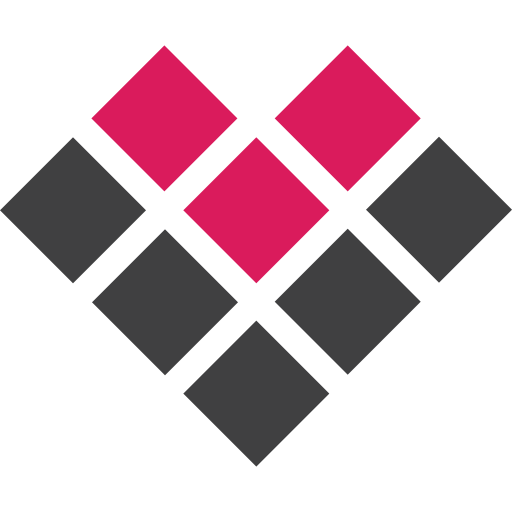 <code>tinfoil</code></a></td><td align="center"><a href="../logos/ting-isp.svg"> <code>ting-isp</code></a></td><td align="center"><a href="../logos/tiny-tiny-rss.svg"> <code>tiny-tiny-rss</code></a></td><td align="center"><a href="../logos/tinyfeed.svg"> <code>tinyfeed</code></a></td></tr>
<tr><td align="center"><a href="../logos/tirreno.svg"> <code>tirreno</code></a></td><td align="center"><a href="../logos/title-card-maker.svg"> <code>title-card-maker</code></a></td><td align="center"><a href="../logos/tmdb.svg"> <code>tmdb</code></a></td><td align="center"><a href="../logos/todoist.svg"> <code>todoist</code></a></td><td align="center"><a href="../logos/todoist-wordmark.svg"> <code>todoist-wordmark</code></a></td><td align="center"><a href="../logos/toggl.svg"> <code>toggl</code></a></td></tr>
<tr><td align="center"><a href="../logos/tolgee.svg"> <code>tolgee</code></a></td><td align="center"><a href="../logos/toodoom.svg"> <code>toodoom</code></a></td><td align="center"><a href="../logos/tooljet.svg"> <code>tooljet</code></a></td><td align="center"><a href="../logos/toolz.svg"> <code>toolz</code></a></td><td align="center"><a href="../logos/topdesk.svg"> <code>topdesk</code></a></td><td align="center"><a href="../logos/toshiba.svg"> <code>toshiba</code></a></td></tr>
<tr><td align="center"><a href="../logos/touitomamout.svg"> <code>touitomamout</code></a></td><td align="center"><a href="../logos/tp-link.svg"> <code>tp-link</code></a></td><td align="center"><a href="../logos/tpdb.svg"> <code>tpdb</code></a></td><td align="center"><a href="../logos/traccar.svg"> <code>traccar</code></a></td><td align="center"><a href="../logos/trackeep.svg"> <code>trackeep</code></a></td><td align="center"><a href="../logos/trackly.svg"> <code>trackly</code></a></td></tr>
<tr><td align="center"><a href="../logos/tracktor.svg"> <code>tracktor</code></a></td><td align="center"><a href="../logos/trade-republic.svg"> <code>trade-republic</code></a></td><td align="center"><a href="../logos/tradetally.svg"> <code>tradetally</code></a></td><td align="center"><a href="../logos/trading-view.svg"> <code>trading-view</code></a></td><td align="center"><a href="../logos/traefik-manager.svg"> <code>traefik-manager</code></a></td><td align="center"><a href="../logos/traggo.svg"> <code>traggo</code></a></td></tr>
<tr><td align="center"><a href="../logos/trakt.svg"> <code>trakt</code></a></td><td align="center"><a href="../logos/trala.svg"> <code>trala</code></a></td><td align="center"><a href="../logos/transfer-zip.svg"> <code>transfer-zip</code></a></td><td align="center"><a href="../logos/transmission.svg"> <code>transmission</code></a></td><td align="center"><a href="../logos/transmute.svg"> <code>transmute</code></a></td><td align="center"><a href="../logos/travelperk.svg"> <code>travelperk</code></a></td></tr>
<tr><td align="center"><a href="../logos/travelperk-wordmark.svg"> <code>travelperk-wordmark</code></a></td><td align="center"><a href="../logos/travstats.svg">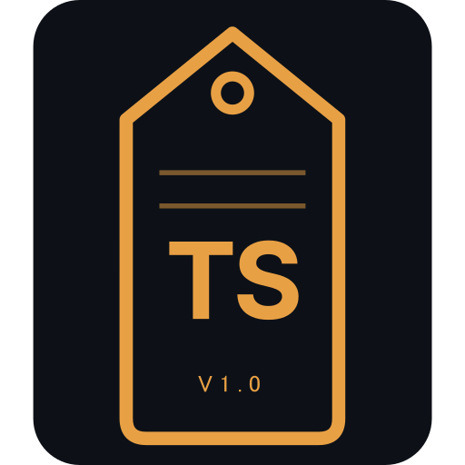 <code>travstats</code></a></td><td align="center"><a href="../logos/trek.svg"> <code>trek</code></a></td><td align="center"><a href="../logos/trellix.svg"> <code>trellix</code></a></td><td align="center"><a href="../logos/trello.svg"> <code>trello</code></a></td><td align="center"><a href="../logos/trello-wordmark.svg"> <code>trello-wordmark</code></a></td></tr>
<tr><td align="center"><a href="../logos/tricentis-tosca.svg"> <code>tricentis-tosca</code></a></td><td align="center"><a href="../logos/trilium.svg"> <code>trilium</code></a></td><td align="center"><a href="../logos/trilium-deprecated.svg"> <code>trilium-deprecated</code></a></td><td align="center"><a href="../logos/trilium-notes.svg"> <code>trilium-notes</code></a></td><td align="center"><a href="../logos/triliumnext.svg"> <code>triliumnext</code></a></td><td align="center"><a href="../logos/trmnl.svg"> <code>trmnl</code></a></td></tr>
<tr><td align="center"><a href="../logos/troddit.svg">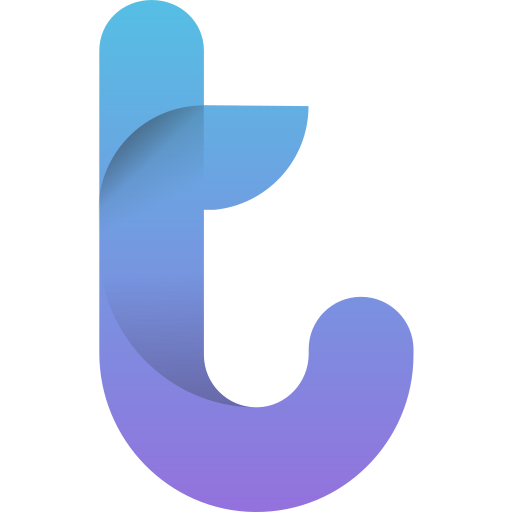 <code>troddit</code></a></td><td align="center"><a href="../logos/truecommand.svg"> <code>truecommand</code></a></td><td align="center"><a href="../logos/trueconf.svg"> <code>trueconf</code></a></td><td align="center"><a href="../logos/truenas-core.svg"> <code>truenas-core</code></a></td><td align="center"><a href="../logos/truenas-scale.svg"> <code>truenas-scale</code></a></td><td align="center"><a href="../logos/trusted-cgi.svg"> <code>trusted-cgi</code></a></td></tr>
<tr><td align="center"><a href="../logos/tryhackme.svg"> <code>tryhackme</code></a></td><td align="center"><a href="../logos/tubesync.svg"> <code>tubesync</code></a></td><td align="center"><a href="../logos/tubetimeout.svg"> <code>tubetimeout</code></a></td><td align="center"><a href="../logos/tududi.svg"> <code>tududi</code></a></td><td align="center"><a href="../logos/tugtainer.svg">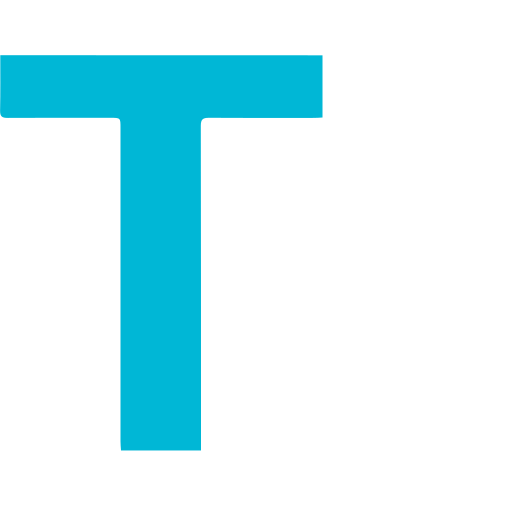 <code>tugtainer</code></a></td><td align="center"><a href="../logos/tunnelix.svg"> <code>tunnelix</code></a></td></tr>
<tr><td align="center"><a href="../logos/tuple.svg"> <code>tuple</code></a></td><td align="center"><a href="../logos/turnkey-linux.svg"> <code>turnkey-linux</code></a></td><td align="center"><a href="../logos/tuta-calendar.svg"> <code>tuta-calendar</code></a></td><td align="center"><a href="../logos/tux.svg"> <code>tux</code></a></td><td align="center"><a href="../logos/twake-drive.svg"> <code>twake-drive</code></a></td><td align="center"><a href="../logos/tweakers.svg"> <code>tweakers</code></a></td></tr>
<tr><td align="center"><a href="../logos/twenty-crm.svg">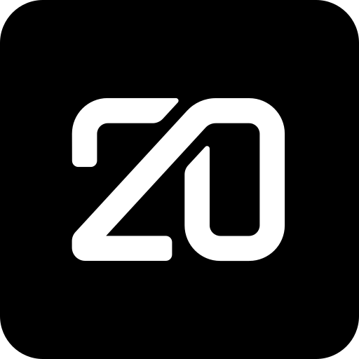 <code>twenty-crm</code></a></td><td align="center"><a href="../logos/twingate.svg"> <code>twingate</code></a></td><td align="center"><a href="../logos/twitchrise.svg"> <code>twitchrise</code></a></td><td align="center"><a href="../logos/tyepcho.svg"> <code>tyepcho</code></a></td><td align="center"><a href="../logos/typebot.svg"> <code>typebot</code></a></td><td align="center"><a href="../logos/typegpu.svg"> <code>typegpu</code></a></td></tr>
<tr><td align="center"><a href="../logos/typegpu-wordmark.svg"> <code>typegpu-wordmark</code></a></td><td align="center"><a href="../logos/typemill.svg"> <code>typemill</code></a></td><td align="center"><a href="../logos/ubiquiti-networks.svg"> <code>ubiquiti-networks</code></a></td><td align="center"><a href="../logos/ubiquiti-unifi.svg"> <code>ubiquiti-unifi</code></a></td><td align="center"><a href="../logos/ubports.svg"> <code>ubports</code></a></td><td align="center"><a href="../logos/ubuntu-linux.svg"> <code>ubuntu-linux</code></a></td></tr>
<tr><td align="center"><a href="../logos/ubuntu-linux-alt.svg"> <code>ubuntu-linux-alt</code></a></td><td align="center"><a href="../logos/uc-browser.svg"> <code>uc-browser</code></a></td><td align="center"><a href="../logos/uefi.svg"> <code>uefi</code></a></td><td align="center"><a href="../logos/ugreen.svg"> <code>ugreen</code></a></td><td align="center"><a href="../logos/ugreen-nas.svg">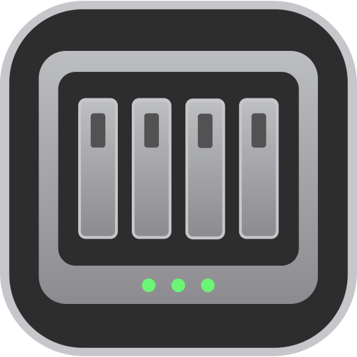 <code>ugreen-nas</code></a></td><td align="center"><a href="../logos/ui-bakery.svg"> <code>ui-bakery</code></a></td></tr>
<tr><td align="center"><a href="../logos/ultimate-guitar.svg"> <code>ultimate-guitar</code></a></td><td align="center"><a href="../logos/umami.svg"> <code>umami</code></a></td><td align="center"><a href="../logos/umbrel.svg"> <code>umbrel</code></a></td><td align="center"><a href="../logos/umbrelos.svg"> <code>umbrelos</code></a></td><td align="center"><a href="../logos/unblink.svg"> <code>unblink</code></a></td><td align="center"><a href="../logos/unbound.svg"> <code>unbound</code></a></td></tr>
<tr><td align="center"><a href="../logos/uncomplicated-alert-receiver.svg"> <code>uncomplicated-alert-receiver</code></a></td><td align="center"><a href="../logos/undb.svg"> <code>undb</code></a></td><td align="center"><a href="../logos/unifi.svg"> <code>unifi</code></a></td><td align="center"><a href="../logos/unifi-drive.svg"> <code>unifi-drive</code></a></td><td align="center"><a href="../logos/unifi-voucher-site.svg"> <code>unifi-voucher-site</code></a></td><td align="center"><a href="../logos/unimus.svg"> <code>unimus</code></a></td></tr>
<tr><td align="center"><a href="../logos/unito.svg"> <code>unito</code></a></td><td align="center"><a href="../logos/unito-wordmark.svg"> <code>unito-wordmark</code></a></td><td align="center"><a href="../logos/univention-corporate-server.svg"> <code>univention-corporate-server</code></a></td><td align="center"><a href="../logos/university-applied-sciences-brandenburg.svg"> <code>university-applied-sciences-brandenburg</code></a></td><td align="center"><a href="../logos/unraid.svg"> <code>unraid</code></a></td><td align="center"><a href="../logos/untangle.svg"> <code>untangle</code></a></td></tr>
<tr><td align="center"><a href="../logos/upsnap.svg"> <code>upsnap</code></a></td><td align="center"><a href="../logos/uptime-kuma.svg"> <code>uptime-kuma</code></a></td><td align="center"><a href="../logos/uptimekit.svg"> <code>uptimekit</code></a></td><td align="center"><a href="../logos/uptimerobot.svg"> <code>uptimerobot</code></a></td><td align="center"><a href="../logos/upvote-rss.svg"> <code>upvote-rss</code></a></td><td align="center"><a href="../logos/us-mobile.svg"> <code>us-mobile</code></a></td></tr>
<tr><td align="center"><a href="../logos/usaa.svg"> <code>usaa</code></a></td><td align="center"><a href="../logos/usermin.svg"> <code>usermin</code></a></td><td align="center"><a href="../logos/usertour.svg"> <code>usertour</code></a></td><td align="center"><a href="../logos/usulnet.svg"> <code>usulnet</code></a></td><td align="center"><a href="../logos/v2raya.svg"> <code>v2raya</code></a></td><td align="center"><a href="../logos/valetudo.svg"> <code>valetudo</code></a></td></tr>
<tr><td align="center"><a href="../logos/valkey.svg"> <code>valkey</code></a></td><td align="center"><a href="../logos/vanguard.svg"> <code>vanguard</code></a></td><td align="center"><a href="../logos/veeam.svg"> <code>veeam</code></a></td><td align="center"><a href="../logos/velero.svg"> <code>velero</code></a></td><td align="center"><a href="../logos/velld.svg"> <code>velld</code></a></td><td align="center"><a href="../logos/vera-crypt.svg"> <code>vera-crypt</code></a></td></tr>
<tr><td align="center"><a href="../logos/verifywise.svg"> <code>verifywise</code></a></td><td align="center"><a href="../logos/verizon.svg"> <code>verizon</code></a></td><td align="center"><a href="../logos/verriflo.svg"> <code>verriflo</code></a></td><td align="center"><a href="../logos/versity.svg"> <code>versity</code></a></td><td align="center"><a href="../logos/vert.svg"> <code>vert</code></a></td><td align="center"><a href="../logos/vertiv.svg"> <code>vertiv</code></a></td></tr>
<tr><td align="center"><a href="../logos/vi.svg"> <code>vi</code></a></td><td align="center"><a href="../logos/victron-energy.svg"> <code>victron-energy</code></a></td><td align="center"><a href="../logos/vidzy.svg"> <code>vidzy</code></a></td><td align="center"><a href="../logos/viewtube.svg"> <code>viewtube</code></a></td><td align="center"><a href="../logos/vikunja.svg"> <code>vikunja</code></a></td><td align="center"><a href="../logos/vince.svg"> <code>vince</code></a></td></tr>
<tr><td align="center"><a href="../logos/vinchin-backup.svg"> <code>vinchin-backup</code></a></td><td align="center"><a href="../logos/virola.svg"> <code>virola</code></a></td><td align="center"><a href="../logos/virtualbox-2010.svg"> <code>virtualbox-2010</code></a></td><td align="center"><a href="../logos/virtualmin.svg"> <code>virtualmin</code></a></td><td align="center"><a href="../logos/virustotal-wordmark.svg"> <code>virustotal-wordmark</code></a></td><td align="center"><a href="../logos/viseron.svg"> <code>viseron</code></a></td></tr>
<tr><td align="center"><a href="../logos/visible-by-verizon.svg"> <code>visible-by-verizon</code></a></td><td align="center"><a href="../logos/visio-meet.svg"> <code>visio-meet</code></a></td><td align="center"><a href="../logos/visual-db.svg"> <code>visual-db</code></a></td><td align="center"><a href="../logos/vitalpbx.svg"> <code>vitalpbx</code></a></td><td align="center"><a href="../logos/vito.svg"> <code>vito</code></a></td><td align="center"><a href="../logos/vllm.svg"> <code>vllm</code></a></td></tr>
<tr><td align="center"><a href="../logos/vlt.svg"> <code>vlt</code></a></td><td align="center"><a href="../logos/vlt-wordmark.svg"> <code>vlt-wordmark</code></a></td><td align="center"><a href="../logos/vmware-esx.svg"> <code>vmware-esx</code></a></td><td align="center"><a href="../logos/vmware-esxi.svg"> <code>vmware-esxi</code></a></td><td align="center"><a href="../logos/vmware-workstation.svg"> <code>vmware-workstation</code></a></td><td align="center"><a href="../logos/vmware-workstation-pro.svg"> <code>vmware-workstation-pro</code></a></td></tr>
<tr><td align="center"><a href="../logos/vn-stat.svg"> <code>vn-stat</code></a></td><td align="center"><a href="../logos/vodafone.svg"> <code>vodafone</code></a></td><td align="center"><a href="../logos/vodia.svg">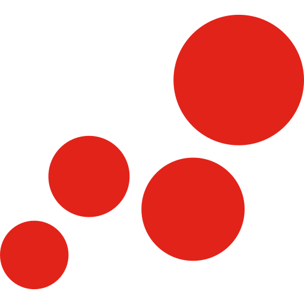 <code>vodia</code></a></td><td align="center"><a href="../logos/void-linux.svg"> <code>void-linux</code></a></td><td align="center"><a href="../logos/voilib.svg"> <code>voilib</code></a></td><td align="center"><a href="../logos/voip-ms.svg"> <code>voip-ms</code></a></td></tr>
<tr><td align="center"><a href="../logos/volkszaehler.svg"> <code>volkszaehler</code></a></td><td align="center"><a href="../logos/volla.svg"> <code>volla</code></a></td><td align="center"><a href="../logos/voltaserve.svg"> <code>voltaserve</code></a></td><td align="center"><a href="../logos/volumio.svg"> <code>volumio</code></a></td><td align="center"><a href="../logos/voron.svg"> <code>voron</code></a></td><td align="center"><a href="../logos/voux.svg"> <code>voux</code></a></td></tr>
<tr><td align="center"><a href="../logos/vue-js.svg"> <code>vue-js</code></a></td><td align="center"><a href="../logos/vue-js-wordmark.svg"> <code>vue-js-wordmark</code></a></td><td align="center"><a href="../logos/vuetorrent.svg"> <code>vuetorrent</code></a></td><td align="center"><a href="../logos/vykar.svg"> <code>vykar</code></a></td><td align="center"><a href="../logos/waffle.svg"> <code>waffle</code></a></td><td align="center"><a href="../logos/waffle-wordmark.svg"> <code>waffle-wordmark</code></a></td></tr>
<tr><td align="center"><a href="../logos/wakapi.svg"> <code>wakapi</code></a></td><td align="center"><a href="../logos/wallabag.svg"> <code>wallabag</code></a></td><td align="center"><a href="../logos/wallos.svg"> <code>wallos</code></a></td><td align="center"><a href="../logos/wally.svg"> <code>wally</code></a></td><td align="center"><a href="../logos/wanderer.svg"> <code>wanderer</code></a></td><td align="center"><a href="../logos/wardrowbe.svg"> <code>wardrowbe</code></a></td></tr>
<tr><td align="center"><a href="../logos/warpgate.svg"> <code>warpgate</code></a></td><td align="center"><a href="../logos/warracker.svg"> <code>warracker</code></a></td><td align="center"><a href="../logos/wastebin.svg">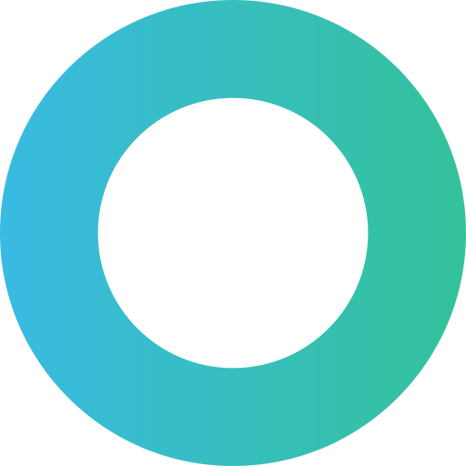 <code>wastebin</code></a></td><td align="center"><a href="../logos/watchguard.svg"> <code>watchguard</code></a></td><td align="center"><a href="../logos/watchtower.svg"> <code>watchtower</code></a></td><td align="center"><a href="../logos/watchyourports.svg"> <code>watchyourports</code></a></td></tr>
<tr><td align="center"><a href="../logos/wattbox.svg"> <code>wattbox</code></a></td><td align="center"><a href="../logos/waze.svg"> <code>waze</code></a></td><td align="center"><a href="../logos/wazuh.svg"> <code>wazuh</code></a></td><td align="center"><a href="../logos/wealthfolio.svg"> <code>wealthfolio</code></a></td><td align="center"><a href="../logos/weam.svg"> <code>weam</code></a></td><td align="center"><a href="../logos/web-check.svg"> <code>web-check</code></a></td></tr>
<tr><td align="center"><a href="../logos/webdb.svg"> <code>webdb</code></a></td><td align="center"><a href="../logos/webgazer.svg">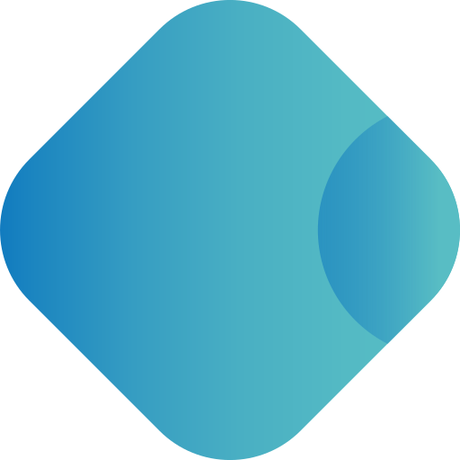 <code>webgazer</code></a></td><td align="center"><a href="../logos/webhook.svg"> <code>webhook</code></a></td><td align="center"><a href="../logos/webhook-tester.svg"> <code>webhook-tester</code></a></td><td align="center"><a href="../logos/webhookd.svg"> <code>webhookd</code></a></td><td align="center"><a href="../logos/webtrees.svg"> <code>webtrees</code></a></td></tr>
<tr><td align="center"><a href="../logos/wekan.svg"> <code>wekan</code></a></td><td align="center"><a href="../logos/wero.svg"> <code>wero</code></a></td><td align="center"><a href="../logos/wetransfer.svg"> <code>wetransfer</code></a></td><td align="center"><a href="../logos/wevr-labs.svg"> <code>wevr-labs</code></a></td><td align="center"><a href="../logos/wger.svg"> <code>wger</code></a></td><td align="center"><a href="../logos/whatnot.svg"> <code>whatnot</code></a></td></tr>
<tr><td align="center"><a href="../logos/whatseerr.svg"> <code>whatseerr</code></a></td><td align="center"><a href="../logos/whishper.svg"> <code>whishper</code></a></td><td align="center"><a href="../logos/whodb.svg"> <code>whodb</code></a></td><td align="center"><a href="../logos/wigwam.svg"> <code>wigwam</code></a></td><td align="center"><a href="../logos/wiki-go.svg"> <code>wiki-go</code></a></td><td align="center"><a href="../logos/wikidata-wordmark.svg"> <code>wikidata-wordmark</code></a></td></tr>
<tr><td align="center"><a href="../logos/wikidocs.svg"> <code>wikidocs</code></a></td><td align="center"><a href="../logos/wikijs.svg"> <code>wikijs</code></a></td><td align="center"><a href="../logos/wikijs-alt.svg"> <code>wikijs-alt</code></a></td><td align="center"><a href="../logos/will-be-done.svg"> <code>will-be-done</code></a></td><td align="center"><a href="../logos/willow.svg"> <code>willow</code></a></td><td align="center"><a href="../logos/windmill.svg"> <code>windmill</code></a></td></tr>
<tr><td align="center"><a href="../logos/windows-10.svg"> <code>windows-10</code></a></td><td align="center"><a href="../logos/windows-95.svg"> <code>windows-95</code></a></td><td align="center"><a href="../logos/windows-defender-2016.svg"> <code>windows-defender-2016</code></a></td><td align="center"><a href="../logos/windows-explorer.svg"> <code>windows-explorer</code></a></td><td align="center"><a href="../logos/windows-retro.svg"> <code>windows-retro</code></a></td><td align="center"><a href="../logos/wiredoor.svg">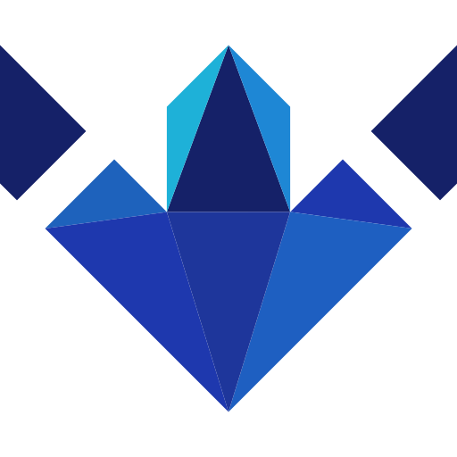 <code>wiredoor</code></a></td></tr>
<tr><td align="center"><a href="../logos/wish-com.svg"> <code>wish-com</code></a></td><td align="center"><a href="../logos/withoutbg.svg">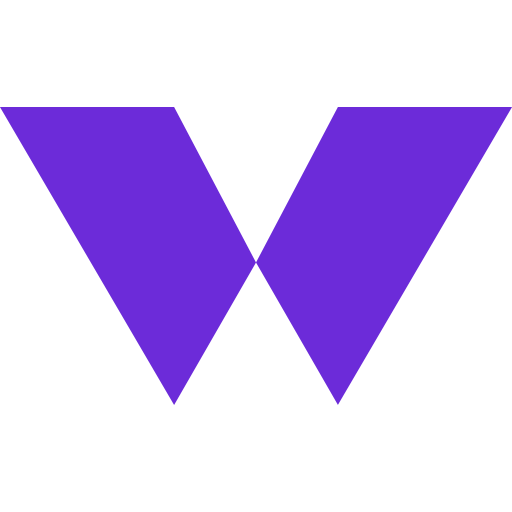 <code>withoutbg</code></a></td><td align="center"><a href="../logos/wiz.svg"> <code>wiz</code></a></td><td align="center"><a href="../logos/wolfi.svg"> <code>wolfi</code></a></td><td align="center"><a href="../logos/wolframalpha.svg"> <code>wolframalpha</code></a></td><td align="center"><a href="../logos/wooting.svg"> <code>wooting</code></a></td></tr>
<tr><td align="center"><a href="../logos/workato.svg"> <code>workato</code></a></td><td align="center"><a href="../logos/workato-wordmark.svg"> <code>workato-wordmark</code></a></td><td align="center"><a href="../logos/workboard.svg"> <code>workboard</code></a></td><td align="center"><a href="../logos/worklenz.svg"> <code>worklenz</code></a></td><td align="center"><a href="../logos/wotdle.svg"> <code>wotdle</code></a></td><td align="center"><a href="../logos/wownero.svg"> <code>wownero</code></a></td></tr>
<tr><td align="center"><a href="../logos/writefreely.svg"> <code>writefreely</code></a></td><td align="center"><a href="../logos/wrtag.svg">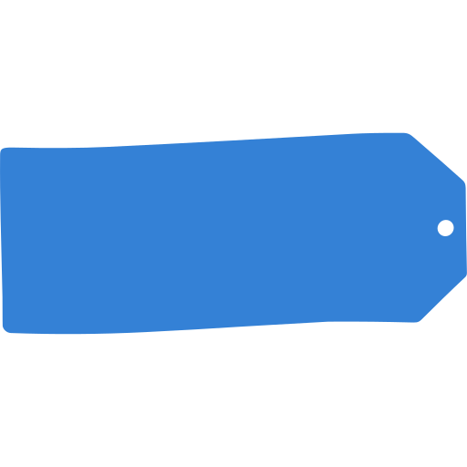 <code>wrtag</code></a></td><td align="center"><a href="../logos/wud.svg"> <code>wud</code></a></td><td align="center"><a href="../logos/wygiwyh.svg"> <code>wygiwyh</code></a></td><td align="center"><a href="../logos/x-p-ferd.svg"> <code>x-p-ferd</code></a></td><td align="center"><a href="../logos/xbackbone.svg"> <code>xbackbone</code></a></td></tr>
<tr><td align="center"><a href="../logos/xbrowsersync.svg"> <code>xbrowsersync</code></a></td><td align="center"><a href="../logos/xcp-ng.svg"> <code>xcp-ng</code></a></td><td align="center"><a href="../logos/xen-orchestra.svg"> <code>xen-orchestra</code></a></td><td align="center"><a href="../logos/xiaomi-global.svg"> <code>xiaomi-global</code></a></td><td align="center"><a href="../logos/xibo.svg">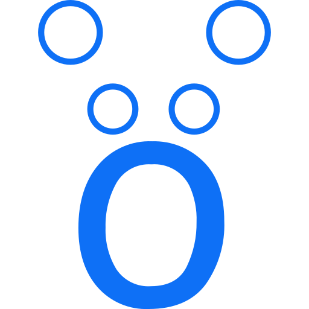 <code>xibo</code></a></td><td align="center"><a href="../logos/xigmanas.svg"> <code>xigmanas</code></a></td></tr>
<tr><td align="center"><a href="../logos/xmr.svg"> <code>xmr</code></a></td><td align="center"><a href="../logos/xmrig.svg"> <code>xmrig</code></a></td><td align="center"><a href="../logos/xpipe.svg"> <code>xpipe</code></a></td><td align="center"><a href="../logos/xplicittrust.svg"> <code>xplicittrust</code></a></td><td align="center"><a href="../logos/xray.svg"> <code>xray</code></a></td><td align="center"><a href="../logos/xrsh.svg"> <code>xrsh</code></a></td></tr>
<tr><td align="center"><a href="../logos/xubuntu-linux.svg"> <code>xubuntu-linux</code></a></td><td align="center"><a href="../logos/xwiki.svg"> <code>xwiki</code></a></td><td align="center"><a href="../logos/xwiki-wordmark.svg"> <code>xwiki-wordmark</code></a></td><td align="center"><a href="../logos/xxl-sports.svg"> <code>xxl-sports</code></a></td><td align="center"><a href="../logos/yabin.svg"> <code>yabin</code></a></td><td align="center"><a href="../logos/yac-reader.svg"> <code>yac-reader</code></a></td></tr>
<tr><td align="center"><a href="../logos/yacd-blue.svg"> <code>yacd-blue</code></a></td><td align="center"><a href="../logos/yacht.svg"> <code>yacht</code></a></td><td align="center"><a href="../logos/yacreaderlibrary.svg"> <code>yacreaderlibrary</code></a></td><td align="center"><a href="../logos/yamlresume.svg"> <code>yamlresume</code></a></td><td align="center"><a href="../logos/yamtrack.svg"> <code>yamtrack</code></a></td><td align="center"><a href="../logos/yeetfile.svg"> <code>yeetfile</code></a></td></tr>
<tr><td align="center"><a href="../logos/ygeeker.svg"> <code>ygeeker</code></a></td><td align="center"><a href="../logos/ynab.svg"> <code>ynab</code></a></td><td align="center"><a href="../logos/yoink.svg"> <code>yoink</code></a></td><td align="center"><a href="../logos/yopass.svg"> <code>yopass</code></a></td><td align="center"><a href="../logos/yourls.svg"> <code>yourls</code></a></td><td align="center"><a href="../logos/youtrack.svg"> <code>youtrack</code></a></td></tr>
<tr><td align="center"><a href="../logos/youtube-dl.svg"> <code>youtube-dl</code></a></td><td align="center"><a href="../logos/youtube-kids.svg"> <code>youtube-kids</code></a></td><td align="center"><a href="../logos/youtube-studio.svg"> <code>youtube-studio</code></a></td><td align="center"><a href="../logos/youtube-watcher.svg"> <code>youtube-watcher</code></a></td><td align="center"><a href="../logos/yt-dlp.svg"> <code>yt-dlp</code></a></td><td align="center"><a href="../logos/yt-dlp-web-player.svg"> <code>yt-dlp-web-player</code></a></td></tr>
<tr><td align="center"><a href="../logos/yts.svg"> <code>yts</code></a></td><td align="center"><a href="../logos/yubal.svg"> <code>yubal</code></a></td><td align="center"><a href="../logos/yundera.svg"> <code>yundera</code></a></td><td align="center"><a href="../logos/z-ai.svg"> <code>z-ai</code></a></td><td align="center"><a href="../logos/z-wave-js-ui.svg"> <code>z-wave-js-ui</code></a></td><td align="center"><a href="../logos/zabka.svg"> <code>zabka</code></a></td></tr>
<tr><td align="center"><a href="../logos/zaia-endless.svg"> <code>zaia-endless</code></a></td><td align="center"><a href="../logos/zalo.svg"> <code>zalo</code></a></td><td align="center"><a href="../logos/zammad.svg"> <code>zammad</code></a></td><td align="center"><a href="../logos/zaneops.svg">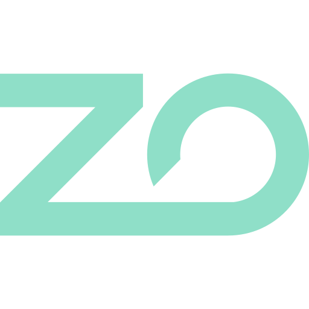 <code>zaneops</code></a></td><td align="center"><a href="../logos/zapier.svg"> <code>zapier</code></a></td><td align="center"><a href="../logos/zapier-wordmark.svg"> <code>zapier-wordmark</code></a></td></tr>
<tr><td align="center"><a href="../logos/zappier.svg"> <code>zappier</code></a></td><td align="center"><a href="../logos/zashboard.svg"> <code>zashboard</code></a></td><td align="center"><a href="../logos/zen-notes.svg"> <code>zen-notes</code></a></td><td align="center"><a href="../logos/zenarmor.svg"> <code>zenarmor</code></a></td><td align="center"><a href="../logos/zenhub.svg"> <code>zenhub</code></a></td><td align="center"><a href="../logos/zenhub-wordmark.svg"> <code>zenhub-wordmark</code></a></td></tr>
<tr><td align="center"><a href="../logos/zenmux.svg"> <code>zenmux</code></a></td><td align="center"><a href="../logos/zensical.svg">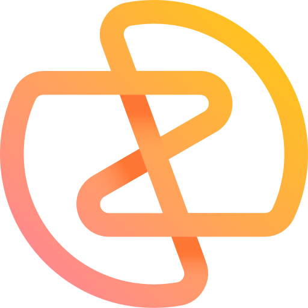 <code>zensical</code></a></td><td align="center"><a href="../logos/zerobyte.svg"> <code>zerobyte</code></a></td><td align="center"><a href="../logos/zigbee2mqtt.svg"> <code>zigbee2mqtt</code></a></td><td align="center"><a href="../logos/ziit.svg"> <code>ziit</code></a></td><td align="center"><a href="../logos/zimaos.svg"> <code>zimaos</code></a></td></tr>
<tr><td align="center"><a href="../logos/zimbra.svg"> <code>zimbra</code></a></td><td align="center"><a href="../logos/zipcaptions.svg"> <code>zipcaptions</code></a></td><td align="center"><a href="../logos/zipline.svg"> <code>zipline</code></a></td><td align="center"><a href="../logos/zipline-diced.svg"> <code>zipline-diced</code></a></td><td align="center"><a href="../logos/zitadel.svg"> <code>zitadel</code></a></td><td align="center"><a href="../logos/zoho.svg"> <code>zoho</code></a></td></tr>
<tr><td align="center"><a href="../logos/zoho-wordmark.svg"> <code>zoho-wordmark</code></a></td><td align="center"><a href="../logos/zomro.svg"> <code>zomro</code></a></td><td align="center"><a href="../logos/zoom-alt.svg"> <code>zoom-alt</code></a></td><td align="center"><a href="../logos/zoraxy.svg"> <code>zoraxy</code></a></td><td align="center"><a href="../logos/zorin-linux.svg"> <code>zorin-linux</code></a></td><td align="center"><a href="../logos/zrok.svg"> <code>zrok</code></a></td></tr>
<tr><td align="center"><a href="../logos/zube.svg"> <code>zube</code></a></td><td align="center"><a href="../logos/zublo.svg"> <code>zublo</code></a></td><td align="center"><a href="../logos/zyxel-communications.svg"> <code>zyxel-communications</code></a></td><td align="center"><a href="../logos/zyxel-networks.svg"> <code>zyxel-networks</code></a></td><td align="center"><a href="../logos/zyxel-networks-wordmark.svg"> <code>zyxel-networks-wordmark</code></a></td></tr>
</table>

Page [1](./prod.md) · **2**

[⬅️ Back to the full catalog](../README.md)
